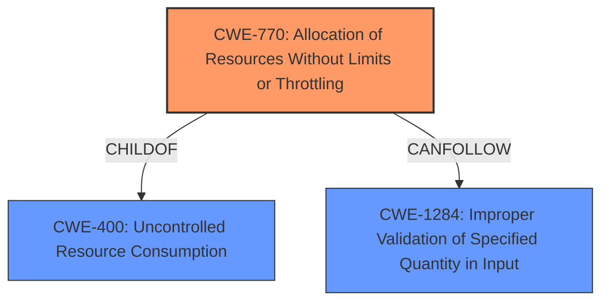

# Enhanced Analysis for CVE-2024-9437

# Summary
| CWE ID | CWE Name | Confidence | CWE Abstraction Level | CWE Vulnerability Mapping Label | CWE-Vulnerability Mapping Notes |
|---|---|---|---|---|---|
| CWE-770 | Allocation of Resources Without Limits or Throttling | 0.9 | Base | Allowed | Primary CWE |
| CWE-400 | Uncontrolled Resource Consumption | 0.7 | Class | Discouraged | Secondary Candidate |
| CWE-1284 | Improper Validation of Specified Quantity in Input | 0.6 | Base | Allowed | Secondary Candidate |

## Evidence and Confidence

*   **Confidence Score:** 0.8
*   **Evidence Strength:** MEDIUM

## Relationship Analysis
The primary weakness is **CWE-770 (Allocation of Resources Without Limits or Throttling)**, which is a Base level CWE. **CWE-400 (Uncontrolled Resource Consumption)** is a Class level CWE and a parent of CWE-770, but it is too general. **CWE-1284 (Improper Validation of Specified Quantity in Input)** is also related, as the boundary could be considered an input quantity, but it doesn't fully capture the essence of the vulnerability.



## Vulnerability Chain
The vulnerability chain starts with the **appending characters to multipart boundary**. This leads to **uncontrolled resource consumption** because the server continuously processes each character. The end result is a **denial of service**.

## Summary of Analysis
The vulnerability is caused by the server's inability to handle malformed multipart boundaries in resource upload requests. The server **allocates resources without limits or throttling**, leading to excessive resource consumption and a denial-of-service condition. This is best represented by **CWE-770 (Allocation of Resources Without Limits or Throttling)**. The **rootcause** "**appending characters to multipart boundary**" directly triggers the allocation of resources without limits.

The retriever results also suggested CWE-400 (Uncontrolled Resource Consumption), which is a valid high-level description of the impact, but not the root cause. CWE-1284 (Improper Validation of Specified Quantity in Input) was also considered, as the multipart boundary could be viewed as a quantity. However, CWE-770 is a more precise fit for the **weakness** where resources are allocated without any size limit.

CWEs considered but not used:

*   CWE-400: While this is the impact, it's too high-level and doesn't describe the root cause. The mapping guidance discourages its use.
*   CWE-1284: This is relevant, as the boundary could be viewed as a quantity, but CWE-770 captures the essence of the problem more directly.
*   CWE-1333: This is related to inefficient algorithms but doesn't apply as the vulnerability isn't caused by a regular expression.
*   CWE-20: Too generic.
*   CWE-306: Authentication is not the primary issue. The vulnerability occurs even without authentication.
*   CWE-401: Memory is not explicitly leaked.
*   CWE-74: This is about injection and doesn't fit the description.
*   CWE-434: The vulnerability is not about the type of file uploaded.
*   CWE-73: The file name is not the issue.


## CWE Relationship Analysis

Current CWEs represent these abstraction levels: .


### Vulnerability Chain Analysis

**Chain starting from CWE-1284:**
- 1284 (Improper Validation of Specified Quantity in Input) - ROOT


**Chain starting from CWE-400:**
- 400 (Uncontrolled Resource Consumption) - ROOT


### CWE Relationship Diagram

```mermaid
graph TD
    classDef primary fill:#f96,stroke:#333,stroke-width:2px
    classDef secondary fill:#69f,stroke:#333
    classDef tertiary fill:#9e9,stroke:#333
```