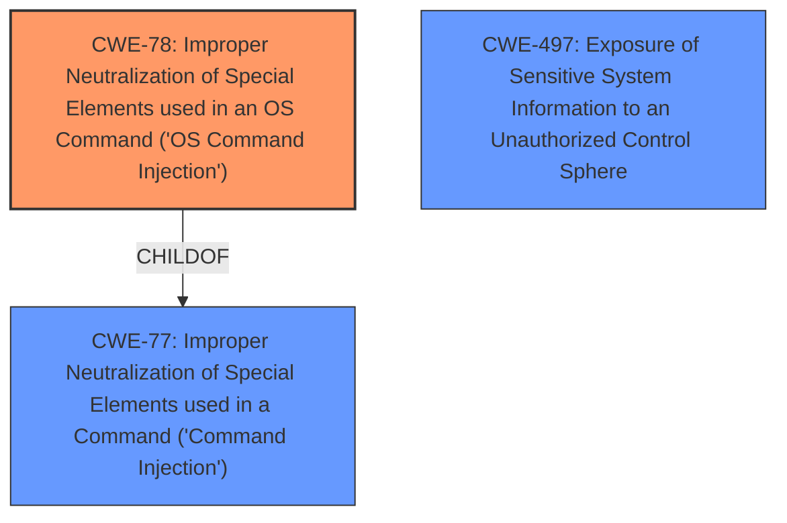

# Analysis Report for CVE-2024-9463

# Vulnerability Analysis Report: CVE-2024-9463

## Description

An **OS command injection** vulnerability in Palo Alto Networks Expedition allows an unauthenticated attacker to run arbitrary OS commands as root in Expedition, resulting in disclosure of usernames, cleartext passwords, device configurations, and device API keys of PAN-OS firewalls.

## Vulnerability Description Key Phrases

- **Weakness:** OS command injection
- **Impact:** run arbitrary OS commands as root
- **Attacker:** unauthenticated attacker
- **Product:** Palo Alto Networks Expedition

## Analysis (with Relationship Data)

# Summary
| CWE ID | CWE Name | Confidence | CWE Abstraction Level | CWE Vulnerability Mapping Label | CWE-Vulnerability Mapping Notes |
|---|---|---|---|---|---|
| CWE-78 | Improper Neutralization of Special Elements used in an OS Command ('OS Command Injection') | 1.0 | Base | Primary | Allowed |
| CWE-497 | Exposure of Sensitive System Information to an Unauthorized Control Sphere | 0.5 | Base | Secondary | Allowed |

## Evidence and Confidence

*   **Confidence Score:** 0.8
*   **Evidence Strength:** HIGH

## Relationship Analysis
The primary relationship identified is that CWE-78 is a specific type of command injection, where the injected commands are OS commands. CWE-78 is a base level CWE which is desirable. CWE-77 is a class level CWE which is less specific than CWE-78 and is thus less desirable. CWE-497 is related to the impact of the command injection, where sensitive system information is exposed.



## Vulnerability Chain
The vulnerability chain starts with an **OS command injection vulnerability (CWE-78)** due to the **improper neutralization** of special elements. This leads to the ability to run arbitrary OS commands as root, which in turn results in the **exposure of sensitive system information (CWE-497)** such as usernames, cleartext passwords, device configurations, and device API keys of PAN-OS firewalls.

## Summary of Analysis
The primary vulnerability is clearly an **OS command injection (CWE-78)**. The vulnerability description explicitly states this, and the CVE reference links content summary confirms it. The retriever results also strongly suggest CWE-78 as the primary CWE.

The impact of the **OS Command Injection** is the exposure of sensitive information. **CWE-497 (Exposure of Sensitive System Information to an Unauthorized Control Sphere)** is included as a secondary CWE to capture this impact.

CWE-77 was considered, but the vulnerability description is very specific about it being an OS command injection, making CWE-78 a better fit.

Relevant CWE Information:

# Enhanced Context (25 CWEs)
The following CWEs were identified as potentially relevant to this vulnerability:

## CWE-497: Exposure of Sensitive System Information to an Unauthorized Control Sphere
**Abstraction Level**: Base
**Similarity Score**: 0.76
**Source**: dense

**Description**:
The product does not properly prevent sensitive system-level information from being accessed by unauthorized actors who do not have the same level of access to the underlying system as the product does.

**Mapping Guidance**:
- Usage: Allowed
- Rationale: This CWE entry is at the Base level of abstraction, which is a preferred level of abstraction for mapping to the root causes of vulnerabilities.

## CWE-78: Improper Neutralization of Special Elements used in an OS Command ('OS Command Injection')
**Abstraction Level**: Base
**Similarity Score**: 1.00
**Source**: alternate_terms

**Description**:
The product constructs all or part of an OS command using externally-influenced input from an upstream component, but it does not neutralize or incorrectly neutralizes special elements that could modify the intended OS command when it is sent to a downstream component.

**Mapping Guidance**:
- Usage: Allowed
- Rationale: This CWE entry is at the Base level of abstraction, which is a preferred level of abstraction for mapping to the root causes of vulnerabilities.


## CWE Relationship Analysis

Current CWEs represent these abstraction levels: .


### Vulnerability Chain Analysis

**Chain starting from CWE-77:**
- 77 (Improper Neutralization of Special Elements used in a Command ('Command Injection')) - ROOT


**Chain starting from CWE-497:**
- 497 (Exposure of Sensitive System Information to an Unauthorized Control Sphere) - ROOT


### CWE Relationship Diagram

```mermaid
graph TD
    classDef primary fill:#f96,stroke:#333,stroke-width:2px
    classDef secondary fill:#69f,stroke:#333
    classDef tertiary fill:#9e9,stroke:#333
```


*Report generated on 2025-07-14 04:52:59*
