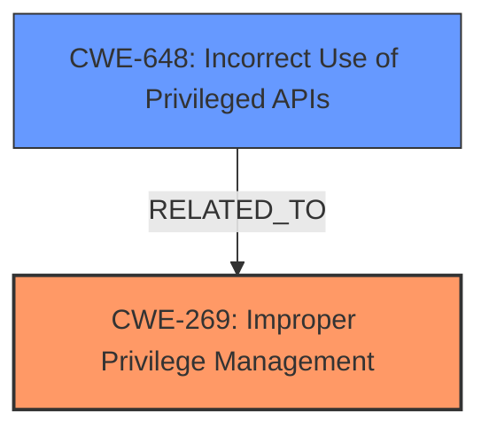

# Raw Analyzer Response for CVE-2024-9471

# Summary
| CWE ID | CWE Name | Confidence | CWE Abstraction Level | CWE Vulnerability Mapping Label | CWE-Vulnerability Mapping Notes |
|---|---|---|---|---|---|
| CWE-269 | Improper Privilege Management | 0.8 | Class | Primary | Discouraged, but most fitting based on the description of the **improper** management of privileges. |
| CWE-648 | Incorrect Use of Privileged APIs | 0.7 | Base | Secondary | Allowed. The vulnerability involves the **incorrect use** of the XML API, which can be considered a privileged API. |

## Evidence and Confidence

*   **Confidence Score:** 0.75
*   **Evidence Strength:** MEDIUM

## Relationship Analysis
The primary CWE is CWE-269, which is a Class-level CWE. While it is discouraged, it is chosen because the vulnerability description clearly indicates a problem with privilege management. CWE-648 is a Base-level CWE and a more specific potential cause of the improper privilege management.

## Vulnerability Chain
The vulnerability chain starts with **improper privilege management** (CWE-269). This leads to the ability to use a compromised XML API key to perform actions beyond the intended permissions. **Incorrect use of Privileged APIs** (CWE-648) can be seen as the technical means of the improper privilege management.

## Summary of Analysis
The initial assessment identified CWE-269 as the primary weakness due to the **improper** handling of privileges, as directly stated in the vulnerability description and CVE summary. While CWE-269 is discouraged, the description does point to a privilege management issue. The evidence is that an authenticated user with restricted privileges can perform actions as a higher privileged administrator. The Retriever Results list CWE-269, but it is listed as discouraged. The mapping guidance states that CWE-269 is commonly misused but provides some context for when it may be appropriate. The vulnerability description supports this selection because a restricted user is able to perform actions as a higher privileged user, due to **improper** privilege management. 

CWE-648 is included as a secondary CWE to capture the technical implementation aspect: the **incorrect use** of the XML API.

The selected CWEs are at the optimal level of specificity based on the available information.
# Enhanced Context (25 CWEs)
The following CWEs were identified as potentially relevant to this vulnerability:

## CWE-267: Privilege Defined With Unsafe Actions
**Abstraction Level**: Base
**Similarity Score**: 0.78
**Source**: dense

**Description**:
A particular privilege, role, capability, or right can be used to perform unsafe actions that were not intended, even when it is assigned to the correct entity.

**Mapping Guidance**:
- Usage: Allowed
- Rationale: This CWE entry is at the Base level of abstraction, which is a preferred level of abstraction for mapping to the root causes of vulnerabilities.
-- Not Selected: While related to privilege issues, it doesn't fit as closely as CWE-269 or CWE-648.

## CWE-280: Improper Handling of Insufficient Permissions or Privileges 
**Abstraction Level**: Base
**Similarity Score**: 0.78
**Source**: dense

**Description**:
The product does not handle or incorrectly handles when it has insufficient privileges to access resources or functionality as specified by their permissions. This may cause it to follow unexpected code paths that may leave the product in an invalid state.

**Mapping Guidance**:
- Usage: Allowed
- Rationale: This CWE entry is at the Base level of abstraction, which is a preferred level of abstraction for mapping to the root causes of vulnerabilities.
-- Not Selected: This CWE focuses on insufficient privileges, while the vulnerability involves using compromised credentials to gain excessive privileges.

## CWE-266: Incorrect Privilege Assignment
**Abstraction Level**: Base
**Similarity Score**: 0.77
**Source**: dense

**Description**:
A product incorrectly assigns a privilege to a particular actor, creating an unintended sphere of control for that actor.

**Mapping Guidance**:
- Usage: Allowed
- Rationale: This CWE entry is at the Base level of abstraction, which is a preferred level of abstraction for mapping to the root causes of vulnerabilities.
-- Not Selected: This CWE focuses on the initial assignment of privileges, while the vulnerability is about using a compromised API key to bypass intended privilege restrictions.

## CWE-274: Improper Handling of Insufficient Privileges
**Abstraction Level**: Base
**Similarity Score**: 0.77
**Source**: dense

**Description**:
The product does not handle or incorrectly handles when it has insufficient privileges to perform an operation, leading to resultant weaknesses.

**Mapping Guidance**:
- Usage: Discouraged
- Rationale: This CWE entry could be deprecated in a future version of CWE.
-- Not Selected: Similar to CWE-280, this focuses on insufficient privileges, which is not the core issue in this vulnerability.

## CWE-668: Exposure of Resource to Wrong Sphere
**Abstraction Level**: Class
**Similarity Score**: 0.76
**Source**: dense

**Description**:
The product exposes a resource to the wrong control sphere, providing unintended actors with inappropriate access to the resource.

**Mapping Guidance**:
- Usage: Discouraged
- Rationale: CWE-668 is high-level and is often misused as a catch-all when lower-level CWE IDs might be applicable. It is sometimes used for low-information vulnerability reports [REF-1287]. It is a level-1 Class (i.e., a child of a Pillar). It is not useful for trend analysis.
-- Not Selected: Too generic and doesn't directly address the privilege escalation aspect.

## CWE-497: Exposure of Sensitive System Information to an Unauthorized Control Sphere
**Abstraction Level**: Base
**Similarity Score**: 0.76
**Source**: dense

**Description**:
The product does not properly prevent sensitive system-level information from being accessed by unauthorized actors who do not have the same level of access to the underlying system as the product does.

**Mapping Guidance**:
- Usage: Allowed
- Rationale: This CWE entry is at the Base level of abstraction, which is a preferred level of abstraction for mapping to the root causes of vulnerabilities.
-- Not Selected: While there might be information exposure as a consequence, the primary issue is privilege escalation.

## CWE-212: Improper Removal of Sensitive Information Before Storage or Transfer
**Abstraction Level**: Base
**Similarity Score**: 0.76
**Source**: dense

**Description**:
The product stores, transfers, or shares a resource that contains sensitive information, but it does not properly remove that information before the product makes the resource available to unauthorized actors.

**Mapping Guidance**:
- Usage: Allowed
- Rationale: This CWE entry is at the Base level of abstraction, which is a preferred level of abstraction for mapping to the root causes of vulnerabilities.
-- Not Selected: Not relevant to the privilege escalation issue.

## CWE-472: External Control of Assumed-Immutable Web Parameter
**Abstraction Level**: Base
**Similarity Score**: 0.76
**Source**: dense

**Description**:
The web application does not sufficiently verify inputs that are assumed to be immutable but are actually externally controllable, such as hidden form fields.

**Mapping Guidance**:
- Usage: Allowed
- Rationale: This CWE entry is at the Base level of abstraction, which is a preferred level of abstraction for mapping to the root causes of vulnerabilities.
-- Not Selected: Not relevant to the privilege escalation issue.

## CWE-41: Improper Resolution of Path Equivalence
**Abstraction Level**: Base
**Similarity Score**: 0.75
**Source**: dense

**Description**:
The product is vulnerable to file system contents disclosure through path equivalence. Path equivalence involves the use of special characters in file and directory names. The associated manipulations are intended to generate multiple names for the same object.

**Mapping Guidance**:
- Usage: Allowed
- Rationale: This CWE entry is at the Base level of abstraction, which is a preferred level of abstraction for mapping to the root causes of vulnerabilities.
-- Not Selected: Not relevant to the privilege escalation issue.

## CWE-754: Improper Check for Unusual or Exceptional Conditions
**Abstraction Level**: Class
**Similarity Score**: 0.75
**Source**: dense

**Description**:
The product does not check or incorrectly checks for unusual or exceptional conditions that are not expected to occur frequently during day to day operation of the product.

**Mapping Guidance**:
- Usage: Allowed-with-Review
- Rationale: This CWE entry is a Class and might have Base-level children that would be more appropriate
-- Not Selected: Too generic and doesn't directly address the privilege escalation aspect.

## CWE-269: Improper Privilege Management
**Abstraction Level**: Class
**Similarity Score**: