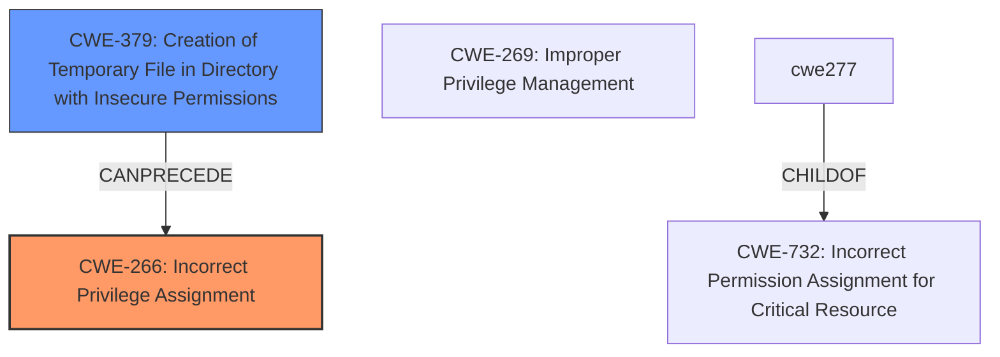

# Analysis Report for CVE-2024-9500

# Vulnerability Analysis Report: CVE-2024-9500

## Description

A maliciously crafted DLL file when placed in temporary files and folders that are leveraged by the Autodesk Installer could lead to escalation of privileges to NT AUTHORITY/SYSTEM due to **insecure privilege management**.

## Vulnerability Description Key Phrases

- **Rootcause:** insecure privilege management
- **Impact:** escalation of privileges to NT AUTHORITY/SYSTEM
- **Vector:** maliciously crafted DLL file
- **Product:** Autodesk Installer

## Analysis (with Relationship Data)

# Summary
| CWE ID | CWE Name | Confidence | CWE Abstraction Level | CWE Vulnerability Mapping Label | CWE-Vulnerability Mapping Notes |
|---|---|---|---|---|---|
| CWE-266 | Incorrect Privilege Assignment | 0.9 | Base | Allowed | Primary CWE |
| CWE-379 | Creation of Temporary File in Directory with Insecure Permissions | 0.7 | Base | Allowed | Secondary Candidate |

## Evidence and Confidence

*   **Confidence Score:** 0.8
*   **Evidence Strength:** HIGH

## Relationship Analysis
The primary CWE is CWE-266, **Incorrect Privilege Assignment**, which is a Base level CWE. This aligns well with the **root cause** described as **insecure privilege management**. The description specifically mentions a **maliciously crafted DLL file** placed in temporary files and folders leading to privilege escalation. Several other CWEs were considered, especially those related to file permissions and privilege management. CWE-379, **Creation of Temporary File in Directory with Insecure Permissions**, is potentially related as the DLL is placed in temporary files, but the core issue is the incorrect assignment of privileges allowing the DLL to be executed with elevated privileges.



## Vulnerability Chain
The vulnerability chain starts with the creation of temporary files with **insecure permissions** (potentially CWE-379), followed by a **malicious DLL** being placed in that directory, leading to **incorrect privilege assignment** (CWE-266) when the DLL is executed by the Autodesk installer, ultimately resulting in privilege escalation.

## Summary of Analysis
The primary assessment is based on the explicit description of **insecure privilege management** as the root cause, supported by the CVE Reference Links Content Summary confirming this weakness. The selection of CWE-266 is further justified by the "Privileges vs Permissions Guidance," specifically the symptom "User gets higher privilege role (e.g., admin) by mistake" which maps directly to CWE-266 when the root cause is role misassignment. The "Technical Impact Phrases" table also reinforces this mapping, as "Escalate to root/admin" suggests a privilege escalation impact where the root cause could be CWE-266. While other CWEs like CWE-379 (creation of temp files), CWE-732 (**incorrect permissions**), and CWE-269 (**improper privilege management**) were considered, CWE-266 more precisely captures the **root cause**, especially in the context of the provided guidance. The chosen CWEs are at the optimal level of specificity, with CWE-266 being a Base level CWE, representing the core weakness.

Relevant CWE Information:

# Enhanced Context (25 CWEs)
The following CWEs were identified as potentially relevant to this vulnerability:

## CWE-266: Incorrect Privilege Assignment
**Abstraction Level**: Base
**Similarity Score**: 0.80
**Source**: dense

**Description**:
A product incorrectly assigns a privilege to a particular actor, creating an unintended sphere of control for that actor.

**Mapping Guidance**:
- Usage: Allowed
- Rationale: This CWE entry is at the Base level of abstraction, which is a preferred level of abstraction for mapping to the root causes of vulnerabilities.
## CWE-266: **Incorrect Privilege Assignment**

* The system assigns incorrect privileges to a user (e.g., admin instead of guest).
* Often the result of misconfigured roles or faulty logic during account provisioning.
* ✅ *“A user created with the ‘guest’ role was assigned admin privileges due to a logic flaw.”*


## CWE Relationship Analysis

Current CWEs represent these abstraction levels: .


### Vulnerability Chain Analysis

**Chain starting from CWE-266:**
- 266 (Incorrect Privilege Assignment) - ROOT


**Chain starting from CWE-269:**
- 269 (Improper Privilege Management) - ROOT


### CWE Relationship Diagram

```mermaid
graph TD
    classDef primary fill:#f96,stroke:#333,stroke-width:2px
    classDef secondary fill:#69f,stroke:#333
    classDef tertiary fill:#9e9,stroke:#333
```


*Report generated on 2025-07-14 04:56:14*
