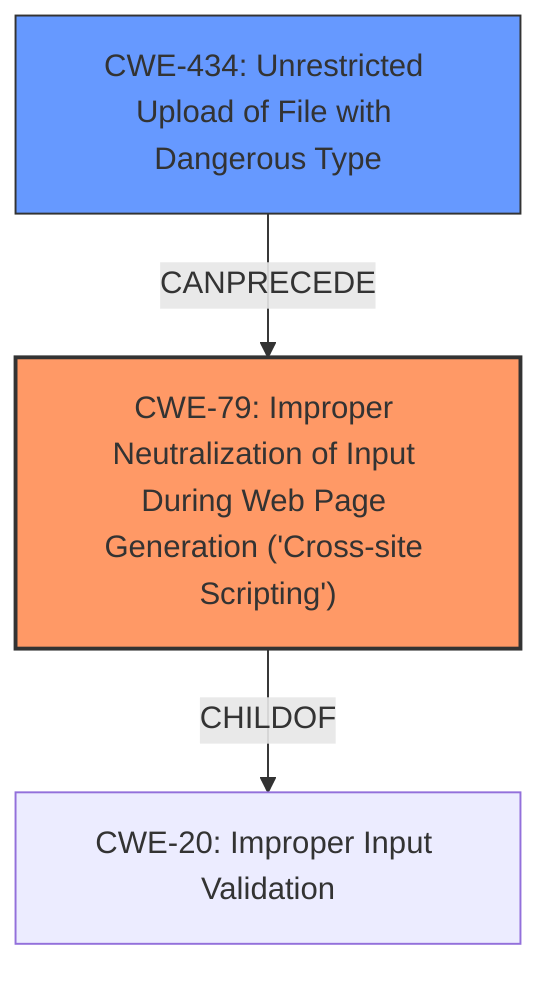

# Analysis for CVE-2024-9504

# Summary
| CWE ID | CWE Name | Confidence | CWE Abstraction Level | CWE Vulnerability Mapping Label | CWE-Vulnerability Mapping Notes |
|---|---|---|---|---|---|
| CWE-79 | Improper Neutralization of Input During Web Page Generation ('Cross-site Scripting') | 1.0 | Base | Primary | Allowed |
| CWE-434 | Unrestricted Upload of File with Dangerous Type | 0.9 | Base | Secondary | Allowed |

## Evidence and Confidence

*   **Confidence Score:** 0.95
*   **Evidence Strength:** HIGH

## Relationship Analysis
The primary relationship is that **insufficient input sanitization** (leading to CWE-79) can be caused by allowing **unrestricted file uploads** (CWE-434). CWE-79 is a child of CWE-20 (Improper Input Validation), indicating a more general class of input handling errors. CWE-434 can lead to CWE-79 if the uploaded file is not properly sanitized before being served.

## Vulnerability Chain
1.  **Unrestricted File Upload (CWE-434):** The application allows the upload of SVG files without proper validation.
2.  **Insufficient Input Sanitization (CWE-79):** The SVG file is not properly sanitized, allowing malicious scripts to be embedded.
3.  **Stored Cross-Site Scripting (CWE-79):** When a user accesses the SVG file, the malicious script is executed in their browser.

Root Cause: CWE-434 and CWE-79
Impact: Stored Cross-Site Scripting

## Summary of Analysis
The vulnerability is a Stored Cross-Site Scripting (XSS) vulnerability due to **insufficient input sanitization and output escaping** in the Booking calendar, Appointment Booking System plugin for WordPress. The plugin allows unauthenticated attackers to upload SVG files containing malicious scripts, which are then executed when a user accesses the file.

The primary CWE is CWE-79 (Improper Neutralization of Input During Web Page Generation ('Cross-site Scripting')), as the core issue is the lack of proper sanitization of user-supplied input (the SVG file content) before it is rendered in a web page. The vulnerability description clearly states **"insufficient input sanitization and output escaping"**.

The secondary CWE is CWE-434 (Unrestricted Upload of File with Dangerous Type), which describes the ability to upload dangerous file types (SVG) that are automatically processed within the environment. This contributes to the vulnerability by allowing attackers to upload malicious files in the first place. The "CVE Reference Links Content Summary" section provides solid evidence of this weakness: "The plugin allows unrestricted uploads of files with dangerous types (SVG), which can then be used to inject malicious scripts."

CWE-79 directly addresses the XSS issue, while CWE-434 represents the precursor condition that enables the XSS vulnerability.

Other CWEs Considered:

*   CWE-116 (Improper Encoding or Escaping of Output): While related to XSS, the primary issue is the lack of sanitization rather than encoding/escaping problems.
*   CWE-352 (Cross-Site Request Forgery (CSRF)): Not applicable as the vulnerability doesn't involve forging requests.
*   CWE-425 (Direct Request ('Forced Browsing')): Not applicable as the vulnerability doesn't involve bypassing authorization checks to access restricted resources.

Based on the evidence and relationship analysis, CWE-79 and CWE-434 are the most appropriate CWEs for this vulnerability. They accurately reflect the root cause and contributing factors, and are at the appropriate level of specificity.