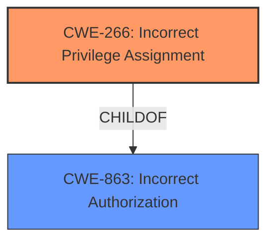

# Enhanced Analysis for CVE-2024-9518

# Summary
| CWE ID | CWE Name | Confidence | CWE Abstraction Level | CWE Vulnerability Mapping Label | CWE-Vulnerability Mapping Notes |
|---|---|---|---|---|---|
| CWE-266 | Incorrect Privilege Assignment | 0.9 | Base | Primary | Allowed |
| CWE-863 | Incorrect Authorization | 0.7 | Class | Secondary Candidate | Allowed-with-Review |

## Evidence and Confidence

*   **Confidence Score:** 0.8
*   **Evidence Strength:** HIGH

## Relationship Analysis
The primary CWE is CWE-266, Incorrect Privilege Assignment, which is a base-level CWE. CWE-863 is a Class-level CWE that is more general. The relationship between privileges and permissions is important. This vulnerability description is about assigning the wrong privileges to a user during registration.



## Vulnerability Chain
The vulnerability chain starts with the **insufficient restriction on form_actions and userplus_update_user_profile functions**, leading to **incorrect privilege assignment** (CWE-266), which allows **unauthenticated attackers** to **specify their user role during registration**, resulting in **privilege escalation**.

## Summary of Analysis
The initial analysis considered several CWEs, but the key phrase "insufficient restriction" and the impact of "privilege escalation" pointed towards privilege or authorization-related issues. The retriever results suggested CWE-863 (Incorrect Authorization), CWE-284 (Improper Access Control), and CWE-266 (Incorrect Privilege Assignment).

The guidance provided in the Privileges vs Permissions section helped to differentiate between these CWEs. Since the vulnerability allows unauthenticated users to assign themselves any role during registration due to **insufficient restriction**, CWE-266 (Incorrect Privilege Assignment) is the most appropriate primary CWE. It is a base-level CWE, which is preferred.

CWE-863 (Incorrect Authorization) could be considered a secondary CWE as it describes a more general scenario where authorization is not correctly performed. However, CWE-266 more accurately captures the specific issue of incorrect privilege assignment during user registration.

The evidence from the vulnerability description and CVE reference links content summary supports this decision. The vulnerability description clearly states that the **insufficient restriction** allows attackers to specify their user role. The CVE reference links content summary also mentions **improper privilege management** as a present weakness.

Relevant CWE Information:

# Enhanced Context (25 CWEs)
The following CWEs were identified as potentially relevant to this vulnerability:

## CWE-266: Incorrect Privilege Assignment
**Abstraction Level**: Base
**Similarity Score**: 1464.67
**Source**: sparse

**Description**:
A product incorrectly assigns a privilege to a particular actor, creating an unintended sphere of control for that actor.

**Mapping Guidance**:
- Usage: Allowed
- Rationale: This CWE entry is at the Base level of abstraction, which is a preferred level of abstraction for mapping to the root causes of vulnerabilities.

## CWE-863: Incorrect Authorization
**Abstraction Level**: Class
**Similarity Score**: 1582.52
**Source**: sparse

**Description**:
The product performs an authorization check when an actor attempts to access a resource or perform an action, but it does not correctly perform the check.

**Mapping Guidance**:
- Usage: Allowed-with-Review
- Rationale: This CWE entry is a Class and might have Base-level children that would be more appropriate

CWE-266 is the optimal level of specificity.


## CWE Relationship Analysis

Current CWEs represent these abstraction levels: .


### Vulnerability Chain Analysis

**Chain starting from CWE-284:**
- 284 (Improper Access Control) - ROOT


**Chain starting from CWE-266:**
- 266 (Incorrect Privilege Assignment) - ROOT


### CWE Relationship Diagram

```mermaid
graph TD
    classDef primary fill:#f96,stroke:#333,stroke-width:2px
    classDef secondary fill:#69f,stroke:#333
    classDef tertiary fill:#9e9,stroke:#333
```