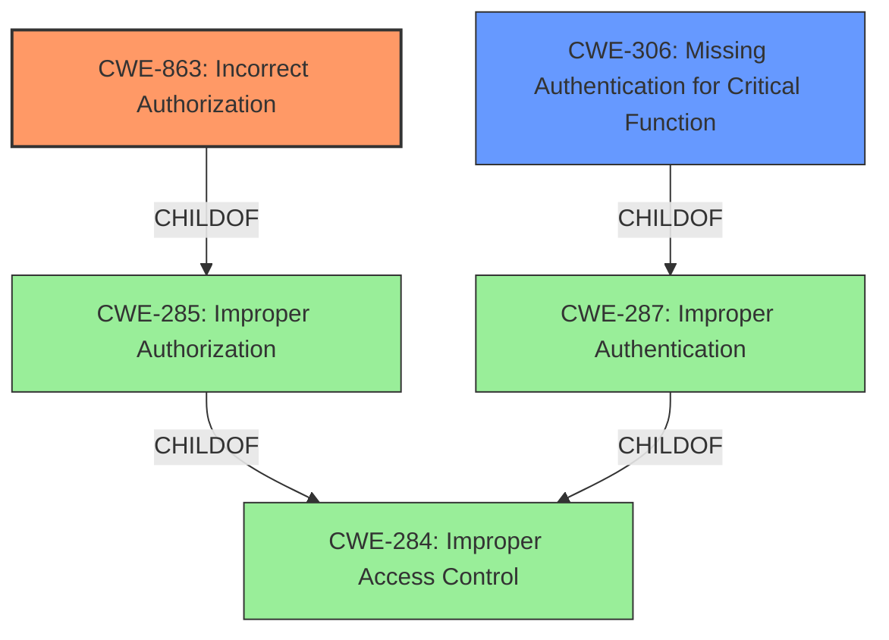

# Raw Analyzer Response for CVE-2024-9522

# Summary
| CWE ID | CWE Name | Confidence | CWE Abstraction Level | CWE Vulnerability Mapping Label | CWE-Vulnerability Mapping Notes |
|---|---|---|---|---|---|
| CWE-863 | Incorrect Authorization | 1.0 | Class | Primary | Allowed-with-Review |
| CWE-306 | Missing Authentication for Critical Function | 0.7 | Base | Secondary | Allowed |

## Evidence and Confidence

*   **Confidence Score:** 0.85
*   **Evidence Strength:** HIGH

## Relationship Analysis
The primary relationship that influenced the CWE selection was the distinction between authentication and authorization. The vulnerability involves **incorrect authentication and capability checking**, but the user is already authenticated as a subscriber. Therefore, the focus shifts to whether the authenticated user is authorized to perform the action of masquerading as another user. This points towards an authorization issue (CWE-863) rather than a missing authentication issue (CWE-306) for the masquerading functionality itself. However, since the vulnerability allows an authenticated user (subscriber) to perform actions reserved for higher-privileged users (like administrators), there is a component of Missing Authentication for Critical Functionality, making it a secondary classification. The guidance clearly differentiate between the two and helped in selecting the correct CWE.

## Vulnerability Chain
The vulnerability chain starts with the **incorrect authentication and capability checking** (CWE-863). This leads to an **authentication bypass**, allowing an attacker with subscriber-level permissions to log in as any existing user, including an administrator. The final impact is complete account takeover and full site control.

## Summary of Analysis
The initial analysis identified the vulnerability as an **authentication bypass** due to **incorrect authentication and capability checking**. Further analysis, guided by the provided information, particularly the "Authentication vs Authorization vs Access Control Guidance," clarified that the primary issue is with authorization. While the vulnerability description mentions "authentication bypass," it's more accurately described as an authorization flaw because the user is already authenticated; the problem lies in the improper checks that allow them to assume the identity of other users. The choice of CWE-863 is supported by the fact that the plugin *attempts* to perform authorization checks but does so incorrectly, as indicated by the presence of `wp_verify_nonce` (for CSRF protection) and the inadequate privilege checks before calling `wp_set_current_user` and `wp_set_auth_cookie`. The guidance also states "Role check is present but flawed -> CWE-863". CWE-306 is considered as a secondary weakness as a critical function (masquerading) lacks proper authentication checks to ensure that only authorized users (e.g., administrators) can perform it.

The selection of CWE-863 is at the Class level because there isn't a more specific Base or Variant CWE that precisely captures the nature of the incorrect authorization logic. While CWE-639 (Authorization Bypass Through User-Controlled Key) was considered, it doesn't fit as well because the bypass isn't solely due to a user-controlled key; it's the broader problem of flawed capability checking. The evidence from the "CVE Reference Links Content Summary" explicitly states: "The core issue is that the plugin doesn't properly verify if the current user is authorized to masquerade as another user before switching their session," which directly supports the choice of CWE-863.

Relevant CWE Information:

# Enhanced Context (25 CWEs)
The following CWEs were identified as potentially relevant to this vulnerability:

## CWE-266: Incorrect Privilege Assignment
**Abstraction Level**: Base
**Similarity Score**: 0.75
**Source**: dense

**Description**:
A product incorrectly assigns a privilege to a particular actor, creating an unintended sphere of control for that actor.
*This CWE was not chosen because the issue is not about assigning wrong priviliges, but about checking if the authenticated user has the right privileges to assume identity of another user.*

## CWE-472: External Control of Assumed-Immutable Web Parameter
**Abstraction Level**: Base
**Similarity Score**: 0.75
**Source**: dense

**Description**:
The web application does not sufficiently verify inputs that are assumed to be immutable but are actually externally controllable, such as hidden form fields.
*This CWE was not chosen because the root cause is not related to external control of parameters.*

## CWE-267: Privilege Defined With Unsafe Actions
**Abstraction Level**: Base
**Similarity Score**: 0.75
**Source**: dense

**Description**:
A particular privilege, role, capability, or right can be used to perform unsafe actions that were not intended, even when it is assigned to the correct entity.
*This CWE was not chosen because the issue is not that the privilege itself is unsafe, but that the authorization check is incorrect.*

## CWE-639: Authorization Bypass Through User-Controlled Key
**Abstraction Level**: Base
**Similarity Score**: 0.74
**Source**: dense

**Description**:
The system's authorization functionality does not prevent one user from gaining access to another user's data or record by modifying the key value identifying the data.
*This CWE was not chosen because the authorization bypass is not through a User-Controlled Key.*

## CWE-41: Improper Resolution of Path Equivalence
**Abstraction Level**: Base
**Similarity Score**: 0.74
**Source**: dense

**Description**:
The product is vulnerable to file system contents disclosure through path equivalence. Path equivalence involves the use of special characters in file and directory names. The associated manipulations are intended to generate multiple names for the same object.
*This CWE was not chosen because the vulnerability is not related to file system path equivalence.*

## CWE-1390: Weak Authentication
**Abstraction Level**: Class
**Similarity Score**: 0.74
**Source**: dense

**Description**:
The product uses an authentication mechanism to restrict access to specific users or identities, but the mechanism does not sufficiently prove that the claimed identity is correct.
*This CWE was not chosen because the issue is not with weak authentication, but with improper authorization.*

## CWE-425: Direct Request ('Forced Browsing')
**Abstraction Level**: Base
**Similarity Score**: 0.74
**Source**: dense

**Description**:
The web application does not adequately enforce appropriate authorization on all restricted URLs, scripts, or files.
*This CWE was not chosen because the problem isn't a direct request to a restricted URL, but a bypass of authorization within a specific function.*

## CWE-668: Exposure of Resource to Wrong Sphere
**Abstraction Level**: Class
**Similarity Score**: 0.74
**Source**: dense

**Description**:
The product exposes a resource to the wrong control sphere, providing unintended actors with inappropriate access to the resource.
*This CWE was not chosen because CWE-668 is too high-level, and more specific CWEs like CWE-863 and CWE-306 are more appropriate.*

## CWE-280: Improper Handling of Insufficient Permissions or Privileges 
**Abstraction Level**: Base
**Similarity Score**: 0.73
**Source**: dense

**Description**:
The product does not handle or incorrectly handles when it has insufficient privileges to access resources or functionality as specified by their permissions. This may cause it to follow unexpected code paths that may leave the product in an invalid state.
*This CWE was not chosen because the issue is not related to code paths when permissions are insufficient.*

## CWE-74: Improper Neutralization of Special Elements in Output Used by a Downstream Component ('Injection')
**Abstraction Level**: Class
**Similarity Score**: 0.73
**Source**: dense

**Description**:
The product constructs all or part of a command, data structure, or record using externally-influenced input from an upstream component, but it does not neutralize or incorrectly neutralizes special elements that could modify how it is parsed or interpreted when it is sent to a downstream component.
*This CWE was not chosen because the vulnerability is not related to injection.*

## CWE-863: Incorrect Authorization
**Abstraction Level**: Class
**Similarity Score**: 2915.56
**Source**: sparse

**Description**:
The product performs an authorization check when an actor attempts to access a resource or