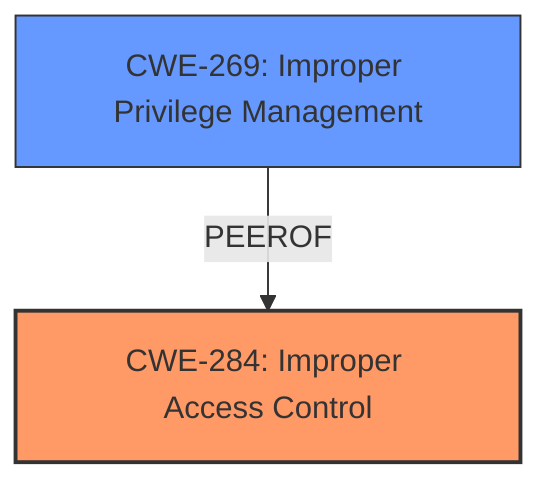

# Raw Analyzer Response for CVE-2024-9576

# Summary
| CWE ID | CWE Name | Confidence | CWE Abstraction Level | CWE Vulnerability Mapping Label | CWE-Vulnerability Mapping Notes |
|---|---|---|---|---|---|
| CWE-284 | Improper Access Control | 0.9 | Class | Primary | Allowed |
| CWE-269 | Improper Privilege Management | 0.6 | Class | Secondary | Discouraged |

## Evidence and Confidence

*   **Confidence Score:** 0.9
*   **Evidence Strength:** HIGH

## Relationship Analysis
The primary CWE selected is CWE-284, which is a class-level CWE. Although it's a higher-level CWE, the provided information doesn't point to a more specific base or variant. It is related to privilege management and authorization issues. CWE-269 is a peer of CWE-284, but is discouraged, so it will only be considered as a secondary mapping.

## Vulnerability Chain
The chain of events for this vulnerability is as follows:
1.  **Root Cause:** **Improper Access Control** (CWE-284) allows manipulation of the network configuration script.
2.  **Impact:** Privilege escalation to root user.

## Summary of Analysis
Based on the provided information, the vulnerability in Distro Linux Workbooth v2.5 allows a low-privileged user to escalate privileges to the root user by manipulating the network configuration script.

The **root cause** appears to be **improper access control**, specifically the ability to modify the network configuration script without proper authorization. The CVE Reference Links Content Summary explicitly states: "Improper access control allows a low-privileged user to modify the network configuration script, leading to privilege escalation. The vulnerability is categorized under CWE-284, which represents improper access control."

The initial Retriever Results suggest CWE-269 (Improper Privilege Management) and CWE-732 (Incorrect Permission Assignment for Critical Resource) as potential candidates. However, CWE-269 is discouraged, and CWE-732 is often misused for authorization weaknesses. The vulnerability description focuses on the ability to modify the script rather than incorrect assignment of permissions.

CWE-284 (Improper Access Control) is a more suitable fit, aligning with the **root cause** of being able to manipulate the configuration script, eventually leading to privilege escalation.

The CWE Classification Guidance on Privileges vs Permissions further supports the selection of CWE-284. The guide indicates that if no specific privilege or permission mistake is identifiable, CWE-284 can be used. While privilege escalation is the impact, the **root cause** is the **lack of proper access control** over the configuration script, which is best captured by CWE-284.

*   **CWE-284: Improper Access Control**
    *   **Technical Explanation:** The vulnerability exists because the system **fails to enforce restrictions on access** to the network configuration script. A low-privileged user is able to modify it, leading to privilege escalation.
    *   **Security Implications:** This leads to a complete compromise of the system, as the attacker gains root privileges.
    *   **Relationship Analysis:** This is a class-level CWE.
    *   **Mapping Guidance:** Used as the primary mapping due to lack of specific privilege/permission details, aligning with guidance to use CWE-284 if children don't fit.
    *   **Supporting Evidence:** "Improper access control allows a low-privileged user to modify the network configuration script, leading to privilege escalation. The vulnerability is categorized under CWE-284, which represents improper access control."
    *   **Confidence:** 0.9

*   **CWE-269: Improper Privilege Management**
    *   **Technical Explanation:** The system does not properly manage the privileges.
    *   **Security Implications:** This leads to a privilege escalation of the system.
    *   **Relationship Analysis:** This is a class-level CWE, and is a peer of CWE-284.
    *   **Mapping Guidance:** Discouraged, but included as a secondary candidate.
    *   **Supporting Evidence:** "privilege escalation"
    *   **Confidence:** 0.6