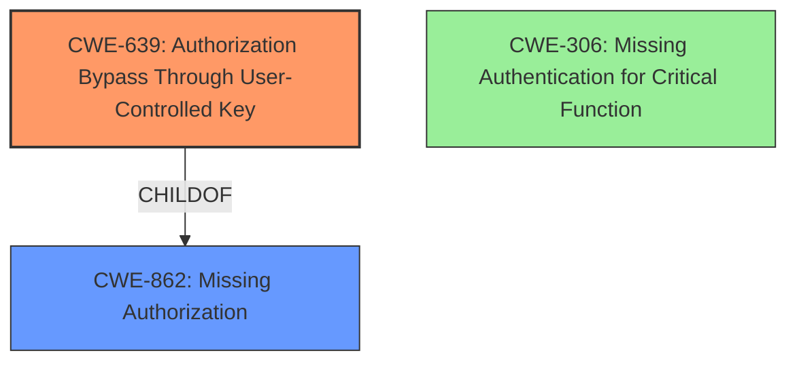

# Raw Analyzer Response for CVE-2024-9617

# Summary
| CWE ID | CWE Name | Confidence | CWE Abstraction Level | CWE Vulnerability Mapping Label | CWE-Vulnerability Mapping Notes |
|---|---|---|---|---|---|
| CWE-639 | Authorization Bypass Through User-Controlled Key | 0.9 | Base | Allowed | Primary CWE |
| CWE-862 | Missing Authorization | 0.7 | Class | Allowed-with-Review | Secondary Candidate |
| CWE-306 | Missing Authentication for Critical Function | 0.5 | Base | Allowed | Secondary Candidate |

## Evidence and Confidence

*   **Confidence Score:** 0.8
*   **Evidence Strength:** MEDIUM

## Relationship Analysis
The primary CWE is CWE-639, which is a Base level CWE. It directly addresses the vulnerability where an attacker can access another user's data by modifying the key value. CWE-862, Missing Authorization, is a broader Class level CWE and can be considered as a parent. CWE-306, Missing Authentication for Critical Function, is considered, but the description focuses more on authorization rather than authentication.

## Vulnerability Chain
The vulnerability chain starts with the **lack of access control verification**. This leads to an **IDOR** vulnerability, allowing an attacker to view any files. The root cause is the **missing** authorization check on the file ID, and the impact is unauthorized file access.

## Summary of Analysis
The primary CWE is CWE-639, as it best describes the vulnerability: An **IDOR** vulnerability occurs due to the **lack of access control verification** which allows an attacker to view any files by directly calling the API endpoint with a modified file ID. This is because the application does not verify whether the attacker is the creator of the file. The evidence "The application does not verify whether the attacker is the creator of the file, allowing the attacker to directly call the GET /api/chat/file/{file_id} interface to view any users file" directly supports this. CWE-862 and CWE-306 were considered, but CWE-639 is more specific and accurate. The selection is based on the retriever results, the CWE descriptions, and the vulnerability description itself.

Relevant CWE Information:

# Enhanced Context (25 CWEs)
The following CWEs were identified as potentially relevant to this vulnerability:

## CWE-639: Authorization Bypass Through User-Controlled Key
**Abstraction Level**: Base
**Similarity Score**: 0.74
**Source**: dense

**Description**:
The system's authorization functionality does not prevent one user from gaining access to another user's data or record by modifying the key value identifying the data.

**Mapping Guidance**:
- Usage: Allowed
- Rationale: This CWE entry is at the Base level of abstraction, which is a preferred level of abstraction for mapping to the root causes of vulnerabilities.

## CWE-862: Missing Authorization
**Abstraction Level**: Class
**Similarity Score**: 1239.61
**Source**: sparse

**Description**:
The product performs an authorization check when an actor attempts to access a resource or perform an action, but it does not correctly perform the check.

**Mapping Guidance**:
- Usage: Allowed-with-Review
- Rationale: This CWE entry is a Class and might have Base-level children that would be more appropriate

## CWE-306: Missing Authentication for Critical Function
**Abstraction Level**: Base
**Similarity Score**: 1195.17
**Source**: sparse

**Description**:
The product does not perform any authentication for functionality that requires a provable user identity or consumes a significant amount of resources.

**Mapping Guidance**:
- Usage: Allowed
- Rationale: This CWE entry is at the Base level of abstraction, which is a preferred level of abstraction for mapping to the root causes of vulnerabilities.