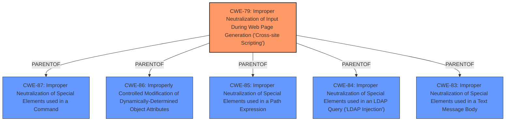

# Analysis Report for CVE-2024-9663

# Vulnerability Analysis Report: CVE-2024-9663

## Description

The CYAN Backup WordPress plugin before 2.5.3 **does not sanitise and escape some of its settings**, which could allow high privilege users such as admin to perform Stored Cross-Site Scripting attacks even when the unfiltered_html capability is disallowed (for example in multisite setup).

## Vulnerability Description Key Phrases

- **Rootcause:** does not sanitise and escape some of its settings
- **Weakness:** cross-site scripting
- **Impact:** Stored Cross-Site Scripting attacks
- **Attacker:** high privilege users
- **Product:** CYAN Backup WordPress plugin
- **Version:** before 2.5.3

## Analysis (with Relationship Data)

# Summary
| CWE ID | CWE Name | Confidence | CWE Abstraction Level | CWE Vulnerability Mapping Label | CWE-Vulnerability Mapping Notes |
|---|---|---|---|---|---|
| CWE-79 | Improper Neutralization of Input During Web Page Generation ('Cross-site Scripting') | 1.0 | Base | Allowed | Primary CWE |

## Evidence and Confidence

*   **Confidence Score:** 1.0
*   **Evidence Strength:** HIGH

## Relationship Analysis
The primary relationship that influenced the decision was the direct match of the vulnerability description to the definition and examples provided for CWE-79. The retriever results also listed CWE-79 as the top match with a Base abstraction level.



## Vulnerability Chain
The vulnerability chain starts with the **improper sanitization and escaping of settings** within the CYAN Backup WordPress plugin, leading directly to the possibility of Stored Cross-Site Scripting (XSS) attacks.
  - **Root Cause:** **CWE-79** Improper Neutralization of Input During Web Page Generation ('Cross-site Scripting') due to **not sanitising and escaping some of its settings**
  - **Impact:** Stored Cross-Site Scripting attacks

## Summary of Analysis
The analysis indicates a clear match for CWE-79 based on the vulnerability description and CVE details. The plugin **does not sanitise and escape some of its settings**, which directly leads to the possibility of injecting malicious scripts into web pages served to other users. This aligns precisely with the definition of CWE-79. The retriever results also support this classification.

The evidence from the Vulnerability Description and CVE Reference Links Content Summary is as follows:
- "The CYAN Backup WordPress plugin before 2.5.3 **does not sanitise and escape some of its settings**, which could allow high privilege users such as admin to perform Stored Cross-Site Scripting attacks"
- "The plugin **does not sanitize and escape some of its settings**, allowing for XSS attacks."

The selection of CWE-79 is at the optimal level of specificity because it directly addresses the root cause of the vulnerability.
### Analysis of other CWEs:
- CWE-352: Cross-Site Request Forgery (CSRF) - While CSRF is a common web vulnerability, it doesn't directly apply here because the vulnerability is about injecting malicious scripts due to **lack of sanitization**, not about forcing a user to perform unwanted actions.
- CWE-116: Improper Encoding or Escaping of Output - This is a broader category that could be related, but CWE-79 is more specific to XSS vulnerabilities. Since the description explicitly mentions XSS, CWE-79 is a better fit.
- CWE-862: Missing Authorization - This CWE is not applicable as the vulnerability is due to improper sanitization of input, not missing authorization checks.
- CWE-89: Improper Neutralization of Special Elements used in an SQL Command ('SQL Injection') - This CWE is specific to SQL injection vulnerabilities, which are not mentioned or implied in the vulnerability description.
- CWE-434: Unrestricted Upload of File with Dangerous Type - This CWE is not applicable as the vulnerability is due to improper sanitization of input, not unrestricted file uploads.
- CWE-138: Improper Neutralization of Special Elements - This CWE is a Class-level CWE and is less specific than CWE-79.
- CWE-863: Incorrect Authorization - This CWE is not applicable as the vulnerability is due to improper sanitization of input, not incorrect authorization checks.
- CWE-96: Improper Neutralization of Directives in Statically Saved Code ('Static Code Injection') - This CWE is not applicable as the vulnerability is due to improper sanitization of input, not static code injection.
- CWE-471: Modification of Assumed-Immutable Data (MAID) - This CWE is not applicable as the vulnerability is due to improper sanitization of input, not modification of immutable data.


## CWE Relationship Analysis

Current CWEs represent these abstraction levels: .


### Vulnerability Chain Analysis

**Chain starting from CWE-87:**
- 87 (Improper Neutralization of Alternate XSS Syntax) - ROOT


**Chain starting from CWE-89:**
- 89 (Improper Neutralization of Special Elements used in an SQL Command ('SQL Injection')) - ROOT


### CWE Relationship Diagram

```mermaid
graph TD
    classDef primary fill:#f96,stroke:#333,stroke-width:2px
    classDef secondary fill:#69f,stroke:#333
    classDef tertiary fill:#9e9,stroke:#333
```


*Report generated on 2025-07-14 05:03:24*
