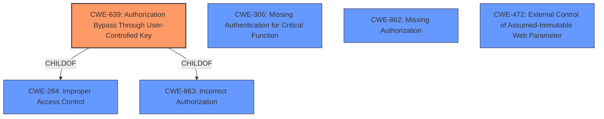

# Enhanced Analysis for CVE-2024-9687

# Summary

| CWE ID   | CWE Name                                                                     | Confidence | CWE Abstraction Level | CWE Vulnerability Mapping Label | CWE-Vulnerability Mapping Notes |
| -------- | ---------------------------------------------------------------------------- | ---------- | --------------------- | ------------------------------- | ------------------------------- |
| CWE-639  | Authorization Bypass Through User-Controlled Key                             | 0.9        | Base                  | Primary                         | Allowed                         |
| CWE-306  | Missing Authentication for Critical Function                                 | 0.6        | Base                  | Secondary                       | Allowed                         |
| CWE-862  | Missing Authorization                                                        | 0.6        | Class                 | Secondary                       | Allowed-with-Review             |
| CWE-863  | Incorrect Authorization                                                      | 0.6        | Class                 | Secondary                       | Allowed-with-Review             |
| CWE-472  | External Control of Assumed-Immutable Web Parameter                        | 0.5        | Base                  | Secondary                       | Allowed                         |

## Evidence and Confidence

*   **Confidence Score:** 0.9
*   **Evidence Strength:** HIGH

## Relationship Analysis

The primary CWE selected is CWE-639 (Authorization Bypass Through User-Controlled Key), which has parent-child relationships with CWE-284 (Improper Access Control) and CWE-863 (Incorrect Authorization). The vulnerability allows bypassing authentication due to **insufficient validation of the user-controlled key**. While CWE-306 (Missing Authentication for Critical Function) and CWE-862 (Missing Authorization) were considered, the evidence points towards a more specific issue of using a user-controlled key to bypass authorization, making CWE-639 more appropriate. CWE-472 (External Control of Assumed-Immutable Web Parameter) was also considered since the key is externally controlled, but CWE-639 is a better fit as it focuses on the authorization bypass aspect.



## Vulnerability Chain

The vulnerability chain starts with **insufficient validation of the user-controlled key** (CWE-639), leading to an **authentication bypass**, allowing attackers to log in as any user.

Root Cause: **Insufficient validation of the user-controlled key** (CWE-639)
Impact: Authentication Bypass, Account Takeover

## Summary of Analysis

The primary CWE selected is CWE-639 (Authorization Bypass Through User-Controlled Key) due to the **insufficient validation of a user-controlled key**. This directly leads to the ability to bypass authentication and gain unauthorized access. The vulnerability description key phrases highlight "**insufficient validation of the user-controlled key**" as the root cause. The "CVE Reference Links Content Summary" confirms that the vulnerability stems from the insufficient validation of a user-controlled key within the 'validate_tg' action, allowing attackers to bypass the authentication process. Other CWEs like CWE-306 (Missing Authentication for Critical Function), CWE-862 (Missing Authorization) and CWE-863 (Incorrect Authorization) were considered but deemed less specific as the primary issue is the **improper validation of a key**. CWE-472 (External Control of Assumed-Immutable Web Parameter) was also considered, but the authorization bypass aspect is more accurately captured by CWE-639.

The selected CWEs are at the optimal level of specificity, with CWE-639 being a Base level weakness that directly addresses the root cause.

Relevant CWE Information:

**CWE-639**: Authorization Bypass Through User-Controlled Key
The system's authorization functionality does not prevent one user from gaining access to another user's data or record by modifying the key value identifying the data.
# ===


## CWE Relationship Analysis

Current CWEs represent these abstraction levels: .


### Vulnerability Chain Analysis

**Chain starting from CWE-863:**
- 863 (Incorrect Authorization) - ROOT


**Chain starting from CWE-862:**
- 862 (Missing Authorization) - ROOT


### CWE Relationship Diagram

```mermaid
graph TD
    classDef primary fill:#f96,stroke:#333,stroke-width:2px
    classDef secondary fill:#69f,stroke:#333
    classDef tertiary fill:#9e9,stroke:#333
```