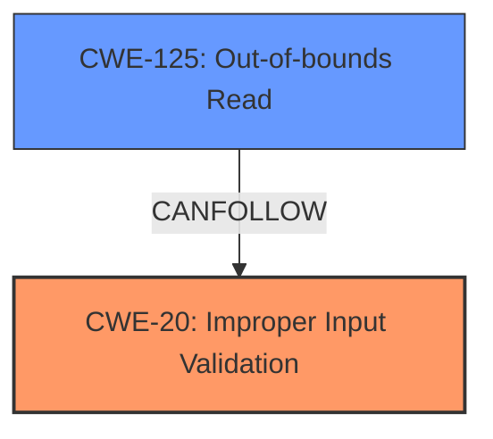

# Analysis Report for CVE-2024-9763

# Vulnerability Analysis Report: CVE-2024-9763

## Description

Tungsten Automation Power PDF PDF File Parsing **Out-Of-Bounds Read** **Information Disclosure Vulnerability**. This vulnerability allows remote attackers to disclose sensitive information on affected installations of Tungsten Automation Power PDF. User interaction is required to exploit this vulnerability in that the target must visit a malicious page or open a malicious file. The specific flaw exists within the parsing of PDF files. The issue results from the **lack of proper validation of user-supplied data**, which can result in a read past the end of an allocated object. An attacker can leverage this in conjunction with other vulnerabilities to execute arbitrary code in the context of the current process. Was ZDI-CAN-24479.

## Vulnerability Description Key Phrases

- **Rootcause:** lack of proper validation of user-supplied data
- **Weakness:** ['Information Disclosure Vulnerability', 'Out-Of-Bounds Read']
- **Impact:** ['Information Disclosure', 'disclose sensitive information', 'execute arbitrary code']
- **Vector:** malicious page or file
- **Attacker:** remote attackers
- **Product:** Tungsten Automation Power PDF
- **Component:** PDF file parsing

## Analysis (with Relationship Data)

# Summary

| CWE ID  | CWE Name                                                                     | Confidence | CWE Abstraction Level | CWE Vulnerability Mapping Label | CWE-Vulnerability Mapping Notes |
| :-------- | :--------------------------------------------------------------------------- | :---------- | :---------------------- | :------------------------------ | :------------------------------ |
| CWE-20  | Improper Input Validation                                                    | 0.9         | Class                   | Primary                         | Allowed                         |
| CWE-125 | Out-of-bounds Read                                                           | 0.8         | Base                    | Secondary                       | Allowed                         |

## Evidence and Confidence

*   **Confidence Score:** 0.85
*   **Evidence Strength:** HIGH

## Relationship Analysis

The primary weakness is **CWE-20 [Improper Input Validation]**, as the root cause is the **lack of proper validation of user-supplied data**. This leads to **CWE-125 [Out-of-bounds Read]** because the unvalidated data allows reading past the end of an allocated object. **CWE-20 [Improper Input Validation]** is a Class-level CWE, while **CWE-125 [Out-of-bounds Read]** is a Base-level CWE, providing a more specific description of the vulnerability's manifestation.



## Vulnerability Chain

The vulnerability chain starts with **CWE-20 [Improper Input Validation]** because the application **lacks proper validation of user-supplied data**. This leads to **CWE-125 [Out-of-bounds Read]**, allowing an attacker to read past the end of an allocated object, resulting in information disclosure.
  - **Root Cause:** **CWE-20 [Improper Input Validation]**
  - **Weakness:** **CWE-125 [Out-of-bounds Read]**
  - **Impact:** Information Disclosure, Potential Arbitrary Code Execution

## Summary of Analysis

The primary CWE is **CWE-20 [Improper Input Validation]** due to the **lack of proper validation of user-supplied data**. The secondary CWE is **CWE-125 [Out-of-bounds Read]** because the **lack of proper validation** leads to reading past the end of allocated memory. The description explicitly mentions the **lack of proper validation** as the root cause, making **CWE-20 [Improper Input Validation]** the most appropriate primary CWE. The vulnerability description explicitly states, "The issue results from the **lack of proper validation of user-supplied data**, which can result in a read past the end of an allocated object." This confirms that the **improper input validation** is the root cause, leading to the **out-of-bounds read**.

I considered CWE-787, CWE-1284, and CWE-122 but they don't accurately capture the initial **rootcause** **lack of proper validation**. They are possible consequences.

Relevant CWE Information:
- The description explicitly mentions "lack of proper validation of user-supplied data," which aligns directly with **CWE-20 [Improper Input Validation]**.
- The description also mentions "read past the end of an allocated object," which aligns with **CWE-125 [Out-of-bounds Read]**.


## CWE Relationship Analysis

Current CWEs represent these abstraction levels: .


### Vulnerability Chain Analysis

**Chain starting from CWE-1284:**
- 1284 (Improper Validation of Specified Quantity in Input) - ROOT


**Chain starting from CWE-125:**
- 125 (Out-of-bounds Read) - ROOT


### CWE Relationship Diagram

```mermaid
graph TD
    classDef primary fill:#f96,stroke:#333,stroke-width:2px
    classDef secondary fill:#69f,stroke:#333
    classDef tertiary fill:#9e9,stroke:#333
```


*Report generated on 2025-07-14 05:10:43*
