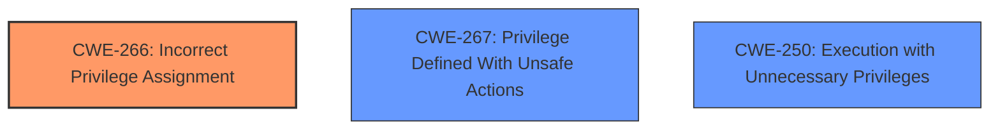

# Analysis Report for CVE-2024-9875

# Vulnerability Analysis Report: CVE-2024-9875

## Description

Okta Privileged Access server agent (SFTD) versions 1.82.0 to 1.84.0 are affected by a **privilege escalation vulnerability** when the sudo command bundles feature is enabled. To remediate this vulnerability, upgrade the Okta Privileged Access server agent (SFTD) to version 1.87.1 or greater.

## Vulnerability Description Key Phrases

- **Weakness:** privilege escalation vulnerability
- **Impact:** privilege escalation
- **Product:** Okta Privileged Access server agent (SFTD)
- **Version:** 1.82.0 to 1.84.0
- **Component:** sudo command bundles feature

## Analysis (with Relationship Data)

# Summary

| CWE ID | CWE Name | Confidence | CWE Abstraction Level | CWE Vulnerability Mapping Label | CWE-Vulnerability Mapping Notes |
|---|---|---|---|---|---|
| CWE-266 | Incorrect Privilege Assignment | 0.8 | Base | Primary CWE | Allowed |
| CWE-267 | Privilege Defined With Unsafe Actions | 0.6 | Base | Secondary Candidate | Allowed |
| CWE-250 | Execution with Unnecessary Privileges | 0.5 | Base | Secondary Candidate | Allowed |

## Evidence and Confidence

*   **Confidence Score:** 0.8
*   **Evidence Strength:** MEDIUM

## Relationship Analysis

The primary relationship influencing the decision is the privilege-related CWEs. CWE-266 (Incorrect Privilege Assignment) is chosen as the root cause. CWE-267 (Privilege Defined With Unsafe Actions) and CWE-250 (Execution with Unnecessary Privileges) are considered as potential related weaknesses. The abstraction levels are base, which is preferred.



## Vulnerability Chain

The vulnerability chain starts with an **Incorrect Privilege Assignment** (CWE-266), potentially leading to a situation where **Privileges are Defined With Unsafe Actions** (CWE-267) or the software is running with **Execution with Unnecessary Privileges** (CWE-250). The final impact is privilege escalation.

## Summary of Analysis

The initial analysis identified a **privilege escalation vulnerability** in the Okta Privileged Access server agent. The key phrase "privilege escalation vulnerability" indicates a problem with privilege management. The fix involved upgrading the Okta Privileged Access server agent, suggesting that the older version had a flaw. The CVE Reference Links Content Summary mentions a malformed configuration file in the `sft-gatewayd.sample.yaml` file.

Based on the evidence and the MITRE guidance on privileges vs. permissions, CWE-266 (Incorrect Privilege Assignment) is the most appropriate primary CWE. The vulnerability description explicitly states "privilege escalation," which relates to the actor's identity level. The provided guidance suggests CWE-266 when a user is assigned the wrong role due to misconfiguration.

CWE-267 and CWE-250 are also considered as secondary candidates.

CWE-285 (Improper Authorization) and CWE-284 (Improper Access Control) were considered, but the description better aligns with a specific privilege assignment problem.

Relevant CWE Information:

# Enhanced Context (25 CWEs)
The following CWEs were identified as potentially relevant to this vulnerability:

## CWE-266: Incorrect Privilege Assignment
**Abstraction Level**: Base
**Similarity Score**: 0.79
**Source**: dense

**Description**:
A product incorrectly assigns a privilege to a particular actor, creating an unintended sphere of control for that actor.

**Mapping Guidance**:
- Usage: Allowed
- Rationale: This CWE entry is at the Base level of abstraction, which is a preferred level of abstraction for mapping to the root causes of vulnerabilities.

## CWE-267: Privilege Defined With Unsafe Actions
**Abstraction Level**: Base
**Similarity Score**: 0.79
**Source**: dense

**Description**:
A particular privilege, role, capability, or right can be used to perform unsafe actions that were not intended, even when it is assigned to the correct entity.

**Mapping Guidance**:
- Usage: Allowed
- Rationale: This CWE entry is at the Base level of abstraction, which is a preferred level of abstraction for mapping to the root causes of vulnerabilities.

## CWE-250: Execution with Unnecessary Privileges
**Abstraction Level**: Base
**Similarity Score**: 0.79
**Source**: dense

**Description**:
The product executes code with unnecessary privileges, which are not required to perform the intended functionality.

**Mapping Guidance**:
- Usage: Allowed
- Rationale: This CWE entry is at the Base level of abstraction, which is a preferred level of abstraction for mapping to the root causes of vulnerabilities.

# Complete CWE Specifications

CWE-269: Improper Privilege Management
CWE-732: Incorrect Permission Assignment for Critical Resource
CWE-250: Execution with Unnecessary Privileges
CWE-267: Privilege Defined With Unsafe Actions
CWE-284: Improper Access Control
CWE-287: Improper Authentication
CWE-59: Improper Link Resolution Before File Access ('Link Following')
CWE-367: Time-of-check Time-of-use (TOCTOU) Race Condition
CWE-285: Improper Authorization

Specifically:

**CWE-266: Incorrect Privilege Assignment:** This CWE describes a scenario where a product incorrectly assigns a privilege to an actor, creating an unintended sphere of control. The vulnerability description states that the issue is a privilege escalation vulnerability, which can result from an incorrect privilege assignment. The MITRE guidance suggests this CWE when a user is assigned the wrong role due to misconfiguration.

**CWE-267: Privilege Defined With Unsafe Actions:** This CWE addresses situations where a privilege can be used to perform unsafe actions. While not the primary issue, it's possible that the assigned privileges in this case allowed for unsafe actions, making it a secondary concern.

**CWE-250: Execution with Unnecessary Privileges:** While not explicitly stated, the privilege escalation could also be occurring because the application runs with higher privileges than necessary, which is described by CWE-250.


## CWE Relationship Analysis

Current CWEs represent these abstraction levels: .


### Vulnerability Chain Analysis

**Chain starting from CWE-732:**
- 732 (Incorrect Permission Assignment for Critical Resource) - ROOT


**Chain starting from CWE-59:**
- 59 (Improper Link Resolution Before File Access ('Link Following')) - ROOT


### CWE Relationship Diagram

```mermaid
graph TD
    classDef primary fill:#f96,stroke:#333,stroke-width:2px
    classDef secondary fill:#69f,stroke:#333
    classDef tertiary fill:#9e9,stroke:#333
```


*Report generated on 2025-07-14 05:15:34*
