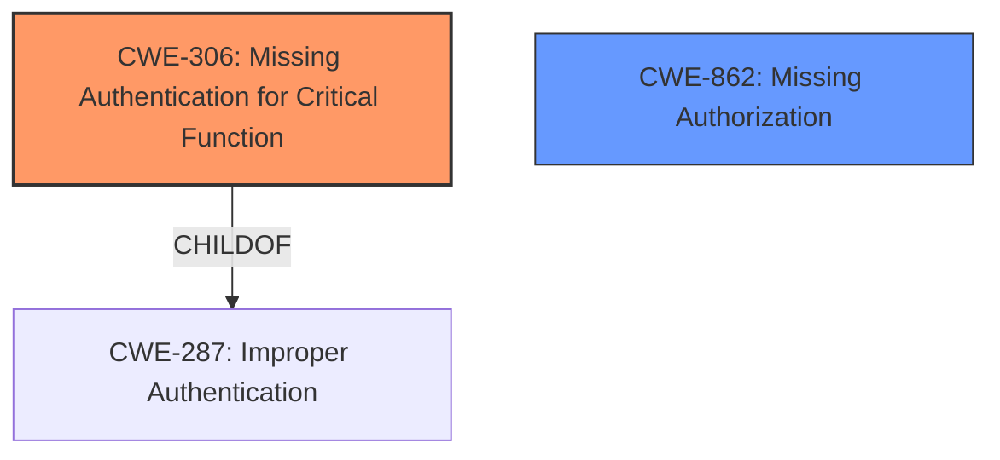

# Raw Analyzer Response for CVE-2024-9919

# Summary
| CWE ID | CWE Name | Confidence | CWE Abstraction Level | CWE Vulnerability Mapping Label | CWE-Vulnerability Mapping Notes |
|---|---|---|---|---|---|
| CWE-306 | Missing Authentication for Critical Function | 1.0 | Base | Primary | Allowed |
| CWE-862 | Missing Authorization | 0.7 | Class | Secondary | Allowed-with-Review |

## Evidence and Confidence

*   **Confidence Score:** 0.9
*   **Evidence Strength:** HIGH

## Relationship Analysis
The primary relationship that influenced my decision was the parent-child relationship between CWE-287 (Improper Authentication) and CWE-306 (Missing Authentication for Critical Function). Since the vulnerability description explicitly states a **missing authentication check**, CWE-306 is a more specific and accurate representation of the weakness than its parent. The secondary candidate, CWE-862 (Missing Authorization), was considered, as authorization issues often arise when authentication is absent. However, the root cause is clearly the **missing authentication check**, making CWE-306 the primary weakness.

## Vulnerability Chain
The vulnerability chain starts with the **missing authentication check** (CWE-306) on the uninstall endpoint. This **missing authentication** allows an attacker to bypass security controls and delete directories without proper authorization. The authorization check (CWE-862) would normally prevent unauthorized users from performing this action, but because authentication is missing, the authorization check is never reached. The final impact is unauthorized directory deletion.

## Summary of Analysis
My assessment is strongly based on the provided evidence, particularly the phrase "**missing authentication check**" in the vulnerability description. This directly aligns with the definition of CWE-306 (Missing Authentication for Critical Function). The retriever results also support this classification, with CWE-306 being the top result. While other CWEs related to authorization were considered, the explicit mention of a **missing authentication check** makes CWE-306 the most accurate and specific representation of the vulnerability's root cause. The decision to select CWE-306 is at the optimal level of specificity, as it directly addresses the **missing authentication** issue identified in the vulnerability description.

Relevant CWE Information:

# Enhanced Context (25 CWEs)
The following CWEs were identified as potentially relevant to this vulnerability:

## CWE-306: Missing Authentication for Critical Function
**Abstraction Level**: Base
**Similarity Score**: 0.253
**Source**: sparse

**Description**:
The product does not perform any authentication for functionality that requires a provable user identity or consumes a significant amount of resources.

**Mapping Guidance**:
- Usage: Allowed
- Rationale: This CWE entry is at the Base level of abstraction, which is a preferred level of abstraction for mapping to the root causes of vulnerabilities.

## CWE-862: Missing Authorization
**Abstraction Level**: Class
**Similarity Score**: 0.249
**Source**: sparse

**Description**:
The product does not perform an authorization check when an actor attempts to access a resource or perform an action.

**Mapping Guidance**:
- Usage: Allowed-with-Review
- Rationale: This CWE entry is a Class and might have Base-level children that would be more appropriate

## CWE-306: Missing Authentication for Critical Function
**Abstraction Level**: base
**Similarity Score**: 2.47
**Source**: graph

**Description**:
CWE-306: Missing Authentication for Critical Function

**Mapping Guidance**:
- Usage: Allowed
- Rationale: This CWE entry is at the Base level of abstraction, which is a preferred level of abstraction for mapping to the root causes of vulnerabilities.

**Relationships**:
- PARENTOF -> CWE-322
- PARENTOF -> CWE-288
- CHILDOF -> CWE-287
- CHILDOF -> CWE-287
- CHILDOF -> CWE-306

## Complete CWE Specifications

CWE-306: Missing Authentication for Critical Function

CWE-862: Missing Authorization