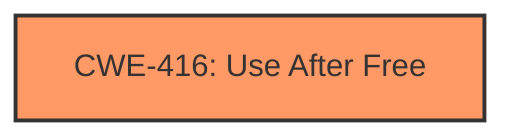

# Raw Analyzer Response for CVE-2024-9954

# Summary
| CWE ID  | CWE Name  | Confidence | CWE Abstraction Level | CWE Vulnerability Mapping Label | CWE-Vulnerability Mapping Notes |
|---|---|---|---|---|---|
| CWE-416 | Use After Free | 1.0 | Variant | Allowed | Primary CWE. Matches the vulnerability description's **rootcause**. |

## Evidence and Confidence

*   **Confidence Score:** 1.0
*   **Evidence Strength:** HIGH

## Relationship Analysis
The primary relationship considered was the direct match of CWE-416 to the stated root cause in the vulnerability description. The retriever results also strongly suggested CWE-416.



## Vulnerability Chain
The vulnerability chain is straightforward: a **use after free** (CWE-416) condition leads to heap corruption and the potential for arbitrary code execution.

## Summary of Analysis
The vulnerability description clearly states that the **rootcause** is a **use after free** in the AI component of Google Chrome. This directly corresponds to CWE-416. The CVE Reference Links Content Summary also confirms **use after free** as a weakness. The retriever results strongly support CWE-416 as the primary candidate.

Relevant CWE Information:

# Enhanced Context (25 CWEs)
The following CWEs were identified as potentially relevant to this vulnerability:

## CWE-416: Use After Free
**Abstraction Level**: Variant
**Similarity Score**: 0.78
**Source**: dense

**Description**:
The product reuses or references memory after it has been freed. At some point afterward, the memory may be allocated again and saved in another pointer, while the original pointer references a location somewhere within the new allocation. Any operations using the original pointer are no longer valid because the memory "belongs" to the code that operates on the new pointer.

**Mapping Guidance**:
- Usage: Allowed
- Rationale: This CWE entry is at the Variant level of abstraction, which is a preferred level of abstraction for mapping to the root causes of vulnerabilities.

## Vulnerability Description
Use after free in AI in Google Chrome prior to 130.0.6723.58 allowed a remote attacker to potentially exploit heap corruption via a crafted HTML page. (Chromium security severity High)

### Vulnerability Description Key Phrases
- **rootcause:** **use after free**
- **impact:** potentially exploit heap corruption
- **vector:** crafted HTML page
- **attacker:** remote attacker
- **product:** Google Chrome
- **version:** prior to 130.0.6723.58
- **component:** AI

### CWE for similar CVE Descriptions
### Primary CWE Match
CWE-416

#### Top CWEs
- CWE-416 (Count: 766)
- CWE-362 (Count: 14)
- CWE-787 (Count: 7)

## CVE Reference Links Content Summary
```
{
  "vulnerability_details": {
    "root_cause": "Use after free",
    "weaknesses": [
      "Use after free"
    ],
    "impact": "Memory corruption, potential for arbitrary code execution.",
    "attack_vectors": "Likely involves specific AI-related functionality in Chrome.",
     "required_capabilities": "Requires ability to trigger the vulnerable code path in AI functionality."
  }
}
```
The other CWEs listed in the retriever results, such as CWE-366 (Race Condition within a Thread), CWE-843 (Access of Resource Using Incompatible Type ('Type Confusion')), CWE-415 (Double Free), and CWE-787 (Out-of-bounds Write) are not directly supported by the provided evidence. While heap corruption is mentioned as a potential impact, the **rootcause** is explicitly a **use after free**.