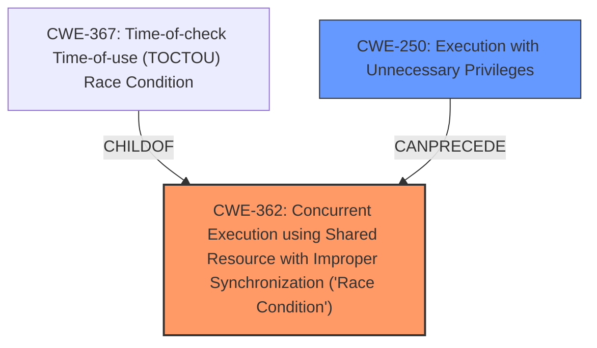

# Analysis Report for CVE-2025-0120

# Vulnerability Analysis Report: CVE-2025-0120

## Description

A vulnerability with a privilege management mechanism in the Palo Alto Networks GlobalProtect app on Windows devices allows a locally authenticated non-administrative Windows user to escalate their privileges to NT AUTHORITY\\SYSTEM. However, execution requires that the local user can also successfully exploit a **race condition**, which makes this vulnerability difficult to exploit.

## Vulnerability Description Key Phrases

- **Component:** privilege management mechanism
- **Weakness:** race condition
- **Product:** Palo Alto Networks GlobalProtect app
- **Impact:** escalate their privileges to NT AUTHORITY\SYSTEM, privilege escalation
- **Attacker:** locally authenticated non-administrative Windows user

## Analysis (with Relationship Data)

# Summary

| CWE ID  | CWE Name                                                                                           | Confidence | CWE Abstraction Level | CWE Vulnerability Mapping Label | CWE-Vulnerability Mapping Notes |
| :-------- | :--------------------------------------------------------------------------------------------------- | :--------- | :---------------------- | :------------------------------ | :-------------------------------- |
| CWE-362   | Concurrent Execution using Shared Resource with Improper Synchronization ('**Race Condition**')           | 0.9        | Class                   | Primary                         | Allowed-with-Review                |
| CWE-250   | Execution with Unnecessary Privileges                                                              | 0.7        | Base                    | Secondary                       | Allowed                           |

## Evidence and Confidence

*   **Confidence Score:** 0.8
*   **Evidence Strength:** MEDIUM

## Relationship Analysis

The primary CWE is CWE-362, which is a Class-level CWE describing **race conditions**. The vulnerability description explicitly mentions a **race condition**, making this a strong candidate. CWE-362 is related to CWE-367 (Time-of-check Time-of-use), a more specific type of **race condition**, but the description lacks the detail needed to confirm TOCTOU. CWE-250 (Execution with Unnecessary Privileges) is a base-level CWE and is also related, as the **privilege escalation** is happening due to a service running with elevated privileges and a **race condition** exists.



## Vulnerability Chain

The vulnerability chain involves a privilege management mechanism running with elevated privileges (CWE-250), coupled with a **race condition** (CWE-362) that allows a local user to escalate to NT AUTHORITY\SYSTEM.

1.  CWE-250: Execution with Unnecessary Privileges (Privilege management runs with SYSTEM privileges)
2.  CWE-362: Concurrent Execution using Shared Resource with Improper Synchronization ('**Race Condition**') (Local user exploits the **race condition**)
3.  Impact: Privilege escalation to NT AUTHORITY\SYSTEM

## Summary of Analysis

The primary weakness is the **race condition**, which is explicitly mentioned in the vulnerability description. The **privilege escalation** is the impact, and CWE-250 highlights that the process/service runs with unnecessary privileges which enables this impact.

The evidence for the **race condition** is direct from the vulnerability description: "However, execution requires that the local user can also successfully exploit a **race condition**."

CWE-362 is the best fit because it directly addresses the **race condition**. CWE-250 also fits based on the CVE reference which lists it as a weakness.

The selected CWEs are at the optimal level of specificity. While CWE-367 (TOCTOU) is a more specific type of **race condition**, there isn't enough information to confirm it.
# Enhanced Context (25 CWEs)
The following CWEs were identified as potentially relevant to this vulnerability:

## CWE-266: Incorrect Privilege Assignment
**Abstraction Level**: Base
**Similarity Score**: 0.79
**Source**: dense

**Description**:
A product incorrectly assigns a privilege to a particular actor, creating an unintended sphere of control for that actor.

**Mapping Guidance**:
- Usage: Allowed
- Rationale: This CWE entry is at the Base level of abstraction, which is a preferred level of abstraction for mapping to the root causes of vulnerabilities.

## CWE-267: Privilege Defined With Unsafe Actions
**Abstraction Level**: Base
**Similarity Score**: 0.79
**Source**: dense

**Description**:
A particular privilege, role, capability, or right can be used to perform unsafe actions that were not intended, even when it is assigned to the correct entity.

**Mapping Guidance**:
- Usage: Allowed
- Rationale: This CWE entry is at the Base level of abstraction, which is a preferred level of abstraction for mapping to the root causes of vulnerabilities.

## CWE-59: Improper Link Resolution Before File Access ('Link Following')
**Abstraction Level**: Base
**Similarity Score**: 0.78
**Source**: dense

**Description**:
The product attempts to access a file based on the filename, but it does not properly prevent that filename from identifying a link or shortcut that resolves to an unintended resource.

**Mapping Guidance**:
- Usage: Allowed
- Rationale: This CWE entry is at the Base level of abstraction, which is a preferred level of abstraction for mapping to the root causes of vulnerabilities.

## CWE-668: Exposure of Resource to Wrong Sphere
**Abstraction Level**: Class
**Similarity Score**: 0.77
**Source**: dense

**Description**:
The product exposes a resource to the wrong control sphere, providing unintended actors with inappropriate access to the resource.

**Mapping Guidance**:
- Usage: Discouraged
- Rationale: CWE-668 is high-level and is often misused as a catch-all when lower-level CWE IDs might be applicable. It is sometimes used for low-information vulnerability reports [REF-1287]. It is a level-1 Class (i.e., a child of a Pillar). It is not useful for trend analysis.

## CWE-41: Improper Resolution of Path Equivalence
**Abstraction Level**: Base
**Similarity Score**: 0.77
**Source**: dense

**Description**:
The product is vulnerable to file system contents disclosure through path equivalence. Path equivalence involves the use of special characters in file and directory names. The associated manipulations are intended to generate multiple names for the same object.

**Mapping Guidance**:
- Usage: Allowed
- Rationale: This CWE entry is at the Base level of abstraction, which is a preferred level of abstraction for mapping to the root causes of vulnerabilities.

## CWE-274: Improper Handling of Insufficient Privileges
**Abstraction Level**: Base
**Similarity Score**: 0.77
**Source**: dense

**Description**:
The product does not handle or incorrectly handles when it has insufficient privileges to perform an operation, leading to resultant weaknesses.

**Mapping Guidance**:
- Usage: Discouraged
- Rationale: This CWE entry could be deprecated in a future version of CWE.

## CWE-667: Improper Locking
**Abstraction Level**: Class
**Similarity Score**: 0.76
**Source**: dense

**Description**:
The product does not properly acquire or release a lock on a resource, leading to unexpected resource state changes and behaviors.

**Mapping Guidance**:
- Usage: Allowed-with-Review
- Rationale: This CWE entry is a Class and might have Base-level children that would be more appropriate

## CWE-280: Improper Handling of Insufficient Permissions or Privileges
**Abstraction Level**: Base
**Similarity Score**: 0.76
**Source**: dense

**Description**:
The product does not handle or incorrectly handles when it has insufficient privileges to access resources or functionality as specified by their permissions. This may cause it to follow unexpected code paths that may leave the product in an invalid state.

**Mapping Guidance**:
- Usage: Allowed
- Rationale: This CWE entry is at the Base level of abstraction, which is a preferred level of abstraction for mapping to the root causes of vulnerabilities.

## CWE-754: Improper Check for Unusual or Exceptional Conditions
**Abstraction Level**: Class
**Similarity Score**: 0.76
**Source**: dense

**Description**:
The product does not check or incorrectly checks for unusual or exceptional conditions that are not expected to occur frequently during day to day operation of the product.

**Mapping Guidance**:
- Usage: Allowed-with-Review
- Rationale: This CWE entry is a Class and might have Base-level children that would be more appropriate

## CWE-497: Exposure of Sensitive System Information to an Unauthorized Control Sphere
**Abstraction Level**: Base
**Similarity Score**: 0.76
**Source**: dense

**Description**:
The product does not properly prevent sensitive system-level information from being accessed by unauthorized actors who do not have the same level of access to the underlying system as the product does.

**Mapping Guidance**:
- Usage: Allowed
- Rationale: This CWE entry is at the Base level of abstraction, which is a preferred level of abstraction for mapping to the root causes of vulnerabilities.

## CWE-367: Time-of-check Time-of-use (TOCTOU) Race Condition
**Abstraction Level**: Base
**Similarity Score**: 2161.63
**Source**: sparse

**Description**:
The product checks the state of a resource before using that resource, but the resource'


## CWE Relationship Analysis

Current CWEs represent these abstraction levels: .


### Vulnerability Chain Analysis

**Chain starting from CWE-274:**
- 274 (Improper Handling of Insufficient Privileges) - ROOT


**Chain starting from CWE-280:**
- 280 (Improper Handling of Insufficient Permissions or Privileges ) - ROOT


### CWE Relationship Diagram

```mermaid
graph TD
    classDef primary fill:#f96,stroke:#333,stroke-width:2px
    classDef secondary fill:#69f,stroke:#333
    classDef tertiary fill:#9e9,stroke:#333
```


*Report generated on 2025-07-14 05:23:06*
