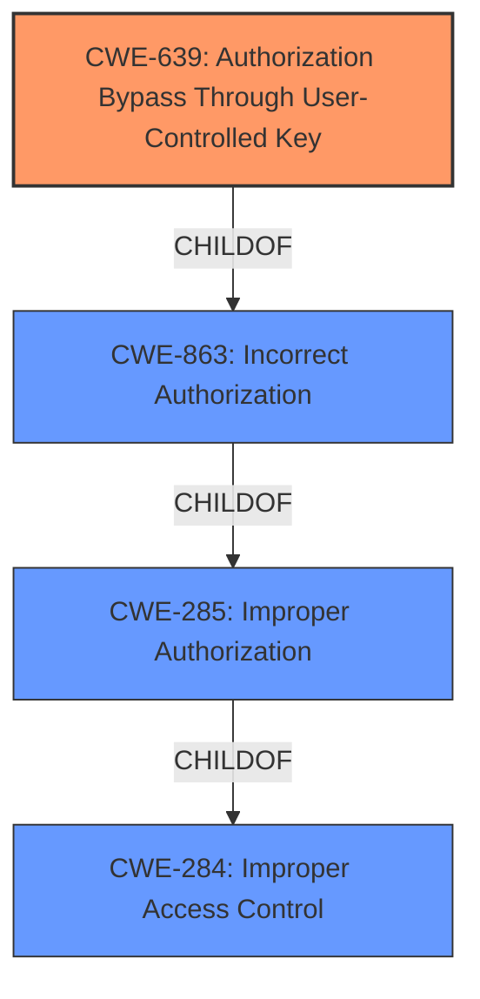

# Analysis for CVE-2025-0217

# Summary
| CWE ID | CWE Name | Confidence | CWE Abstraction Level | CWE Vulnerability Mapping Label | CWE-Vulnerability Mapping Notes |
|---|---|---|---|---|---|
| CWE-639 | Authorization Bypass Through User-Controlled Key | 0.75 | Base | Allowed | Primary CWE. The authorization is bypassed when a local authenticated attacker views the connection details of a ShellJump session using external tools. |
| CWE-284 | Improper Access Control | 0.5 | Pillar | Discouraged | Secondary Candidate. Because the root cause is authorization bypass, and because a more specific CWE is available, this general CWE is not the best choice. |

## Evidence and Confidence

*   **Confidence Score:** 0.70
*   **Evidence Strength:** MEDIUM

## Relationship Analysis
The primary relationship that influenced the decision was the hierarchical structure with CWE-639 being a more specific form of access control issue than the higher level CWE-284. There are also other authorization related CWEs to consider.

## Vulnerability Chain
The vulnerability chain involves a **WEAKNESS** in the authorization mechanism, allowing an attacker to bypass intended restrictions and gain unauthorized access to sensitive information.
  - The root cause is the authorization bypass through a user-controlled key.
  - The impact is unauthorized access to connection details of a ShellJump session.

## Summary of Analysis
The analysis focused on identifying the root cause of the vulnerability, which is the authorization bypass. The description explicitly mentions that a local authenticated attacker can view connection details of a ShellJump session that was initiated with external tools. This indicates that the attacker is bypassing authorization checks to access sensitive information.

The selection of CWE-639 is based on the following:
  - The vulnerability involves an authorization bypass, aligning with the core concept of CWE-639.
  - The attacker is using external tools to view connection details, suggesting a manipulation of the key value identifying the data.
  - CWE-639 is a Base level CWE, providing a specific and accurate representation of the weakness.

The retriever results also support the selection of authorization-related CWEs, such as CWE-863 and CWE-285, but CWE-639 is a more precise match for the vulnerability description.

The decision is based on the evidence that the authorization mechanism is being bypassed to access sensitive information. The description states: "A local authenticated attacker can view the connection details of a ShellJump session that was initiated with external tools, allowing unauthorized access to connected sessions." This clearly indicates that the attacker is circumventing the intended authorization controls. The abstraction level of CWE-639 (Base) is optimal because it provides a specific representation of the authorization bypass.

I considered other CWEs like CWE-284, CWE-863, CWE-285, and CWE-306, but they were not as fitting as CWE-639:
  - CWE-284 (Improper Access Control) is too general and doesn't capture the specific nature of the authorization bypass.
  - CWE-863 (Incorrect Authorization) and CWE-285 (Improper Authorization) are related to authorization issues, but they don't specifically address the manipulation of key values to bypass authorization.
  - CWE-306 (Missing Authentication for Critical Function) is not applicable because the attacker is authenticated.
  - CWE-532 (Insertion of Sensitive Information into Log File) is not relevant as the vulnerability is not about logging sensitive information.
  - CWE-287 (Improper Authentication) is not relevant as the attacker is authenticated.

Relevant CWE Information:

## CWE-639: Authorization Bypass Through User-Controlled Key
**Abstraction Level**: Base
**Similarity Score**: 1183.42
**Source**: sparse

**Description**:
The system's authorization functionality does not prevent one user from gaining access to another user's data or record by modifying the key value identifying the data.

**Mapping Guidance**:
- Usage: Allowed
- Rationale: This CWE entry is at the Base level of abstraction, which is a preferred level of abstraction for mapping to the root causes of vulnerabilities.