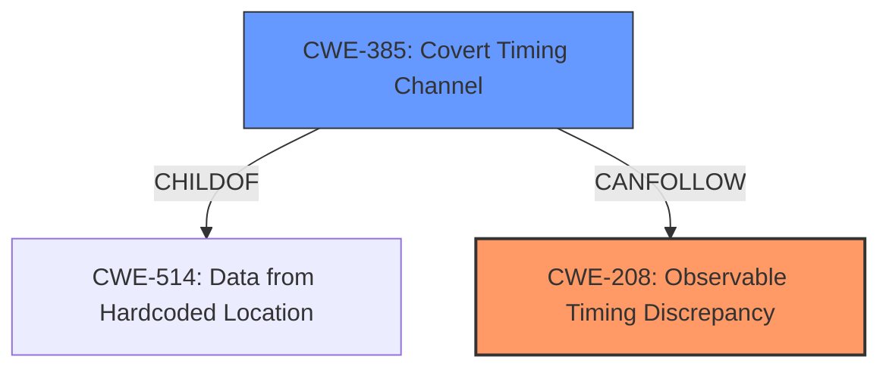

# Analysis Report for CVE-2025-0306

# Vulnerability Analysis Report: CVE-2025-0306

## Description

A vulnerability was found in Ruby. The Ruby interpreter is vulnerable to the **Marvin Attack**. This attack allows the attacker to decrypt previously encrypted messages or forge signatures by exchanging a large number of messages with the vulnerable service.

## Vulnerability Description Key Phrases

- **Weakness:** Marvin Attack
- **Product:** Ruby interpreter
- **Impact:** decrypt previously encrypted messages, forge signatures
- **Attacker:** attacker

## Analysis (with Relationship Data)

# Summary
| CWE ID | CWE Name | Confidence | CWE Abstraction Level | CWE Vulnerability Mapping Label | CWE-Vulnerability Mapping Notes |
|---|---|---|---|---|---|
| CWE-208 | Observable Timing Discrepancy | 0.9 | Base | Allowed | Primary CWE. The vulnerability stems from timing variations during cryptographic operations that an attacker can observe to decrypt messages or forge signatures. |
| CWE-385 | Covert Timing Channel | 0.7 | Base | Allowed | Secondary CWE. This complements the primary CWE by specifying the mechanism that enables the timing-based attack, where timing differences act as a covert channel for information leakage. |

## Evidence and Confidence

*   **Confidence Score:** 0.8
*   **Evidence Strength:** MEDIUM

## Relationship Analysis
The primary CWE is CWE-208 Observable Timing Discrepancy, which is a base-level CWE describing vulnerabilities where variations in operation timing reveal sensitive information. CWE-385 Covert Timing Channel is a related CWE that describes how timing differences act as a covert channel. CWE-385 is a child of CWE-514 and can follow CWE-208.
The relationship between these CWEs suggests a scenario where an observable timing discrepancy (CWE-208) is exploited through a covert timing channel (CWE-385), allowing attackers to gain unauthorized information.



## Vulnerability Chain
The vulnerability chain starts with the **Marvin Attack** on the Ruby interpreter, which exploits timing discrepancies in cryptographic operations. This allows attackers to decrypt messages and forge signatures.
1.  **Root Cause:** CWE-208 Observable Timing Discrepancy: The timing differences in cryptographic operations are observable.
2.  CWE-385 Covert Timing Channel: These timing differences act as a covert channel, leaking information.
3.  **Impact:** Decryption of messages and forging of signatures.

## Summary of Analysis
The initial analysis considered several CWEs, including those related to cryptographic weaknesses and authentication bypass. However, the core of the vulnerability lies in the observable timing discrepancies during cryptographic operations, making CWE-208 the most appropriate primary CWE. The relationship analysis further supports the inclusion of CWE-385 as a secondary CWE, as it explains how the timing discrepancies are exploited as a covert channel.

The evidence supporting this assessment comes directly from the vulnerability description, which states that the Ruby interpreter is vulnerable to the **Marvin Attack**, allowing decryption and signature forgery by exchanging messages with the service. The CVE reference summary details that the attacker can measure the time of calls to `RSA::private_decrypt()` or `PKey::decrypt()` and the error handling of those methods. This confirms the presence of observable timing discrepancies.

The selection of CWE-208 and CWE-385 is at the optimal level of specificity, as they accurately represent the root cause and mechanism of the vulnerability. Other CWEs, such as those related to broken cryptographic algorithms or weak hashes, are less relevant because the primary issue is not the algorithm itself but the timing variations during its execution.

Relevant CWE Information:

# Enhanced Context (25 CWEs)
The following CWEs were identified as potentially relevant to this vulnerability:

## CWE-208: Observable Timing Discrepancy
**Abstraction Level**: Base
**Similarity Score**: 0.73
**Source**: dense

**Description**:
Two separate operations in a product require different amounts of time to complete, in a way that is observable to an actor and reveals security-relevant information about the state of the product, such as whether a particular operation was successful or not.

**Mapping Guidance**:
- Usage: Allowed
- Rationale: This CWE entry is at the Base level of abstraction, which is a preferred level of abstraction for mapping to the root causes of vulnerabilities.


## CWE-918: Server-Side Request Forgery (SSRF)
**Abstraction Level**: Base
**Similarity Score**: 0.72
**Source**: dense

**Description**:
The web server receives a URL or similar request from an upstream component and retrieves the contents of this URL, but it does not sufficiently ensure that the request is being sent to the expected destination.

**Mapping Guidance**:
- Usage: Allowed
- Rationale: This CWE entry is at the Base level of abstraction, which is a preferred level of abstraction for mapping to the root causes of vulnerabilities.


## CWE-1286: Improper Validation of Syntactic Correctness of Input
**Abstraction Level**: Base
**Similarity Score**: 0.72
**Source**: dense

**Description**:
The product receives input that is expected to be well-formed - i.e., to comply with a certain syntax - but it does not validate or incorrectly validates that the input complies with the syntax.

**Mapping Guidance**:
- Usage: Allowed
- Rationale: This CWE entry is at the Base level of abstraction, which is a preferred level of abstraction for mapping to the root causes of vulnerabilities.


## CWE-1391: Use of Weak Credentials
**Abstraction Level**: Class
**Similarity Score**: 0.71
**Source**: dense

**Description**:
The product uses weak credentials (such as a default key or hard-coded password) that can be calculated, derived, reused, or guessed by an attacker.

**Mapping Guidance**:
- Usage: Allowed-with-Review
- Rationale: This CWE entry is a Class and might have Base-level children that would be more appropriate


## CWE-204: Observable Response Discrepancy
**Abstraction Level**: Base
**Similarity Score**: 0.71
**Source**: dense

**Description**:
The product provides different responses to incoming requests in a way that reveals internal state information to an unauthorized actor outside of the intended control sphere.

**Mapping Guidance**:
- Usage: Allowed
- Rationale: This CWE entry is at the Base level of abstraction, which is a preferred level of abstraction for mapping to the root causes of vulnerabilities.


## CWE-328: Use of Weak Hash
**Abstraction Level**: Base
**Similarity Score**: 0.71
**Source**: dense

**Description**:
The product uses an algorithm that produces a digest (output value) that does not meet security expectations for a hash function that allows an adversary to reasonably determine the original input (preimage attack), find another input that can produce the same hash (2nd preimage attack), or find multiple inputs that evaluate to the same hash (birthday attack).

**Mapping Guidance**:
- Usage: Allowed
- Rationale: This CWE entry is at the Base level of abstraction, which is a preferred level of abstraction for mapping to the root causes of vulnerabilities.


## CWE-203: Observable Discrepancy
**Abstraction Level**: Base
**Similarity Score**: 0.71
**Source**: dense

**Description**:
The product behaves differently or sends different responses under different circumstances in a way that is observable to an unauthorized actor, which exposes security-relevant information about the state of the product, such as whether a particular operation was successful or not.

**Mapping Guidance**:
- Usage: Allowed
- Rationale: This CWE entry is at the Base level of abstraction, which is a preferred level of abstraction for mapping to the root causes of vulnerabilities.


## CWE-330: Use of Insufficiently Random Values
**Abstraction Level**: Class
**Similarity Score**: 0.70
**Source**: dense

**Description**:
The product uses insufficiently random numbers or values in a security context that depends on unpredictable numbers.

**Mapping Guidance**:
- Usage: Discouraged
- Rationale: This CWE entry is a level-1 Class (i.e., a child of a Pillar). It might have lower-level children that would be more appropriate


## CWE-319: Cleartext Transmission of Sensitive Information
**Abstraction Level**: Base
**Similarity Score**: 0.70
**Source**: dense

**Description**:
The product transmits sensitive or security-critical data in cleartext in a communication channel that can be sniffed by unauthorized actors.

**Mapping Guidance**:
- Usage: Allowed
- Rationale: This CWE entry is at the Base level of abstraction, which is a preferred level of abstraction for mapping to the root causes of vulnerabilities.


## CWE-294: Authentication Bypass by Capture-replay
**Abstraction Level**: Base
**Similarity Score**: 0.70
**Source**: dense

**Description**:
A capture-replay flaw exists when the design of the product makes it possible for a malicious user to sniff network traffic and bypass authentication by replaying it to the server in question to the same effect as the original message (or with minor changes).

**Mapping Guidance**:
- Usage: Allowed
- Rationale: This CWE entry is at the Base level of abstraction, which is a preferred


## CWE Relationship Analysis

Current CWEs represent these abstraction levels: .


### Vulnerability Chain Analysis

**Chain starting from CWE-203:**
- 203 (Observable Discrepancy) - ROOT


**Chain starting from CWE-330:**
- 330 (Use of Insufficiently Random Values) - ROOT


### CWE Relationship Diagram

```mermaid
graph TD
    classDef primary fill:#f96,stroke:#333,stroke-width:2px
    classDef secondary fill:#69f,stroke:#333
    classDef tertiary fill:#9e9,stroke:#333
```


*Report generated on 2025-07-14 05:39:30*
