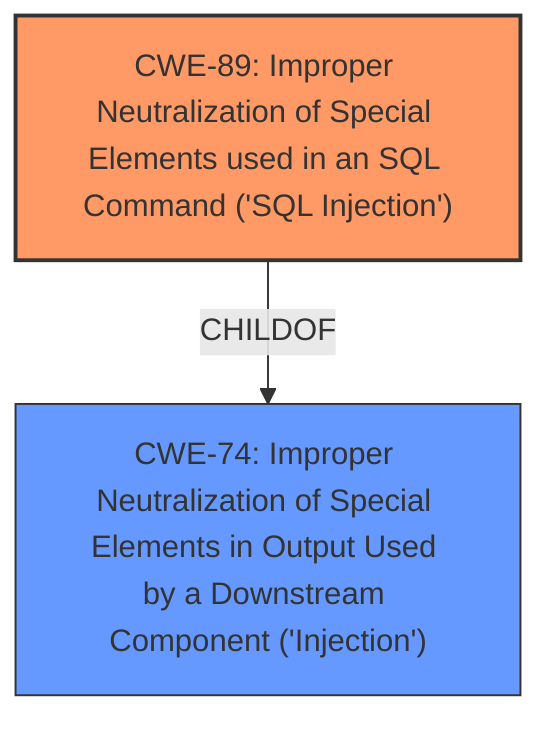

# Enhanced Analysis for CVE-2025-0308

# Summary
| CWE ID | CWE Name | Confidence | CWE Abstraction Level | CWE Vulnerability Mapping Label | CWE-Vulnerability Mapping Notes |
|---|---|---|---|---|---|
| CWE-89 | Improper Neutralization of Special Elements used in an SQL Command ('SQL Injection') | 1.0 | Base | Primary | Allowed |

## Evidence and Confidence

*   **Confidence Score:** 1.0
*   **Evidence Strength:** HIGH

## Relationship Analysis
The primary CWE is CWE-89, which is a base level CWE. The vulnerability description clearly indicates that the root cause is related to **insufficient escaping on the user supplied parameter and lack of sufficient preparation on the existing SQL query**, directly leading to the possibility of **time-based SQL Injection**. No child CWEs of CWE-89 are more specific for this case.



## Vulnerability Chain
The vulnerability chain starts with the **insufficient escaping on the user supplied parameter and lack of sufficient preparation on the existing SQL query** (CWE-89) which leads to **time-based SQL Injection**, allowing **unauthenticated attackers to append additional SQL queries** and **extract sensitive information from the database**.

## Summary of Analysis
The initial assessment strongly points towards CWE-89, given the explicit mention of **insufficient escaping** and the resulting **SQL Injection**. The vulnerability description clearly outlines how the **lack of proper neutralization** allows attackers to inject malicious SQL commands. The relationships of CWE-89 confirm that it is a child of the broader CWE-74 (Improper Neutralization of Special Elements in Output Used by a Downstream Component ('Injection')), but CWE-89 is more specific and appropriate. The final decision is based on the direct evidence provided in the vulnerability description and the supporting information from the CWE specifications. The selected CWE is at the optimal level of specificity, accurately representing the weakness.

Relevant CWE Information:

**CWE-89: Improper Neutralization of Special Elements used in an SQL Command ('SQL Injection')**
The product constructs all or part of an SQL command using externally-influenced input from an upstream component, but it does not neutralize or incorrectly neutralizes special elements that could modify the intended SQL command when it is sent to a downstream component. Without sufficient removal or quoting of SQL syntax in user-controllable inputs, the generated SQL query can cause those inputs to be interpreted as SQL instead of ordinary user data.


## CWE Relationship Analysis

Current CWEs represent these abstraction levels: .


### Vulnerability Chain Analysis

**Chain starting from CWE-89:**
- 89 (Improper Neutralization of Special Elements used in an SQL Command ('SQL Injection')) - ROOT


**Chain starting from CWE-74:**
- 74 (Improper Neutralization of Special Elements in Output Used by a Downstream Component ('Injection')) - ROOT


### CWE Relationship Diagram

```mermaid
graph TD
    classDef primary fill:#f96,stroke:#333,stroke-width:2px
    classDef secondary fill:#69f,stroke:#333
    classDef tertiary fill:#9e9,stroke:#333
```