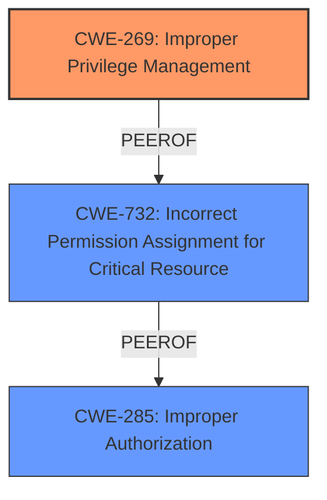

# Analysis Report for CVE-2025-0327

# Vulnerability Analysis Report: CVE-2025-0327

## Description

**CWE-269 Improper Privilege Management** vulnerability exists for two services (of which one managing audit trail data and the other acting as server managing client request) that could cause a loss of Confidentiality, Integrity and Availability of engineering workstation when an attacker with standard privilege modifies the executable path of the windows services. To be exploited, services need to be restarted.

## Vulnerability Description Key Phrases

- **Rootcause:** CWE-269 Improper Privilege Management
- **Impact:** Availability, Integrity, loss of Confidentiality
- **Attacker:** attacker with standard privilege

## Analysis (with Relationship Data)

# Summary
| CWE ID | CWE Name | Confidence | CWE Abstraction Level | CWE Vulnerability Mapping Label | CWE-Vulnerability Mapping Notes |
|---|---|---|---|---|---|
| CWE-269 | Improper Privilege Management | 1.0 | Class | Primary | Allowed |
| CWE-732 | Incorrect Permission Assignment for Critical Resource | 0.6 | Class | Secondary | Allowed-with-Review |
| CWE-285 | Improper Authorization | 0.5 | Class | Secondary | Discouraged |

## Evidence and Confidence

*   **Confidence Score:** 0.9
*   **Evidence Strength:** HIGH

## Relationship Analysis
The primary relationship that influenced the decision was the direct identification of **CWE-269 Improper Privilege Management** as the root cause in the vulnerability description and CVE summary. Other relationships, such as ChildOf, were considered within the context of access control and authorization, but **CWE-269** remained the most direct fit due to the explicit mention. We also considered **CWE-732 Incorrect Permission Assignment for Critical Resource** and **CWE-285 Improper Authorization** as they relate to permissions and authorization, but they were ultimately deemed less specific than **CWE-269** for this scenario. The Class abstraction level for **CWE-269** is appropriate given the general nature of the privilege management issue.



## Vulnerability Chain
The vulnerability chain starts with **CWE-269 Improper Privilege Management**, where the services are not correctly managing the privileges required to modify their executable paths. This leads to an attacker with standard privileges being able to modify these paths, resulting in a loss of Confidentiality, Integrity, and Availability.

**CWE-269** (Root Cause) -> Attacker Modifies Executable Path -> Loss of Confidentiality, Integrity, and Availability (Impact)

## Summary of Analysis
The initial assessment correctly identified **CWE-269 Improper Privilege Management** as the primary weakness based on the vulnerability description and CVE summary, which explicitly states "**CWE-269 Improper Privilege Management** vulnerability exists". This is strong evidence, leading to a high confidence score.

The graph relationships helped contextualize the vulnerability within the broader scope of access control issues. While **CWE-732 Incorrect Permission Assignment for Critical Resource** and **CWE-285 Improper Authorization** were considered, they were deemed less specific. **CWE-732** relates to incorrect permission assignments, but the core issue is the broader **improper management** of privileges, making **CWE-269** more appropriate. Similarly, **CWE-285** focuses on authorization checks, which is not the primary issue here.

The chosen CWEs are at the optimal level of specificity because they directly address the root cause and contributing factors. While a more specific CWE might exist, the available evidence does not support a more granular classification.

The analysis is heavily based on the provided evidence, particularly the explicit mention of **CWE-269** in the vulnerability description and CVE summary. This direct reference significantly increases confidence in the mapping.

Relevant CWE Information:

# Enhanced Context (25 CWEs)
The following CWEs were identified as potentially relevant to this vulnerability:

## CWE-266: Incorrect Privilege Assignment
**Abstraction Level**: Base
**Similarity Score**: 0.81
**Source**: dense

**Description**:
A product incorrectly assigns a privilege to a particular actor, creating an unintended sphere of control for that actor.

**Mapping Guidance**:
- Usage: Allowed
- Rationale: This CWE entry is at the Base level of abstraction, which is a preferred level of abstraction for mapping to the root causes of vulnerabilities.

*Not Used:* This CWE is more specific, and there is no evidence that any privilege assignment was incorrect. The issue is improper privilege management which may include incorrect assignments.

## CWE-274: Improper Handling of Insufficient Privileges
**Abstraction Level**: Base
**Similarity Score**: 0.80
**Source**: dense

**Description**:
The product does not handle or incorrectly handles when it has insufficient privileges to perform an operation, leading to resultant weaknesses.

**Mapping Guidance**:
- Usage: Discouraged
- Rationale: This CWE entry could be deprecated in a future version of CWE.

*Not Used:* This CWE is about insufficient privileges, and the vulnerability is about improper privilege management.

## CWE-280: Improper Handling of Insufficient Permissions or Privileges 
**Abstraction Level**: Base
**Similarity Score**: 0.80
**Source**: dense

**Description**:
The product does not handle or incorrectly handles when it has insufficient privileges to access resources or functionality as specified by their permissions. This may cause it to follow unexpected code paths that may leave the product in an invalid state.

**Mapping Guidance**:
- Usage: Allowed
- Rationale: This CWE entry is at the Base level of abstraction, which is a preferred level of abstraction for mapping to the root causes of vulnerabilities.

*Not Used:* Similar to CWE-274, this CWE is about insufficient privileges/permissions and is not the core issue.

## CWE-267: Privilege Defined With Unsafe Actions
**Abstraction Level**: Base
**Similarity Score**: 0.80
**Source**: dense

**Description**:
A particular privilege, role, capability, or right can be used to perform unsafe actions that were not intended, even when it is assigned to the correct entity.

**Mapping Guidance**:
- Usage: Allowed
- Rationale: This CWE entry is at the Base level of abstraction, which is a preferred level of abstraction for mapping to the root causes of vulnerabilities.

*Not Used:* There is no evidence that any privilege is defined with unsafe actions.

## CWE-668: Exposure of Resource to Wrong Sphere
**Abstraction Level**: Class
**Similarity Score**: 0.79
**Source**: dense

**Description**:
The product exposes a resource to the wrong control sphere, providing unintended actors with inappropriate access to the resource.

**Mapping Guidance**:
- Usage: Discouraged
- Rationale: CWE-668 is high-level and is often misused as a catch-all when lower-level CWE IDs might be applicable. It is sometimes used for low-information vulnerability reports [REF-1287]. It is a level-1 Class (i.e., a child of a Pillar). It is not useful for trend analysis.

*Not Used:* Too general and the improper privilege management describes the issue better.

## CWE-59: Improper Link Resolution Before File Access ('Link Following')
**Abstraction Level**: Base
**Similarity Score**: 0.77
**Source**: dense

**Description**:
The product attempts to access a file based on the filename, but it does not properly prevent that filename from identifying a link or shortcut that resolves to an unintended resource.

**Mapping Guidance**:
- Usage: Allowed
- Rationale: This CWE entry is at the Base level of abstraction, which is a preferred level of abstraction for mapping to the root causes of vulnerabilities.

*Not Used:* Not relevant to the vulnerability.

## CWE-269: Improper Privilege Management
**Abstraction Level**: Class
**Similarity Score**: 0.77
**Source**: dense

**Description**:
The product does not properly assign, modify, track, or check privileges for an actor, creating an unintended sphere of control for that actor.

**Mapping Guidance**:
- Usage: Discouraged
- Rationale: CWE-269 is commonly misused. It can be conflated with "privilege escalation," which is a technical impact that is listed in many low-information vulnerability reports [REF-1287]. It is not useful for trend analysis.

*Used:* This is the **Primary** CWE because the description and summary explicitly state it.

## CWE-276: Incorrect Default Permissions
**Abstraction Level**: Base
**Similarity Score**: 0.77
**Source**: dense

**Description**:
During installation, installed file permissions are set to allow anyone to modify those files.

**Mapping Guidance**:
- Usage: Allowed
- Rationale: This CWE entry is at the Base level of abstraction, which is a preferred level of abstraction for mapping to the root causes of vulnerabilities.

*Not Used:* The issue is improper privilege management of running services and not about file permissions during installation.

## CWE-73: External Control of File Name or Path
**Abstraction Level**: Base
**Similarity Score**: 0.77
**Source**: dense

**Description**:
The product allows user input to control or influence paths or file names that are used in filesystem operations.

**Mapping Guidance**:
- Usage: Allowed
- Rationale: This CWE entry is at


## CWE Relationship Analysis

Current CWEs represent these abstraction levels: .


### Vulnerability Chain Analysis

**Chain starting from CWE-274:**
- 274 (Improper Handling of Insufficient Privileges) - ROOT


**Chain starting from CWE-280:**
- 280 (Improper Handling of Insufficient Permissions or Privileges ) - ROOT


### CWE Relationship Diagram

```mermaid
graph TD
    classDef primary fill:#f96,stroke:#333,stroke-width:2px
    classDef secondary fill:#69f,stroke:#333
    classDef tertiary fill:#9e9,stroke:#333
```


*Report generated on 2025-07-14 05:40:43*
