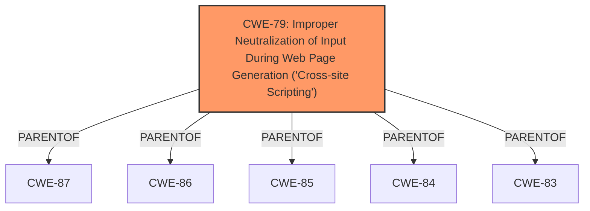

# Analysis for CVE-2025-0329

# Summary

| CWE ID | CWE Name | Confidence | CWE Abstraction Level | CWE Vulnerability Mapping Label | CWE-Vulnerability Mapping Notes |
|---|---|---|---|---|---|
| CWE-79 | Improper Neutralization of Input During Web Page Generation ('Cross-site Scripting') | 1.0 | Base | Allowed | Primary CWE |

## Evidence and Confidence

*   **Confidence Score:** 1.0
*   **Evidence Strength:** HIGH

## Relationship Analysis

The primary relationship that influenced the decision was the direct match of the vulnerability description to the definition and examples of CWE-79. While other CWEs such as CWE-116, CWE-863, and CWE-352 were considered, the root cause of the vulnerability (not sanitizing and escaping settings) leading directly to stored XSS strongly aligns with CWE-79.

## Vulnerability Chain

The vulnerability chain starts with the **failure to sanitize and escape settings**, leading directly to **Stored Cross-Site Scripting**.

1.  **Root Cause:** The AI ChatBot for WordPress WordPress plugin **does not sanitise and escape some of its settings**.
2.  **Weakness:** This leads to **Stored Cross-Site Scripting** (CWE-79).
3.  **Impact:** High privilege users such as admin can perform Stored Cross-Site Scripting attacks.

## Summary of Analysis

The analysis strongly indicates that the most appropriate CWE is CWE-79. The vulnerability description clearly states that the plugin **does not sanitise and escape some of its settings**, which directly results in Stored Cross-Site Scripting. The CVE reference confirms this, stating, "The plugin **does not sanitise and escape some of its settings**, allowing for XSS attacks."

The retriever results listed CWE-79 as a highly relevant CWE. The description of CWE-79, "The product does not neutralize or incorrectly neutralizes user-controllable input before it is placed in output that is used as a web page that is served to other users," aligns perfectly with the vulnerability.

The other CWEs were considered but deemed less relevant. CWE-116 (Improper Encoding or Escaping of Output) is a class-level CWE, and CWE-79 is a more specific base-level CWE. CWE-863 (Incorrect Authorization) and CWE-352 (Cross-Site Request Forgery (CSRF)) do not accurately describe the root cause of the vulnerability. The root cause is the **lack of sanitization and escaping of settings**, not an authorization issue or a CSRF vulnerability.

The selected CWE, CWE-79, is at the optimal level of specificity because it directly addresses the **root cause** of the vulnerability which is the **improper neutralization of input** leading to XSS.