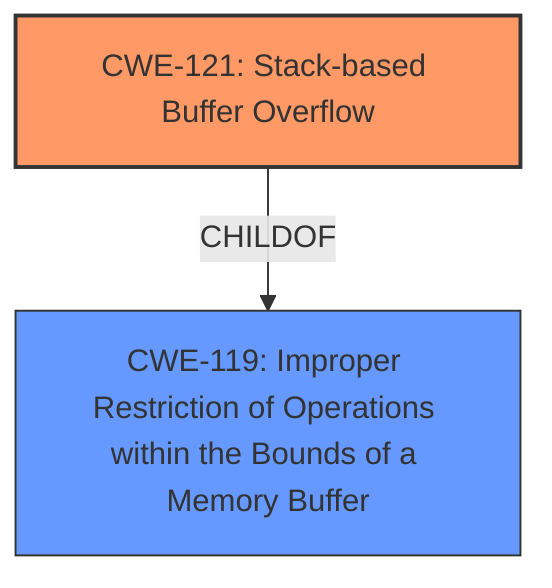

# Analysis Report for CVE-2025-0349

# Vulnerability Analysis Report: CVE-2025-0349

## Description

A vulnerability classified as critical has been found in Tenda AC6 15.03.05.16. Affected is the function GetParentControlInfo of the file /goform/GetParentControlInfo. The manipulation of the argument src/mac leads to **stack-based buffer overflow**. It is possible to launch the attack remotely. The exploit has been disclosed to the public and may be used. Other parameters might be affected as well.

## Vulnerability Description Key Phrases

- **Weakness:** stack-based buffer overflow
- **Vector:** manipulation of the argument src/mac
- **Product:** Tenda AC6
- **Version:** 15.03.05.16
- **Component:** GetParentControlInfo of the file /goform/GetParentControlInfo

## Analysis (with Relationship Data)

# Summary
| CWE ID | CWE Name | Confidence | CWE Abstraction Level | CWE Vulnerability Mapping Label | CWE-Vulnerability Mapping Notes |
|---|---|---|---|---|---|
| CWE-121 | Stack-based Buffer Overflow | 1.0 | Variant | Primary | Allowed |
| CWE-119 | Improper Restriction of Operations within the Bounds of a Memory Buffer | 0.7 | Class | Secondary | Discouraged |

## Evidence and Confidence

*   **Confidence Score:** 0.9
*   **Evidence Strength:** HIGH

## Relationship Analysis
The primary CWE is CWE-121 which is a variant of CWE-119. CWE-119 is a more general class of weakness. Since the description specifies a stack-based buffer overflow, CWE-121 is the more specific and appropriate choice. The relationship between CWE-121 and CWE-119 influenced the decision to choose the more specific variant.



## Vulnerability Chain
The vulnerability chain begins with the use of `strcpy` without proper bounds checking, leading to a stack-based buffer overflow.

Root Cause: **strcpy** without bounds checking
Weakness: **stack-based buffer overflow**
Impact: Potential Denial of Service (DoS) or Remote Code Execution (RCE)

## Summary of Analysis
The vulnerability description explicitly states a **stack-based buffer overflow** due to manipulation of the `src/mac` argument. The CVE Reference Links Content Summary confirms the root cause as the use of `strcpy` without bounds checking.

CWE-121, "Stack-based Buffer Overflow," is a Variant-level CWE and is the most precise match for the described vulnerability. It is a child of the more general CWE-119, "Improper Restriction of Operations within the Bounds of a Memory Buffer."

The evidence is strong and directly supports the selection of CWE-121. The CVE Reference Links Content Summary provides detailed information about the root cause, affected function, and attack vector.

Other CWEs Considered:

*   CWE-119: While relevant as a parent, it's too general. The description clearly indicates a stack-based overflow, making CWE-121 a better fit.
*   CWE-122 (Heap-based Buffer Overflow): Ruled out because the overflow is explicitly stated to be stack-based.
*   CWE-131 (Incorrect Calculation of Buffer Size): While potentially related, the primary issue is the unchecked copying of data using `strcpy`, not necessarily an incorrect size calculation.
*   CWE-190 (Integer Overflow or Wraparound): Not directly related to the buffer overflow issue.

Relevant CWE Information:

# Enhanced Context (25 CWEs)
The following CWEs were identified as potentially relevant to this vulnerability:

## CWE-121: Stack-based Buffer Overflow
**Abstraction Level**: Variant
**Similarity Score**: 0.77
**Source**: dense

**Description**:
A stack-based buffer overflow condition is a condition where the buffer being overwritten is allocated on the stack (i.e., is a local variable or, rarely, a parameter to a function).

**Mapping Guidance**:
- Usage: Allowed
- Rationale: This CWE entry is at the Variant level of abstraction, which is a preferred level of abstraction for mapping to the root causes of vulnerabilities.

## CWE-119: Improper Restriction of Operations within the Bounds of a Memory Buffer
**Abstraction Level**: Class
**Similarity Score**: 0.75
**Source**: dense

**Description**:
The product performs operations on a memory buffer, but it reads from or writes to a memory location outside the buffer's intended boundary. This may result in read or write operations on unexpected memory locations that could be linked to other variables, data structures, or internal program data.

**Mapping Guidance**:
- Usage: Discouraged
- Rationale: CWE-119 is commonly misused in low-information vulnerability reports when lower-level CWEs could be used instead, or when more details about the vulnerability are available.

## CWE-131: Incorrect Calculation of Buffer Size
**Abstraction Level**: Base
**Similarity Score**: 0.76
**Source**: dense

**Description**:
The product does not correctly calculate the size to be used when allocating a buffer, which could lead to a buffer overflow.

**Mapping Guidance**:
- Usage: Allowed
- Rationale: This CWE entry is at the Base level of abstraction, which is a preferred level of abstraction for mapping to the root causes of vulnerabilities.

## CWE-190: Integer Overflow or Wraparound
**Abstraction Level**: Base
**Similarity Score**: 1394.76
**Source**: sparse

**Description**:
The product performs a calculation that can
         produce an integer overflow or wraparound when the logic
         assumes that the resulting value will always be larger than
         the original value. This occurs when an integer value is
         incremented to a value that is too large to store in the
         associated representation. When this occurs, the value may
         become a very small or negative number.

**Mapping Guidance**:
- Usage: Allowed
- Rationale: This CWE entry is at the Base level of abstraction, which is a preferred level of abstraction for mapping to the root causes of vulnerabilities.


## CWE Relationship Analysis

Current CWEs represent these abstraction levels: .


### Vulnerability Chain Analysis

**Chain starting from CWE-121:**
- 121 (Stack-based Buffer Overflow) - ROOT


**Chain starting from CWE-131:**
- 131 (Incorrect Calculation of Buffer Size) - ROOT


### CWE Relationship Diagram

```mermaid
graph TD
    classDef primary fill:#f96,stroke:#333,stroke-width:2px
    classDef secondary fill:#69f,stroke:#333
    classDef tertiary fill:#9e9,stroke:#333
```


*Report generated on 2025-07-14 05:44:21*
