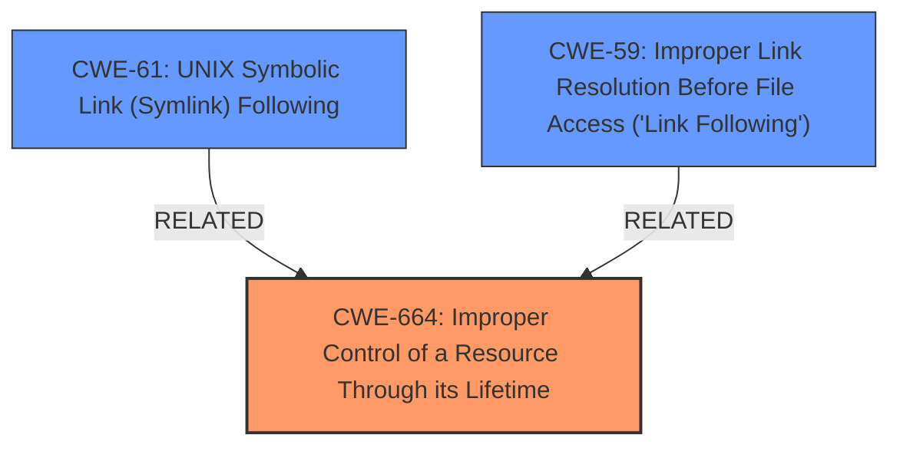

# Raw Analyzer Response for CVE-2025-0411

# Summary
| CWE ID | CWE Name | Confidence | CWE Abstraction Level | CWE Vulnerability Mapping Label | CWE-Vulnerability Mapping Notes |
|---|---|---|---|---|---|
| CWE-664 | Improper Control of a Resource Through its Lifetime | 0.8 | Class | Primary | Allowed-with-Review |
| CWE-61 | UNIX Symbolic Link (Symlink) Following | 0.6 | Compound | Secondary | Allowed |
| CWE-59 | Improper Link Resolution Before File Access ('Link Following') | 0.5 | Base | Secondary | Allowed |

## Evidence and Confidence

*   **Confidence Score:** 0.7
*   **Evidence Strength:** MEDIUM

## Relationship Analysis
The primary relationship that influenced the choice of CWE-664 was its broad coverage of resource lifetime issues, which aligns with the vulnerability's failure to properly manage the Mark-of-the-Web attribute. CWE-61 and CWE-59 were considered as more specific aspects of file handling vulnerabilities, particularly concerning symbolic links, but were deemed secondary because the core issue is about resource management.

## Vulnerability Chain
The vulnerability chain starts with the **improper control of a resource** (the Mark-of-the-Web attribute), leading to a **bypass of the Mark-of-the-Web protection mechanism**, ultimately enabling the **execution of arbitrary code**.

## Summary of Analysis
The initial assessment focused on identifying the root cause of the Mark-of-the-Web bypass in 7-Zip. The vulnerability description explicitly states that 7-Zip does not propagate the Mark-of-the-Web to extracted files, leading to a bypass of security mechanisms and potential arbitrary code execution.

The decision to map CWE-664 as the primary CWE is based on the understanding that the core issue is the **improper control of a resource** through its lifetime. The Mark-of-the-Web attribute is a resource that should be managed and propagated correctly during file extraction to maintain security context. The failure to do so directly leads to the vulnerability.

CWE-61 and CWE-59 capture potential aspects of the vulnerability, particularly related to symbolic links and improper link resolution, but they do not fully encompass the broader issue of resource management.

The selected CWEs are at the optimal level of specificity, with CWE-664 providing a broad, high-level view of the vulnerability, and CWE-61 and CWE-59 offering more specific perspectives related to file handling.

Relevant CWE Information:

# Enhanced Context (25 CWEs)
The following CWEs were identified as potentially relevant to this vulnerability:

## CWE-59: Improper Link Resolution Before File Access ('Link Following')
**Abstraction Level**: Base
**Similarity Score**: 0.76
**Source**: dense

**Description**:
The product attempts to access a file based on the filename, but it does not properly prevent that filename from identifying a link or shortcut that resolves to an unintended resource.

**Mapping Guidance**:
- Usage: Allowed
- Rationale: This CWE entry is at the Base level of abstraction, which is a preferred level of abstraction for mapping to the root causes of vulnerabilities.

**Technical Explanation**: While file access is involved, the **root cause** isn't directly related to link resolution in the traditional sense. The primary issue is the **failure to propagate security attributes** (Mark-of-the-Web) during file extraction, rather than improper handling of symbolic links. This is more about managing resources and their associated metadata.

## CWE-41: Improper Resolution of Path Equivalence
**Abstraction Level**: Base
**Similarity Score**: 0.73
**Source**: dense

**Description**:
The product is vulnerable to file system contents disclosure through path equivalence. Path equivalence involves the use of special characters in file and directory names. The associated manipulations are intended to generate multiple names for the same object.

**Mapping Guidance**:
- Usage: Allowed
- Rationale: This CWE entry is at the Base level of abstraction, which is a preferred level of abstraction for mapping to the root causes of vulnerabilities.

**Technical Explanation**: Path equivalence issues aren't the primary concern here. The vulnerability revolves around **failing to maintain security attributes** during file extraction, not exploiting path manipulation techniques.

## CWE-497: Exposure of Sensitive System Information to an Unauthorized Control Sphere
**Abstraction Level**: Base
**Similarity Score**: 0.73
**Source**: dense

**Description**:
The product does not properly prevent sensitive system-level information from being accessed by unauthorized actors who do not have the same level of access to the underlying system as the product does.

**Mapping Guidance**:
- Usage: Allowed
- Rationale: This CWE entry is at the Base level of abstraction, which is a preferred level of abstraction for mapping to the root causes of vulnerabilities.

**Technical Explanation**: While the Mark-of-the-Web attribute can be considered sensitive system information, the **root cause** isn't directly about exposure of this information. Instead, it's the **failure to propagate** this information, leading to a security bypass.

## CWE-552: Files or Directories Accessible to External Parties
**Abstraction Level**: Base
**Similarity Score**: 0.72
**Source**: dense

**Description**:
The product makes files or directories accessible to unauthorized actors, even though they should not be.

**Mapping Guidance**:
- Usage: Allowed
- Rationale: This CWE entry is at the Base level of abstraction, which is a preferred level of abstraction for mapping to the root causes of vulnerabilities.

**Technical Explanation**: This CWE is not applicable because the vulnerability is not about making files accessible to external parties. The vulnerability is about **bypassing the Mark-of-the-Web protection mechanism**, which leads to the execution of arbitrary code.

## CWE-923: Improper Restriction of Communication Channel to Intended Endpoints
**Abstraction Level**: Class
**Similarity Score**: 0.72
**Source**: dense

**Description**:
The product establishes a communication channel to (or from) an endpoint for privileged or protected operations, but it does not properly ensure that it is communicating with the correct endpoint.

**Mapping Guidance**:
- Usage: Allowed-with-Review
- Rationale: This CWE entry is a Class and might have Base-level children that would be more appropriate

**Technical Explanation**: This CWE is not applicable because the vulnerability is not about establishing a communication channel. The vulnerability is about **bypassing the Mark-of-the-Web protection mechanism**, which leads to the execution of arbitrary code.

## CWE-23: Relative Path Traversal
**Abstraction Level**: Base
**Similarity Score**: 0.72
**Source**: dense

**Description**:
The product uses external input to construct a pathname that should be within a restricted directory, but it does not properly neutralize sequences such as ".." that can resolve to a location that is outside of that directory.

**Mapping Guidance**:
- Usage: Allowed
- Rationale: This CWE entry is at the Base level of abstraction, which is a preferred level of abstraction for mapping to the root causes of vulnerabilities.

**Technical Explanation**: This CWE is not applicable because the vulnerability is not about path traversal. The vulnerability is about **bypassing the Mark-of-the-Web protection mechanism**, which leads to the execution of arbitrary code.

## CWE-425: Direct Request ('Forced Browsing')
**Abstraction Level**: Base
**Similarity Score**: 0.72
**Source**: dense

**Description**:
The web application does not adequately enforce appropriate authorization on all restricted URLs, scripts, or files.

**Mapping Guidance**:
- Usage: Allowed
- Rationale: This CWE entry is at the Base level of abstraction, which is a preferred level of abstraction for mapping to the root causes of vulnerabilities.

**Technical Explanation**: This CWE is not applicable because the vulnerability is not about direct request or forced browsing. The vulnerability is about **bypassing the Mark-of-the-Web protection mechanism**, which leads to the execution of arbitrary code.

## CWE-116: Improper Encoding or Escaping of Output
**Abstraction Level**: Class
**Similarity Score**: 0.72
**Source**: dense

**Description**:
The product prepares a structured message for communication with another component, but encoding or escaping of the data is either missing or done incorrectly. As a result, the intended structure of the message is not preserved.

**Mapping Guidance**:
- Usage: Allowed-with-Review
- Rationale: This CWE entry is a Class and might have Base-level children that would be more appropriate

**Technical Explanation**: This CWE is not applicable because the vulnerability is not about encoding or escaping of output. The