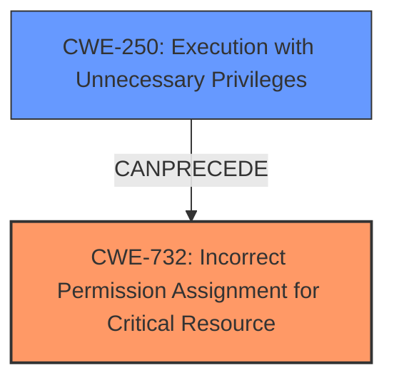

# Analysis Report for CVE-2025-0416

# Vulnerability Analysis Report: CVE-2025-0416

## Description

Local privilege escalation through **insecure DCOM configuration** in Valmet DNA versions prior to C2023. The DCOM object Valmet DNA Engineering has permissions that allow it to run commands as a user with the SeImpersonatePrivilege privilege. The SeImpersonatePrivilege privilege is a Windows permission that allows a process to impersonate another user. An attacker can use this vulnerability to escalate their privileges and take complete control of the system.

## Vulnerability Description Key Phrases

- **Rootcause:** insecure DCOM configuration
- **Weakness:** command execution
- **Impact:** ['Local privilege escalation', 'impersonate another user', 'SeImpersonatePrivilege']
- **Product:** Valmet DNA
- **Version:** versions prior to C2023
- **Component:** DCOM object Valmet DNA Engineering

## Analysis (with Relationship Data)

# Summary
| CWE ID | CWE Name | Confidence | CWE Abstraction Level | CWE Vulnerability Mapping Label | CWE-Vulnerability Mapping Notes |
|---|---|---|---|---|---|
| CWE-732 | Incorrect Permission Assignment for Critical Resource | 0.8 | Class | Primary | Allowed-with-Review |
| CWE-250 | Execution with Unnecessary Privileges | 0.6 | Base | Secondary | Allowed |

## Evidence and Confidence

*   **Confidence Score:** 0.7
*   **Evidence Strength:** MEDIUM

## Relationship Analysis
The primary relationship influencing the decision is the hierarchical connection where CWE-732 (Incorrect Permission Assignment for Critical Resource) serves as a Class-level categorization. The analysis also considered CWE-250 (Execution with Unnecessary Privileges) which is at the Base level and represents a more specific weakness related to running code with higher privileges than necessary. The choice of CWE-732 reflects the initial **insecure DCOM configuration**, while CWE-250 reflects the consequence of the configuration.



## Vulnerability Chain
The vulnerability chain starts with an **insecure DCOM configuration** leading to incorrect permission assignment for a critical resource. This allows the DCOM object to run commands as a user with `SeImpersonatePrivilege`, leading to potential privilege escalation and complete control of the system by an attacker.
  - **Root Cause:** Insecure DCOM configuration leading to incorrect permission assignment.
  - **Weakness:** DCOM object runs commands with unnecessary privileges.
  - **Impact:** Local privilege escalation and system compromise.

## Summary of Analysis
The initial assessment focused on identifying the root cause of the vulnerability. The evidence points to an **insecure DCOM configuration** that leads to incorrect permission assignments, as stated in the "Vulnerability Description Key Phrases" and "CVE Reference Links Content Summary".

The "Retriever Results" list CWE-732 (Incorrect Permission Assignment for Critical Resource) as the top candidate, which aligns with the root cause. CWE-250 (Execution with Unnecessary Privileges) is also considered as a secondary factor, since the DCOM object ends up running with higher privileges than it needs to function, because it inherits `SeImpersonatePrivilege`.

The graph relationships highlight the connection between these CWEs. The decision to choose CWE-732 as the primary CWE is supported by the evidence indicating an initial configuration issue regarding permissions. CWE-250 is listed as a secondary issue that arises from the **incorrect permission assignment**. The selected CWEs are at an optimal level of specificity, with CWE-732 being a Class-level categorization and CWE-250 at the Base level.

Relevant CWE Information:

# Enhanced Context (25 CWEs)
The following CWEs were identified as potentially relevant to this vulnerability:

## CWE-732: Incorrect Permission Assignment for Critical Resource
**Abstraction Level**: Class
**Similarity Score**: 1477.49
**Source**: sparse

**Description**:
The product specifies permissions for a security-critical resource in a way that allows that resource to be read or modified by unintended actors.

**Mapping Guidance**:
- Usage: Allowed-with-Review
- Rationale: While the name itself indicates an assignment of permissions for resources, this is often misused for vulnerabilities in which "permissions" are not checked, which is an "authorization" weakness (CWE-285 or descendants) within CWE's model [REF-1287].

## CWE-250: Execution with Unnecessary Privileges
**Abstraction Level**: Base
**Similarity Score**: 0.403
**Source**: sparse

**Description**:
Code is executed with privileges that are not required for the completion of the intended functionality, effectively granting the code more privileges than it needs.

**Mapping Guidance**:
- Usage: Allowed
- Rationale: This CWE entry is at the Base level of abstraction, which is a preferred level of abstraction for mapping to the root causes of vulnerabilities.

CWEs considered but not used:
- CWE-269: Improper Privilege Management - Discouraged because it is too high-level and does not directly represent the **insecure DCOM configuration**.
- CWE-863: Incorrect Authorization - While authorization is related, the root cause is the incorrect permission assignment, not necessarily a flawed authorization check.
- CWE-285: Improper Authorization - Similar to CWE-863, the issue is more about the initial assignment of permissions rather than a failure in authorization checks.


## CWE Relationship Analysis

Current CWEs represent these abstraction levels: .


### Vulnerability Chain Analysis

**Chain starting from CWE-863:**
- 863 (Incorrect Authorization) - ROOT


**Chain starting from CWE-732:**
- 732 (Incorrect Permission Assignment for Critical Resource) - ROOT


### CWE Relationship Diagram

```mermaid
graph TD
    classDef primary fill:#f96,stroke:#333,stroke-width:2px
    classDef secondary fill:#69f,stroke:#333
    classDef tertiary fill:#9e9,stroke:#333
```


*Report generated on 2025-07-14 05:50:39*
