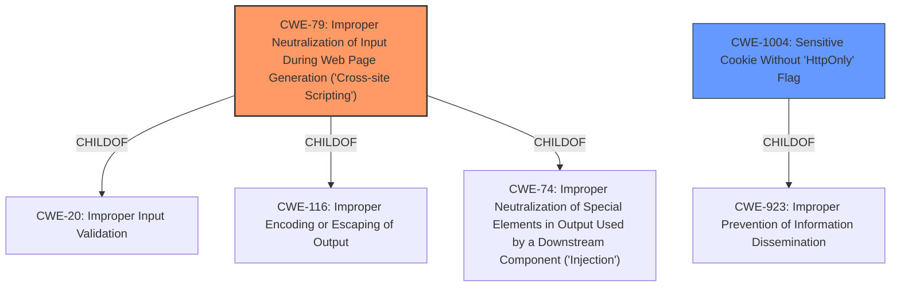

# Analysis Report for CVE-2025-0423

# Vulnerability Analysis Report: CVE-2025-0423

## Description

In the bestinformed Web application, some user input was not properly sanitized. This leads to multiple unauthenticated stored cross-site scripting vulnerabilities. An unauthenticated attacker is able to compromise the sessions of users on the server by injecting JavaScript code into their session using an Unauthenticated Stored Cross-Site Scripting. The attacker is then able to ride the session of those users and can abuse their privileges on the bestinformed Web application.

## Vulnerability Description Key Phrases

- **Rootcause:** improper input sanitization
- **Weakness:** Stored XSS, cross-site scripting vulnerabilities
- **Product:** bestinformed Web application
- **Impact:** session compromise
- **Attacker:** unauthenticated attacker

## Analysis (with Relationship Data)

# Summary
| CWE ID | CWE Name | Confidence | CWE Abstraction Level | CWE Vulnerability Mapping Label | CWE-Vulnerability Mapping Notes |
|---|---|---|---|---|---|
| CWE-79 | Improper Neutralization of Input During Web Page Generation ('Cross-site Scripting') | 1.0 | Base | Allowed | Primary CWE. The vulnerability description explicitly mentions "Stored XSS, cross-site scripting vulnerabilities", and the root cause is **improper input sanitization**. |
| CWE-1004 | Sensitive Cookie Without 'HttpOnly' Flag | 0.7 | Variant | Allowed | Secondary candidate. The CVE Reference Links Content Summary mentions "Lack of HttpOnly flag on cookies", which is related to cookie security. This could allow attackers to access cookies. |

## Evidence and Confidence

*   **Confidence Score:** 0.85
*   **Evidence Strength:** MEDIUM

## Relationship Analysis
The primary CWE is CWE-79, which is a Base level CWE. CWE-79 has several parent CWEs (e.g., CWE-116, CWE-74, CWE-20) and child CWEs, but none of these are more specific to the provided vulnerability description. CWE-1004 is a variant of CWE-923. The retriever results suggest considering CWE-352 (Cross-Site Request Forgery) and CWE-384 (Session Fixation), however, there isn't enough evidence to support these.



## Vulnerability Chain
The vulnerability chain starts with **improper input sanitization** (root cause), which leads to Stored Cross-Site Scripting (CWE-79). An attacker can inject JavaScript code into user sessions, potentially leading to session compromise and abuse of user privileges. The lack of HttpOnly flag (CWE-1004) on cookies could further facilitate session hijacking.

## Summary of Analysis
The primary weakness is CWE-79, as the vulnerability description explicitly states the presence of "Stored XSS, cross-site scripting vulnerabilities" due to **improper input sanitization**. The CWE-79 description matches the vulnerability details because the product (**bestinformed Web application**) does not properly neutralize user-controllable input before placing it in a web page. This allows an unauthenticated attacker to inject malicious JavaScript code.

The CVE Reference Links Content Summary indicates an issue with cookie security, specifically the lack of the HttpOnly flag. Therefore, CWE-1004 is included as a secondary CWE.

CWE-79 is at the optimal level of specificity (Base) as it directly addresses the **improper neutralization** of input leading to Cross-Site Scripting.

Other CWEs Considered:

*   CWE-352 (Cross-Site Request Forgery): While the vulnerability description mentions session compromise, there is no explicit mention of CSRF.
*   CWE-138 (Improper Neutralization of Special Elements): This is a class-level CWE, and CWE-79 is a more specific base-level CWE.
*   CWE-80 (Improper Neutralization of Script-Related HTML Tags in a Web Page (Basic XSS)): CWE-79 is a more general case of XSS, and the description doesn't specifically mention HTML tag neutralization issues.
*   CWE-116 (Improper Encoding or Escaping of Output): While encoding/escaping could be a potential solution, the root cause is **improper neutralization** of input.
*   CWE-89 (Improper Neutralization of Special Elements used in an SQL Command ('SQL Injection')): There is no indication of SQL injection in the vulnerability description.
*   CWE-434 (Unrestricted Upload of File with Dangerous Type): There is no mention of file uploads in the description.
*   CWE-384 (Session Fixation): While session compromise is mentioned, there is no explicit indication of Session Fixation.
*   CWE-184 (Incomplete List of Disallowed Inputs): This is a more general CWE, and **improper input sanitization** is a more direct root cause.


## CWE Relationship Analysis

Current CWEs represent these abstraction levels: .


### Vulnerability Chain Analysis

**Chain starting from CWE-89:**
- 89 (Improper Neutralization of Special Elements used in an SQL Command ('SQL Injection')) - ROOT


**Chain starting from CWE-116:**
- 116 (Improper Encoding or Escaping of Output) - ROOT


### CWE Relationship Diagram

```mermaid
graph TD
    classDef primary fill:#f96,stroke:#333,stroke-width:2px
    classDef secondary fill:#69f,stroke:#333
    classDef tertiary fill:#9e9,stroke:#333
```


*Report generated on 2025-07-14 05:51:17*
