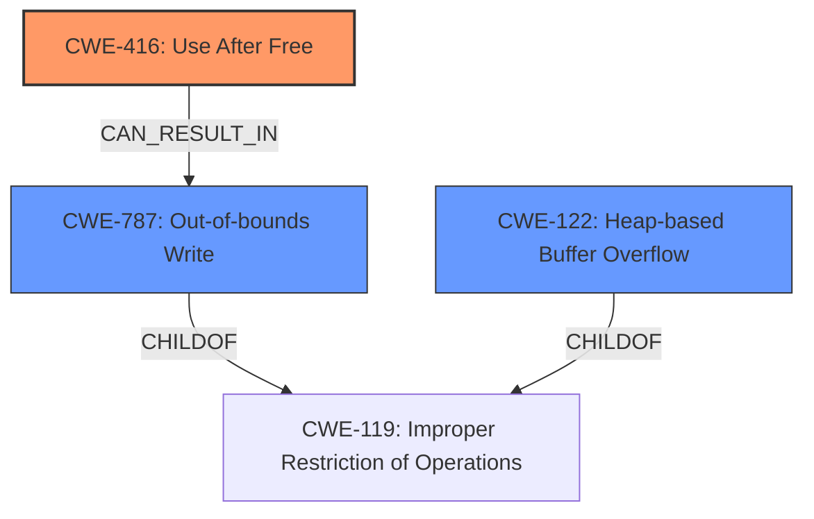

# Analysis for CVE-2025-0445

```markdown
# Summary
| CWE ID  | CWE Name                                                                 | Confidence | CWE Abstraction Level | CWE Vulnerability Mapping Label | CWE-Vulnerability Mapping Notes |
| :-------- | :----------------------------------------------------------------------- | :--------- | :---------------------- | :------------------------------ | :------------------------------ |
| CWE-416 | Use After Free                                                         | 1          | Variant               | Primary                         | Allowed                         |
| CWE-787 | Out-of-bounds Write                                                  | 0.5        | Base                   | Secondary                       | Allowed                         |
| CWE-122 | Heap-based Buffer Overflow                                             | 0.4        | Base                   | Secondary                       | Allowed                         |

## Evidence and Confidence

*   **Confidence Score:** 0.8
*   **Evidence Strength:** HIGH

## Relationship Analysis
The primary CWE is CWE-416, which directly reflects the vulnerability description. CWE-787 (Out-of-bounds Write) and CWE-122 (Heap-based Buffer Overflow) are considered as potential consequences or related issues that could arise from a use-after-free condition, but they are not the direct root cause described in the vulnerability. CWE-416 can lead to memory corruption which in turn can lead to out-of-bounds write.



## Vulnerability Chain
The vulnerability chain starts with the **use-after-free** condition (CWE-416). This can lead to heap corruption, which may then result in other issues like out-of-bounds write (CWE-787) or heap-based buffer overflow (CWE-122). The initial **flaw** is the **use-after-free**, and the impact is potential exploitation through heap corruption.

## Summary of Analysis
The primary weakness is clearly a **use-after-free** condition. The vulnerability description explicitly states "**Use after free** in V8 in Google Chrome...allowed a remote attacker to potentially exploit heap corruption via a crafted HTML page." Therefore, CWE-416 is the most appropriate primary CWE. While heap corruption can have other consequences such as out-of-bounds writes or heap overflows, these are secondary to the initial **use-after-free** condition. The retriever results also strongly suggest CWE-416 as the primary candidate.

I considered other CWEs such as CWE-366, CWE-843, CWE-911, and CWE-415, but these are less directly related to the **use-after-free** condition. CWE-366 (Race Condition within a Thread) might be a contributing factor in some **use-after-free** scenarios, but it is not explicitly mentioned in the description. CWE-843 (Access of Resource Using Incompatible Type) and CWE-911 (Improper Update of Reference Count) are also less directly applicable. CWE-415 (Double Free) is similar to **use-after-free**, but the description specifically mentions reuse after free, not a double free. CWE-122 (Heap-based Buffer Overflow) and CWE-787 (Out-of-bounds Write) are potential consequences of the **use-after-free**, but not the root cause.

The selection of CWE-416 is at the Variant level, which is a preferred level of abstraction for mapping to the root causes of vulnerabilities. The other considered CWEs were at the Base or Class level, making CWE-416 the most specific and accurate choice.

Relevant CWE Information:

# Enhanced Context (25 CWEs)
The following CWEs were identified as potentially relevant to this vulnerability:

## CWE-451: User Interface (UI) Misrepresentation of Critical Information
**Abstraction Level**: Class
**Similarity Score**: 0.76
**Source**: dense

**Description**:
The user interface (UI) does not properly represent critical information to the user, allowing the information - or its source - to be obscured or spoofed. This is often a component in phishing attacks.

**Mapping Guidance**:
- Usage: Allowed-with-Review
- Rationale: This CWE entry is a Class and might have Base-level children that would be more appropriate

## CWE-416: Use After Free
**Abstraction Level**: Variant
**Similarity Score**: 0.75
**Source**: dense

**Description**:
The product reuses or references memory after it has been freed. At some point afterward, the memory may be allocated again and saved in another pointer, while the original pointer references a location somewhere within the new allocation. Any operations using the original pointer are no longer valid because the memory "belongs" to the code that operates on the new pointer.

**Mapping Guidance**:
- Usage: Allowed
- Rationale: This CWE entry is at the Variant level of abstraction, which is a preferred level of abstraction for mapping to the root causes of vulnerabilities.

## CWE-366: Race Condition within a Thread
**Abstraction Level**: Base
**Similarity Score**: 0.75
**Source**: dense

**Description**:
If two threads of execution use a resource simultaneously, there exists the possibility that resources may be used while invalid, in turn making the state of execution undefined.

**Mapping Guidance**:
- Usage: Allowed
- Rationale: This CWE entry is at the Base level of abstraction, which is a preferred level of abstraction for mapping to the root causes of vulnerabilities.

## CWE-843: Access of Resource Using Incompatible Type ('Type Confusion')
**Abstraction Level**: Base
**Similarity Score**: 0.75
**Source**: dense

**Description**:
The product allocates or initializes a resource such as a pointer, object, or variable using one type, but it later accesses that resource using a type that is incompatible with the original type.

**Mapping Guidance**:
- Usage: Allowed
- Rationale: This CWE entry is at the Base level of abstraction, which is a preferred level of abstraction for mapping to the root causes of vulnerabilities.

## CWE-824: Access of Uninitialized Pointer
**Abstraction Level**: Base
**Similarity Score**: 0.74
**Source**: dense

**Description**:
The product accesses or uses a pointer that has not been initialized.

**Mapping Guidance**:
- Usage: Allowed
- Rationale: This CWE entry is at the Base level of abstraction, which is a preferred level of abstraction for mapping to the root causes of vulnerabilities.

## CWE-667: Improper Locking
**Abstraction Level**: Class
**Similarity Score**: 0.73
**Source**: dense

**Description**:
The product does not properly acquire or release a lock on a resource, leading to unexpected resource state changes and behaviors.

**Mapping Guidance**:
- Usage: Allowed-with-Review
- Rationale: This CWE entry is a Class and might have Base-level children that would be more appropriate

## CWE-367: Time-of-check Time-of-use (TOCTOU) Race Condition
**Abstraction Level**: Base
**Similarity Score**: 0.73
**Source**: dense

**Description**:
The product checks the state of a resource before using that resource, but the resource's state can change between the check and the use in a way that invalidates the results of the check. This can cause the product to perform invalid actions when the resource is in an unexpected state.

**Mapping Guidance**:
- Usage: Allowed
- Rationale: This CWE entry is at the Base level of abstraction, which is a preferred level of abstraction for mapping to the root causes of vulnerabilities.

## CWE-356: Product UI does not Warn User of Unsafe Actions
**Abstraction Level**: Base
**Similarity Score**: 0.73
**Source**: dense

**Description**:
The product's user interface does not warn the user before undertaking an unsafe action on behalf of that user. This makes it easier for attackers to trick users into inflicting damage to their system.

**Mapping Guidance**:
- Usage: Allowed
- Rationale: This CWE entry is at the Base level of abstraction, which is a preferred level of abstraction for mapping to the root causes of vulnerabilities.

## CWE-665: Improper Initialization
**Abstraction Level**: Class
**Similarity Score**: 0.73
**Source**: dense

**Description**:
The product does not initialize or incorrectly initializes a resource, which might leave the resource in an unexpected state when it is accessed or used.

**Mapping Guidance**:
- Usage: Discouraged
- Rationale: This CWE entry is a level-1 Class (i