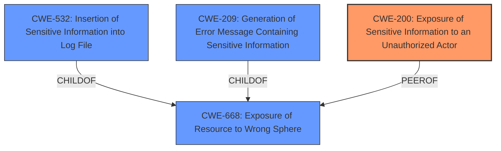

# Analysis for CVE-2025-0472

# Summary
| CWE ID | CWE Name | Confidence | CWE Abstraction Level | CWE Vulnerability Mapping Label | CWE-Vulnerability Mapping Notes |
|---|---|---|---|---|---|
| CWE-200 | Exposure of Sensitive Information to an Unauthorized Actor | 1.0 | Class | Primary | Allowed-with-Review, The vulnerability results in the exposure of internal files by allowing an attacker to upload a file to the environment and enumerate the internal files of a machine by looking at the request response. |

## Evidence and Confidence

*   **Confidence Score:** 1.0
*   **Evidence Strength:** HIGH

## Relationship Analysis
The primary CWE identified is CWE-200, which is a Class-level CWE. While it's generally discouraged to map to Class-level CWEs, in this case, it accurately reflects the high-level nature of the vulnerability, which is the exposure of sensitive information. Other CWEs considered were more specific types of information exposure (e.g., CWE-532, CWE-209), but the provided description doesn't give enough information to definitively narrow it down to one of those. CWE-668 (Exposure of Resource to Wrong Sphere) was also considered, but CWE-200 is more directly related to the described impact.

## Vulnerability Chain
The vulnerability chain begins with the **weakness**, which is **information exposure**, due to an unspecified **root cause** that leads to an attacker being able to upload a file and enumerate internal files. This enumeration of internal files is the impact of the **information exposure**.

## Summary of Analysis
The analysis is based on the vulnerability description and the provided CVE reference summary. The key phrase from the description is "**information exposure** in the PMB platform affecting versions 4.2.13 and earlier. This vulnerability allows an attacker to upload a file to the environment and enumerate the internal files of a machine by looking at the request response." The **CVE Reference Links Content Summary** explicitly states: "**CVE-2025-0472**: Information exposure in the PMB platform." And it confirms that "**CVE-2025-0472**: Allows an attacker to upload a file to the environment and enumerate the internal files of a machine by looking at the request response.".

CWE-200 aligns with the description of "**Exposure of Sensitive Information to an Unauthorized Actor**." The other candidate CWEs from the retriever results, such as CWE-532 (Insertion of Sensitive Information into Log File) and CWE-209 (Generation of Error Message Containing Sensitive Information), are more specific and there is no evidence to support those in the description. CWE-668 (Exposure of Resource to Wrong Sphere) is broader than CWE-200 and less directly relevant to the description, which specifies **information exposure** as the weakness. Therefore, CWE-200 is chosen as the most appropriate CWE at the Class level, given the current information.