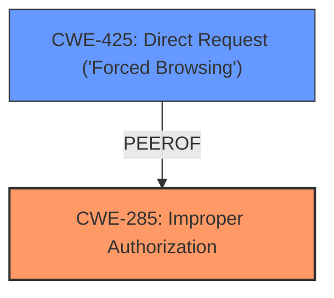

# Raw Analyzer Response for CVE-2025-0484

# Summary
| CWE ID | CWE Name | Confidence | CWE Abstraction Level | CWE Vulnerability Mapping Label | CWE-Vulnerability Mapping Notes |
|---|---|---|---|---|---|
| CWE-285 | Improper Authorization | 0.9 | Class | Primary CWE | Discouraged |
| CWE-425 | Direct Request ('Forced Browsing') | 0.6 | Base | Secondary Candidate | Allowed |

## Evidence and Confidence

*   **Confidence Score:** 0.8
*   **Evidence Strength:** MEDIUM

## Relationship Analysis
The primary relationship that influenced the decision was the parent-child relationship between CWE-285 (Improper Authorization) and more specific authorization-related CWEs. Given the information available, CWE-285 serves as a suitable high-level classification, although a more specific child could be more precise with greater detail. CWE-425 was considered due to the ability to directly request the resource, but is not the root cause.

## Vulnerability Chain
The vulnerability chain starts with **improper authorization** checks in the backend component, allowing unauthorized modification of system configurations, which can be directly accessed.
  - The root cause is the **improper authorization**.
  - The impact is the ability to modify backend data without proper permission.

## Summary of Analysis
The initial assessment identified the **improper authorization** as the primary weakness based on the description and key phrases. The CVE Reference Links Content Summary confirmed this, highlighting the failure to properly verify permissions.

The selection of CWE-285 is based on the evidence indicating a flaw in authorization logic. The vulnerability description explicitly mentions **improper authorization**, and the CVE content details that the application fails to properly verify permissions. This aligns with CWE-285, which covers cases where the product does not perform or incorrectly performs an authorization check.

CWE-425 (Direct Request ('Forced Browsing')) was considered because the attacker is able to directly request and modify the backend resource. However, the root cause is the **improper authorization** check, not simply the direct access. Therefore, CWE-425 is a secondary candidate.

The selected CWEs are at a reasonable level of specificity, given the available information. While more specific child CWEs of CWE-285 might exist, the current evidence doesn't allow for a more precise classification.

Relevant CWE Information:

# Enhanced Context (25 CWEs)
The following CWEs were identified as potentially relevant to this vulnerability:

## CWE-425: Direct Request ('Forced Browsing')
**Abstraction Level**: Base
**Similarity Score**: 0.78
**Source**: dense

**Description**:
The web application does not adequately enforce appropriate authorization on all restricted URLs, scripts, or files.

**Mapping Guidance**:
- Usage: Allowed
- Rationale: This CWE entry is at the Base level of abstraction, which is a preferred level of abstraction for mapping to the root causes of vulnerabilities.

## CWE-285: Improper Authorization
**Abstraction Level**: Class
**Similarity Score**: 1558.01
**Source**: sparse

**Description**:
The product does not perform or incorrectly performs an authorization check when an actor attempts to access a resource or perform an action.

**Mapping Guidance**:
- Usage: Discouraged
- Rationale: CWE-285 is high-level and lower-level CWEs can frequently be used instead. It is a level-1 Class (i.e., a child of a Pillar).

---