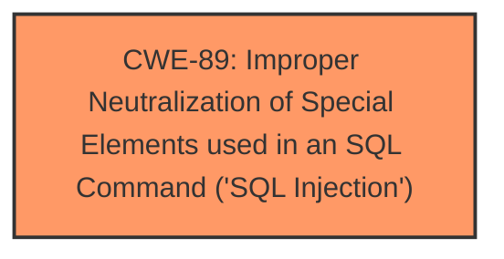

# Raw Analyzer Response for CVE-2025-0561

# Summary
| CWE ID | CWE Name | Confidence | CWE Abstraction Level | CWE Vulnerability Mapping Label | CWE-Vulnerability Mapping Notes |
|---|---|---|---|---|---|
| CWE-89 | Improper Neutralization of Special Elements used in an SQL Command ('SQL Injection') | 1.0 | Base | Primary | Allowed |

## Evidence and Confidence

*   **Confidence Score:** 1.0
*   **Evidence Strength:** HIGH

## Relationship Analysis
The primary identified CWE is CWE-89, which stands alone and does not have any child, parent, or peer relationships that are relevant in this context. It's a base-level CWE, providing sufficient specificity.

## Vulnerability Chain
The vulnerability chain consists of:
1.  **Root Cause:** **Improper Neutralization of Special Elements used in an SQL Command ('SQL Injection')** (CWE-89) due to **manipulation of the argument pigno**.
2.  **Impact:** Remote execution of arbitrary SQL queries.

## Summary of Analysis
The vulnerability description clearly states that the **weakness** is **sql injection** due to the manipulation of the argument pigno in the /add-pig.php file of the itsourcecode Farm Management System 1.0. The retriever results also list CWE-89 as the top candidate with a score of 1.0.

The evidence directly points to CWE-89 [Improper Neutralization of Special Elements used in an SQL Command ('SQL Injection')] as the root cause. This is a base-level CWE, providing a specific description of the vulnerability. The vulnerability description key phrases also directly mention the term **sql injection**.
Relevant CWE Information:

# Enhanced Context (25 CWEs)
The following CWEs were identified as potentially relevant to this vulnerability:

## CWE-89: Improper Neutralization of Special Elements used in an SQL Command ('SQL Injection')
**Abstraction Level**: Base
**Similarity Score**: 0.74
**Source**: dense

**Description**:
The product constructs all or part of an SQL command using externally-influenced input from an upstream component, but it does not neutralize or incorrectly neutralizes special elements that could modify the intended SQL command when it is sent to a downstream component. Without sufficient removal or quoting of SQL syntax in user-controllable inputs, the generated SQL query can cause those inputs to be interpreted as SQL instead of ordinary user data.

**Mapping Guidance**:
- Usage: Allowed
- Rationale: This CWE entry is at the Base level of abstraction, which is a preferred level of abstraction for mapping to the root causes of vulnerabilities.