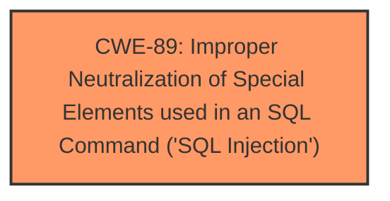

# Raw Analyzer Response for CVE-2025-0563

# Summary
| CWE ID | CWE Name | Confidence | CWE Abstraction Level | CWE Vulnerability Mapping Label | CWE-Vulnerability Mapping Notes |
|---|---|---|---|---|---|
| CWE-89 | Improper Neutralization of Special Elements used in an SQL Command ('SQL Injection') | 1.0 | Base | Primary | Allowed |

## Evidence and Confidence

*   **Confidence Score:** 1.0
*   **Evidence Strength:** HIGH

## Relationship Analysis
The primary relationship is that CWE-89 is a base level weakness, which is the preferred level of abstraction. There are no other hierarchical relationships that would suggest a more specific CWE.

## Vulnerability Chain
The vulnerability chain consists of a single step:

1.  **Root Cause:** CWE-89 - Improper Neutralization of Special Elements used in an SQL Command ('SQL Injection') in the `uname` parameter of `/dash/update.php`.

## Summary of Analysis
The vulnerability description explicitly states that the **weakness** is **sql injection**. The CVE Reference Links Content Summary confirms this, stating that the root cause is insufficient user input validation of the "uname" parameter, allowing attackers to inject malicious SQL queries. The provided information aligns perfectly with the definition of CWE-89, which is at the base level of abstraction. Therefore, CWE-89 is the most appropriate mapping.

The Retriever Results also list CWE-89 as the top combined result, with a score of 1.0, further supporting this decision.

Other CWEs were considered, but ultimately rejected because they did not directly address the root cause of the vulnerability:

*   CWE-79 (Improper Neutralization of Input During Web Page Generation ('Cross-site Scripting')): While XSS involves improper neutralization, it's specific to web page generation. SQL injection targets databases, making CWE-89 more accurate.
*   CWE-434 (Unrestricted Upload of File with Dangerous Type): This is related to file uploads, which is not part of this vulnerability.
*   CWE-1336 (Improper Neutralization of Special Elements Used in a Template Engine): This is related to Template Engines, which is not part of this vulnerability.
*   CWE-73 (External Control of File Name or Path): This is related to file path manipulation, which is not part of this vulnerability.
Relevant CWE Information: