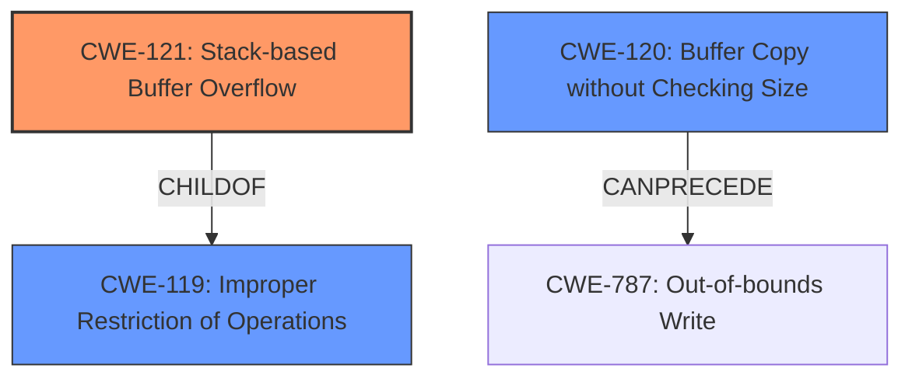

# Raw Analyzer Response for CVE-2025-0566

# Summary
| CWE ID  | CWE Name | Confidence | CWE Abstraction Level | CWE Vulnerability Mapping Label | CWE-Vulnerability Mapping Notes |
|--------------|------------------------------------------------------------------------------------------------------------------|------------|-----------------------|-----------------------------------|---------------------------------------------------------------------------------------------------------------------------------------------------------------------------------------------------------------------|
| CWE-121 | Stack-based Buffer Overflow | 1.0 | Variant | Allowed | Primary CWE. The vulnerability description explicitly states "stack-based buffer overflow" making this the most accurate primary CWE. |
| CWE-120 | Buffer Copy without Checking Size of Input ('Classic Buffer Overflow') | 0.7 | Base | Allowed-with-Review | Secondary candidate. While the description indicates a buffer overflow, the specifics of a copy operation without size checking aren't explicitly stated, lowering the confidence. |
| CWE-119 | Improper Restriction of Operations within the Bounds of a Memory Buffer | 0.6 | Class | Discouraged | Secondary candidate. CWE-119 is a broader category. Although applicable, it's less specific than CWE-121, which directly identifies the stack-based nature of the overflow. |

## Evidence and Confidence

*   **Confidence Score:** 0.9
*   **Evidence Strength:** HIGH

## Relationship Analysis
The primary relationship that impacted the decision was the parent-child relationship between CWE-119 (Improper Restriction of Operations within the Bounds of a Memory Buffer) and CWE-121 (Stack-based Buffer Overflow). CWE-121 is a variant of CWE-119, making it a more specific and appropriate choice given the explicit mention of "stack-based" in the vulnerability description. CWE-120 (Buffer Copy without Checking Size of Input) can precede CWE-787 (Out-of-bounds Write), illustrating a potential chain. The abstraction levels guided the selection, favoring the variant level CWE-121 for its precision.

## Vulnerability Chain
The vulnerability chain starts with the **improper handling of the 'mac' argument** within the `/goform/SetDevNetName` function. This leads to a **stack-based buffer overflow (CWE-121)** when the input 'mac' exceeds the buffer's capacity. The overflow allows an attacker to overwrite data on the stack, potentially leading to arbitrary code execution.

## Summary of Analysis
The analysis strongly indicates that CWE-121 (Stack-based Buffer Overflow) is the most appropriate primary CWE. This is based on the explicit mention of "stack-based buffer overflow" in the vulnerability description, providing direct evidence for this classification. The retriever results also list CWE-121 as a relevant CWE. The relationship analysis highlights that CWE-121 is a variant of the more general CWE-119, making it a more specific and accurate choice. The selection of CWE-121 is at the optimal level of specificity because it directly reflects the nature of the vulnerability as a stack-based buffer overflow, rather than a more general buffer overflow or memory corruption issue.

Relevant CWE Information:

# Enhanced Context (25 CWEs)
The following CWEs were identified as potentially relevant to this vulnerability:

## CWE-121: Stack-based Buffer Overflow
**Abstraction Level**: Variant
**Similarity Score**: 0.75
**Source**: dense

**Description**:
A stack-based buffer overflow condition is a condition where the buffer being overwritten is allocated on the stack (i.e., is a local variable or, rarely, a parameter to a function).

**Mapping Guidance**:
- Usage: Allowed
- Rationale: This CWE entry is at the Variant level of abstraction, which is a preferred level of abstraction for mapping to the root causes of vulnerabilities.

## CWE-120: Buffer Copy without Checking Size of Input ('Classic Buffer Overflow')
**Abstraction Level**: Base
**Similarity Score**: 521.91
**Source**: sparse

**Description**:
The product copies an input buffer to an output buffer without verifying that the size of the input buffer is less than the size of the output buffer, leading to a buffer overflow.

**Mapping Guidance**:
- Usage: Allowed-with-Review
- Rationale: There are some indications that this CWE ID might be misused and selected simply because it mentions "buffer overflow" - an increasingly vague term. This CWE entry is only appropriate for "Buffer Copy" operations (not buffer reads), in which where there is no "Checking [the] Size of Input", and (by implication of the copy) writing past the end of the buffer.

## CWE-119: Improper Restriction of Operations within the Bounds of a Memory Buffer
**Abstraction Level**: Class
**Similarity Score**: 0.70
**Source**: dense

**Description**:
The product performs operations on a memory buffer, but it reads from or writes to a memory location outside the buffer's intended boundary. This may result in read or write operations on unexpected memory locations that could be linked to other variables, data structures, or internal program data.

**Mapping Guidance**:
- Usage: Discouraged
- Rationale: CWE-119 is commonly misused in low-information vulnerability reports when lower-level CWEs could be used instead, or when more details about the vulnerability are available.

## CWE-78: Improper Neutralization of Special Elements used in an OS Command ('OS Command Injection')
CWE-78 was not selected because the vulnerability description does not indicate command injection, but rather a buffer overflow.

## CWE-79: Improper Neutralization of Input During Web Page Generation ('Cross-site Scripting')
CWE-79 was not selected because the vulnerability is a buffer overflow, not a cross-site scripting issue.

## CWE-89: Improper Neutralization of Special Elements used in an SQL Command ('SQL Injection')
CWE-89 was not selected because the vulnerability description does not indicate SQL injection, but rather a buffer overflow.

## CWE-125: Out-of-bounds Read
CWE-125 was not selected because the vulnerability is specifically a buffer overflow, not an out-of-bounds read.

## CWE-128: Wrap-around Error and CWE-190: Integer Overflow or Wraparound
CWE-128 and CWE-190 were not selected because the vulnerability involves a buffer overflow, not integer handling issues.

## CWE-131: Incorrect Calculation of Buffer Size
CWE-131 was not selected because the root cause is not explicitly stated as incorrect calculation.

## CWE-134: Use of Externally-Controlled Format String
CWE-134 was not selected because the root cause is not explicitly stated as an externally controlled format string.

## CWE-425: Direct Request ('Forced Browsing') and CWE-497: Exposure of Sensitive System Information to an Unauthorized Control Sphere
CWE-425 and CWE-497 were not selected because the vulnerability description does not indicate authorization or information exposure issues.

## CWE-674: Uncontrolled Recursion
CWE-674 was not selected because the vulnerability description does not indicate uncontrolled recursion.

## CWE-755: Improper Handling of Exceptional Conditions
CWE-755 was not selected because the vulnerability description does not indicate exception handling issues.

## CWE-790: Improper Filtering of Special Elements
CWE-790 was not selected because the root cause is not explicitly stated as improper filtering.

## CWE-822: Untrusted Pointer Dereference and CWE-823: Use of Out-of-range Pointer Offset
CWE-822 and CWE-823 were not selected because the vulnerability description does not indicate pointer issues.

## CWE-1339: Insufficient Precision or Accuracy of a Real Number
CWE-1339 was not selected because the vulnerability description does not indicate real number precision or accuracy issues.