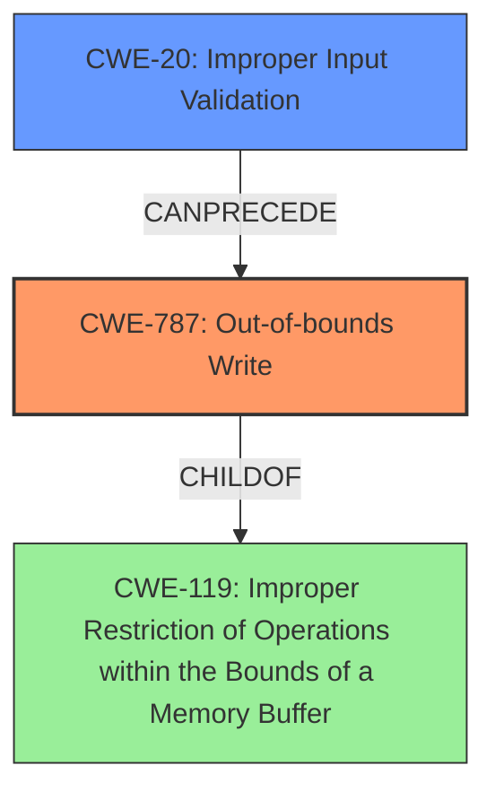

# Enhanced Analysis for CVE-2025-0574

# Summary
| CWE ID | CWE Name | Confidence | CWE Abstraction Level | CWE Vulnerability Mapping Label | CWE-Vulnerability Mapping Notes |
|---|---|---|---|---|---|
| CWE-787 | Out-of-bounds Write | 0.9 | Base | Primary CWE | Allowed |
| CWE-20 | Improper Input Validation | 0.7 | Class | Secondary Candidate | Discouraged |

## Evidence and Confidence

*   **Confidence Score:** 0.8
*   **Evidence Strength:** HIGH

## Relationship Analysis
The primary CWE is CWE-787, which is a Base level CWE. The secondary CWE is CWE-20, which is a Class level CWE. CWE-787 is a child of CWE-119 (Improper Restriction of Operations within the Bounds of a Memory Buffer). CWE-20 can precede CWE-787, as **improper input validation** can lead to an out-of-bounds write. The abstraction levels influenced the selection, as the goal is to select the most specific CWE.



## Vulnerability Chain
The vulnerability chain starts with **lack of proper validation of user-supplied data** (CWE-20), which leads to **memory corruption** (CWE-787), resulting in a denial-of-service condition.
  - CWE-20: Improper Input Validation (Root Cause)
  - CWE-787: Out-of-bounds Write (Weakness)
  - Denial-of-Service (Impact)

## Summary of Analysis
The initial analysis pointed towards CWE-787 as the primary cause due to the **memory corruption** and the ability for remote attackers to cause a denial of service, which aligns with the description of an out-of-bounds write. The vulnerability description key phrases also indicated the rootcause as the **lack of proper validation of user-supplied data**, which points to CWE-20.

The graph relationships influenced the final selection. CWE-20 can precede CWE-787, indicating that improper input validation can lead to an out-of-bounds write.

The selection of CWE-787 is at the optimal level of specificity because it directly describes the **memory corruption** vulnerability, while CWE-20 describes the **lack of proper validation of user-supplied data** that leads to this condition.
The evidence from the Vulnerability Description is: "The issue results from the **lack of proper validation of user-supplied data**, which can result in a **memory corruption** condition."

Relevant CWE Information:

# Enhanced Context (25 CWEs)

## CWE-787: Out-of-bounds Write
**Description**: CWE-787: Out-of-bounds Write
**Mapping Guidance**: Usage: Allowed
**Rationale**: This CWE entry is at the Base level of abstraction, which is a preferred level of abstraction for mapping to the root causes of vulnerabilities.

## CWE-20: Improper Input Validation
**Description**: The product receives input or data, but it does not validate or incorrectly validates that the input has the properties that are required to process the data safely and correctly.
**Mapping Guidance**: Usage: Discouraged
**Rationale**: This CWE entry is a Class and might have Base-level children that would be more appropriate

## CWE-119: Improper Restriction of Operations within the Bounds of a Memory Buffer
**Description**: The product performs an operation on a memory buffer, but it does not correctly restrict the operation to prevent memory corruption.
**Mapping Guidance**: Usage: Discouraged
**Rationale**: This CWE entry is a Class and might have Base-level children that would be more appropriate

### Other CWEs Considered and Rejected:

*   CWE-119, CWE-121, CWE-400, CWE-476, CWE-22, CWE-73: These CWEs were considered but are not as directly relevant as CWE-787 and CWE-20. While some of these (e.g., CWE-119, CWE-121) could be related to the memory corruption, CWE-787 is a more specific description of the **out-of-bounds write** condition.
*   CWE-863, CWE-285, CWE-639, CWE-306, CWE-22: These are related to Authorization or Authentication, but the vulnerability description doesn't point to those categories.
*   CWE-668, CWE-41, CWE-212, CWE-703, CWE-23, CWE-74, CWE-138, CWE-754, CWE-497, CWE-472: These CWEs were considered but are not directly related to the **memory corruption** and **improper input validation** described in the vulnerability.


## CWE Relationship Analysis

Current CWEs represent these abstraction levels: .


### Vulnerability Chain Analysis

**Chain starting from CWE-400:**
- 400 (Uncontrolled Resource Consumption) - ROOT


**Chain starting from CWE-476:**
- 476 (NULL Pointer Dereference) - ROOT


### CWE Relationship Diagram

```mermaid
graph TD
    classDef primary fill:#f96,stroke:#333,stroke-width:2px
    classDef secondary fill:#69f,stroke:#333
    classDef tertiary fill:#9e9,stroke:#333
```