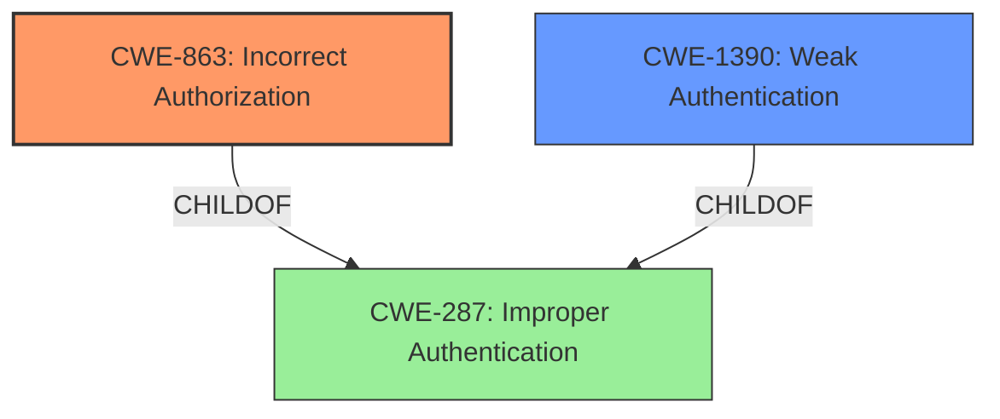

# Analysis Report for CVE-2025-0605

# Vulnerability Analysis Report: CVE-2025-0605

## Description

An issue has been discovered in GitLab CE/EE affecting all versions from 16.8 before 17.10.7, 17.11 before 17.11.3, and 18.0 before 18.0.1. Group access controls could allow certain users to bypass two-factor authentication requirements.

## Vulnerability Description Key Phrases

- **Impact:** bypass two-factor authentication requirements
- **Attacker:** certain users
- **Product:** GitLab CE/EE
- **Version:** all versions from 16.8 before 17.10.7, 17.11 before 17.11.3, and 18.0 before 18.0.1
- **Component:** Group access controls

## Analysis (with Relationship Data)

# Summary
| CWE ID | CWE Name | Confidence | CWE Abstraction Level | CWE Vulnerability Mapping Label | CWE-Vulnerability Mapping Notes |
|---|---|---|---|---|---|
| CWE-863 | Incorrect Authorization | 0.8 | Class | Primary | Allowed-with-Review |
| CWE-1390 | Weak Authentication | 0.6 | Class | Secondary | Allowed-with-Review |

## Evidence and Confidence

*   **Confidence Score:** 0.7
*   **Evidence Strength:** MEDIUM

## Relationship Analysis
The primary relationship influencing my decision is that CWE-863, Incorrect Authorization, is a more specific Class-level CWE that directly addresses the authorization **flaw** where the system incorrectly grants access, allowing users to bypass two-factor authentication. While CWE-1390, Weak Authentication, is related, it is more about the authentication mechanism itself being insufficient. In this case, the authentication (two-factor) is in place but bypassed due to an authorization issue.



## Vulnerability Chain
The vulnerability chain starts with the **incorrect authorization** configuration (CWE-863), which leads to the bypassing of two-factor authentication. The final impact is that certain users can gain unauthorized access.

## Summary of Analysis
The vulnerability description indicates that group access controls **incorrectly allow** certain users to bypass two-factor authentication. The core of the issue lies in the **incorrect authorization**, where the system **fails to properly validate** the user's permissions within the group context.

The retriever results suggested CWE-863 (Incorrect Authorization) and CWE-1390 (Weak Authentication) as relevant candidates. Given the description explicitly states that authentication (two-factor) is bypassed due to group access controls, CWE-863 is the more direct fit. CWE-1390 could be considered as a secondary weakness, as the authorization **flaw** effectively weakens the authentication mechanism, but it is not the primary root cause.

The CWE classification guidance also supports choosing CWE-863 because the problem is that the system is checking authorization, but doing it incorrectly.

I am not selecting CWE-285 (Improper Authorization), because CWE-863 is a child of CWE-285 and is the more specific.

Relevant CWE Information:

# Enhanced Context (25 CWEs)
The following CWEs were identified as potentially relevant to this vulnerability:

## CWE-1390: Weak Authentication
**Abstraction Level**: Class
**Similarity Score**: 0.74
**Source**: dense

**Description**:
The product uses an authentication mechanism to restrict access to specific users or identities, but the mechanism does not sufficiently prove that the claimed identity is correct.

**Mapping Guidance**:
- Usage: Allowed-with-Review
- Rationale: This CWE entry is a Class and might have Base-level children that would be more appropriate

## CWE-863: Incorrect Authorization
**Abstraction Level**: Class
**Similarity Score**: 1199.81
**Source**: sparse

**Description**:
The product performs an authorization check when an actor attempts to access a resource or perform an action, but it does not correctly perform the check.

**Mapping Guidance**:
- Usage: Allowed-with-Review
- Rationale: This CWE entry is a Class and might have Base-level children that would be more appropriate

## CWE-863: Incorrect Authorization
CWE-863 (Incorrect Authorization) is selected because the vulnerability description explicitly states that group access controls **incorrectly allow** certain users to bypass two-factor authentication requirements. This means that an authorization check is in place, but it's **flawed**, directly aligning with CWE-863's description. This **flaw** allows users to gain unauthorized access, bypassing the intended security measures. The security implication is that unauthorized users can access sensitive resources or perform actions they shouldn't be able to, potentially leading to data breaches or system compromise.
The confidence is 0.8.

## CWE-1390: Weak Authentication
CWE-1390 (Weak Authentication) is a secondary candidate because the authorization **flaw** effectively weakens the two-factor authentication mechanism. While the authentication itself might be properly implemented, the **incorrect authorization** undermines its effectiveness.
The confidence is 0.6.


## CWE Relationship Analysis

Current CWEs represent these abstraction levels: .


### Vulnerability Chain Analysis

**Chain starting from CWE-1390:**
- 1390 (Weak Authentication) - ROOT


**Chain starting from CWE-863:**
- 863 (Incorrect Authorization) - ROOT


### CWE Relationship Diagram

```mermaid
graph TD
    classDef primary fill:#f96,stroke:#333,stroke-width:2px
    classDef secondary fill:#69f,stroke:#333
    classDef tertiary fill:#9e9,stroke:#333
```


*Report generated on 2025-07-14 06:09:03*
