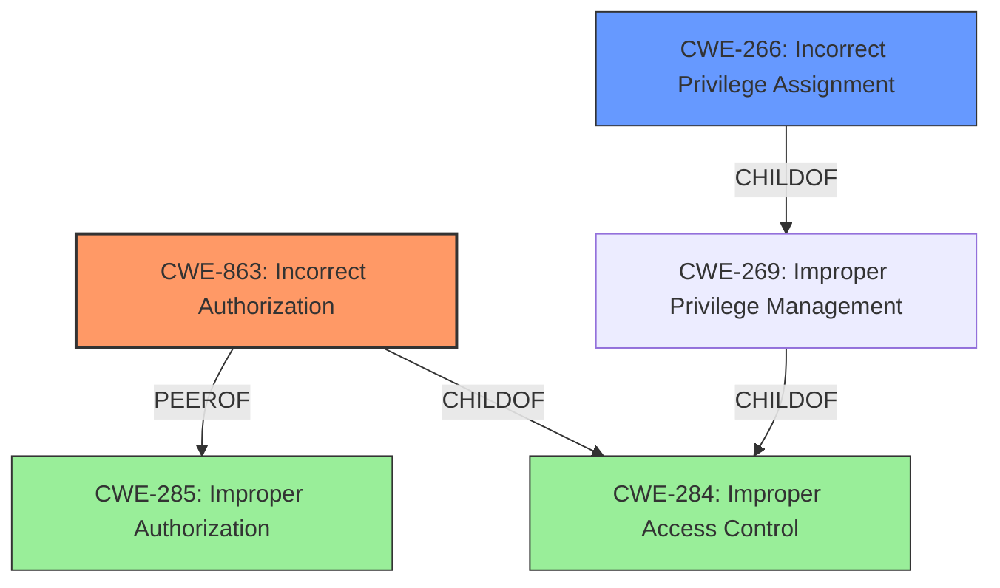

# Analysis Report for CVE-2025-0628

# Vulnerability Analysis Report: CVE-2025-0628

## Description

An **improper authorization** vulnerability exists in the main-latest version of BerriAI/litellm. When a user with the role internal_user_viewer logs into the application, they are provided with an overly privileged API key. This key can be used to access all the admin functionality of the application, including endpoints such as /users/list and /users/get_users. This vulnerability allows for privilege escalation within the application, enabling any account to become a PROXY ADMIN.

## Vulnerability Description Key Phrases

- **Rootcause:** improper authorization
- **Product:** BerriAI/litellm
- **Impact:** access all admin functionality, privilege escalation
- **Attacker:** internal_user_viewer
- **Version:** main-latest

## Analysis (with Relationship Data)

# Summary
| CWE ID | CWE Name | Confidence | CWE Abstraction Level | CWE Vulnerability Mapping Label | CWE-Vulnerability Mapping Notes |
|---|---|---|---|---|---|
| CWE-863 | Incorrect Authorization | 0.9 | Class | Allowed-with-Review | Primary CWE. Authorization check is present, but incorrectly performed. |
| CWE-266 | Incorrect Privilege Assignment | 0.7 | Base | Allowed | Secondary Candidate. The user is assigned an overly-privileged API key. |

## Evidence and Confidence

*   **Confidence Score:** 0.8
*   **Evidence Strength:** HIGH

## Relationship Analysis
The primary relationship influencing the decision is the hierarchical structure where CWE-863 is a Class-level CWE. The analysis also considered CWE-285 (Improper Authorization) as a peer, but CWE-863 was deemed more specific because the vulnerability involves an existing authorization check that is performed incorrectly. Another important aspect was the relationship between privileges and permissions, particularly regarding incorrect privilege assignment (CWE-266) which highlights the overly permissive API key.



## Vulnerability Chain
The vulnerability chain starts with the **improper authorization** (CWE-863) where an internal user is given an overly privileged API key. This leads to **privilege escalation**, allowing the user to access admin functionalities. The final impact is the ability for any account to become a PROXY ADMIN.

## Summary of Analysis
The primary assessment is strongly based on the provided evidence which includes the vulnerability description stating an **improper authorization** issue where a user with the role internal_user_viewer is provided with an overly privileged API key. This allows them to access admin functionalities, leading to **privilege escalation**. The retriever results and the guidance on Authentication vs Authorization support the selection of CWE-863, Incorrect Authorization, as the primary CWE. The relationship analysis shows that CWE-863 is a child of CWE-284 (Improper Access Control), but CWE-863 is more specific and appropriate because it involves an incorrect authorization check.

The CWEs considered but not used include:
*   CWE-284: Improper Access Control - While this is a parent of CWE-863, the description is specific enough to warrant the use of the child CWE.
*   CWE-285: Improper Authorization - Very similar to CWE-863 but less specific as it doesn't highlight the fact that the authorization check exists but is flawed.
*   CWE-269: Improper Privilege Management - Not specific enough as it covers a wide range of privilege management issues.
*   CWE-266: Incorrect Privilege Assignment - A valid secondary candidate because the user is assigned an overly privileged API key.
*   CWE-306: Missing Authentication for Critical Function - Not applicable as the issue is with authorization, not authentication.

The selected CWEs are at the optimal level of specificity because they accurately reflect the nature of the vulnerability based on the available evidence and the MITRE mapping guidance.


## CWE Relationship Analysis

Current CWEs represent these abstraction levels: .


### Vulnerability Chain Analysis

**Chain starting from CWE-863:**
- 863 (Incorrect Authorization) - ROOT


**Chain starting from CWE-306:**
- 306 (Missing Authentication for Critical Function) - ROOT


### CWE Relationship Diagram

```mermaid
graph TD
    classDef primary fill:#f96,stroke:#333,stroke-width:2px
    classDef secondary fill:#69f,stroke:#333
    classDef tertiary fill:#9e9,stroke:#333
```


*Report generated on 2025-07-14 06:09:36*
