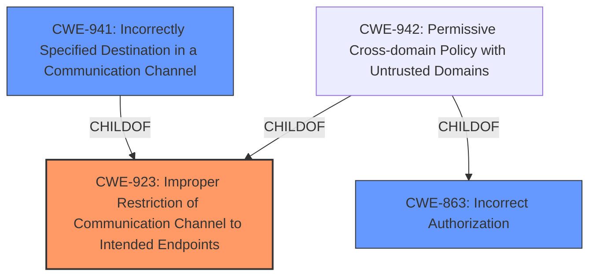

# Analysis Report for CVE-2025-0650

# Vulnerability Analysis Report: CVE-2025-0650

## Description

A flaw was found in the Open Virtual Network (OVN). Specially crafted UDP packets may bypass egress access control lists (ACLs) in OVN installations configured with a logical switch with DNS records set on it and if the same switch has any egress ACLs configured. This issue can lead to unauthorized access to virtual machines and containers running on the OVN network.

## Vulnerability Description Key Phrases

- **Vector:** specially crafted UDP packets
- **Product:** Open Virtual Network
- **Impact:** unauthorized access to virtual machines and containers running on the OVN network, bypass egress access control lists (ACLs)

## Analysis (with Relationship Data)

# Summary
| CWE ID | CWE Name | Confidence | CWE Abstraction Level | CWE Vulnerability Mapping Label | CWE-Vulnerability Mapping Notes |
|---|---|---|---|---|---|
| CWE-923 | Improper Restriction of Communication Channel to Intended Endpoints | 0.8 | Class | Primary | Allowed-with-Review |
| CWE-941 | Incorrectly Specified Destination in a Communication Channel | 0.6 | Base | Secondary | Allowed |
| CWE-863 | Incorrect Authorization | 0.5 | Class | Secondary | Allowed-with-Review |

## Evidence and Confidence

*   **Confidence Score:** 0.7
*   **Evidence Strength:** MEDIUM

## Relationship Analysis

The primary CWE selected is CWE-923: Improper Restriction of Communication Channel to Intended Endpoints, which is a class-level CWE. CWE-941: Incorrectly Specified Destination in a Communication Channel is a base CWE and a child of CWE-923. CWE-863: Incorrect Authorization is a class-level CWE, and CWE-942 is a child of both CWE-923 and CWE-863. The vulnerability involves bypassing egress access control lists (ACLs), indicating a failure to properly restrict the communication channel. The relationship between CWE-923 and its child CWE-941 indicates that the destination is incorrectly specified, contributing to the bypass.


## Vulnerability Chain

The vulnerability chain starts with **specially crafted UDP packets** that **bypass egress access control lists (ACLs)** due to **improper restriction of the communication channel**. This leads to **unauthorized access to virtual machines and containers**.

*   **Root Cause:** Improper restriction of the communication channel (CWE-923) due to interaction between DNS caching and egress ACLs.
*   **Weakness:** Egress ACL bypass
*   **Impact:** Unauthorized access to virtual machines and containers.

## Summary of Analysis

The initial analysis focused on the description of the vulnerability, which involves bypassing egress access control lists (ACLs) with specially crafted UDP packets. The CVE Reference Links Content Summary provided detailed information about the root cause, confirming that the vulnerability arises due to the interaction between OVN's DNS caching and egress ACL rules. The primary CWE selected is CWE-923 because it directly addresses the **improper restriction of the communication channel**, which is the core weakness. CWE-941 is considered a secondary CWE as it is a child of CWE-923 and describes an **incorrectly specified destination**, contributing to the bypass. While the vulnerability also leads to unauthorized access, the root cause is not a direct authorization issue but rather a flaw in how the communication channel is restricted. CWE-863 is a weak secondary candidate as the ACL bypass leads to **incorrect authorization**.

The CWE classifications are based on the evidence provided in the vulnerability description and the CVE Reference Links Content Summary. The relationships between the CWEs, particularly the child-parent relationship between CWE-923 and CWE-941, influenced the selection by providing a more specific understanding of the vulnerability.

Relevant CWE Information:

# Enhanced Context (25 CWEs)
The following CWEs were identified as potentially relevant to this vulnerability:

## CWE-497: Exposure of Sensitive System Information to an Unauthorized Control Sphere
**Abstraction Level**: Base
**Similarity Score**: 0.76
**Source**: dense

**Description**:
The product does not properly prevent sensitive system-level information from being accessed by unauthorized actors who do not have the same level of access to the underlying system as the product does.

**Mapping Guidance**:
- Usage: Allowed
- Rationale: This CWE entry is at the Base level of abstraction, which is a preferred level of abstraction for mapping to the root causes of vulnerabilities.

**Why Not Used**: This CWE relates to the exposure of sensitive information, which is not the primary issue in this vulnerability. The main concern is the bypass of access control.

## CWE-754: Improper Check for Unusual or Exceptional Conditions
**Abstraction Level**: Class
**Similarity Score**: 0.76
**Source**: dense

**Description**:
The product does not check or incorrectly checks for unusual or exceptional conditions that are not expected to occur frequently during day to day operation of the product.

**Mapping Guidance**:
- Usage: Allowed-with-Review
- Rationale: This CWE entry is a Class and might have Base-level children that would be more appropriate

**Why Not Used**: While there might be unusual conditions related to the crafted packets, this CWE is too general and doesn't directly address the access control bypass.

## CWE-41: Improper Resolution of Path Equivalence
**Abstraction Level**: Base
**Similarity Score**: 0.76
**Source**: dense

**Description**:
The product is vulnerable to file system contents disclosure through path equivalence. Path equivalence involves the use of special characters in file and directory names. The associated manipulations are intended to generate multiple names for the same object.

**Mapping Guidance**:
- Usage: Allowed
- Rationale: This CWE entry is at the Base level of abstraction, which is a preferred level of abstraction for mapping to the root causes of vulnerabilities.

**Why Not Used**: This CWE is specific to file system path manipulation, which is not relevant to the network access control bypass described in the vulnerability.

## CWE-617: Reachable Assertion
**Abstraction Level**: Base
**Similarity Score**: 0.75
**Source**: dense

**Description**:
The product contains an assert() or similar statement that can be triggered by an attacker, which leads to an application exit or other behavior that is more severe than necessary.

**Mapping Guidance**:
- Usage: Allowed
- Rationale: This CWE entry is at the Base level of abstraction, which is a preferred level of abstraction for mapping to the root causes of vulnerabilities.

**Why Not Used**: The vulnerability doesn't involve triggering an assertion; it's about bypassing access controls.

## CWE-668: Exposure of Resource to Wrong Sphere
**Abstraction Level**: Class
**Similarity Score**: 0.75
**Source**: dense

**Description**:
The product exposes a resource to the wrong control sphere, providing unintended actors with inappropriate access to the resource.

**Mapping Guidance**:
- Usage: Discouraged
- Rationale: CWE-668 is high-level and is often misused as a catch-all when lower-level CWE IDs might be applicable. It is sometimes used for low-information vulnerability reports [REF-1287]. It is a level-1 Class (i.e., a child of a Pillar). It is not useful for trend analysis.

**Why Not Used**: Although the vulnerability leads to unauthorized access, CWE-668 is too high-level and discouraged. CWE-923 provides a more specific and accurate representation.

## CWE-404: Improper Resource Shutdown or Release
**Abstraction Level**: Class
**Similarity Score**: 0.75
**Source**: dense

**Description**:
The product does not release or incorrectly releases a resource before it is made available for re-use.

**Mapping Guidance**:
- Usage: Allowed-with-Review
- Rationale: This CWE entry is a Class and might have Base-level children that would be more appropriate

**Why Not Used**: This CWE is about resource management, which is not the primary concern in this vulnerability.

## CWE-212: Improper Removal of Sensitive Information Before Storage or Transfer
**Abstraction Level**: Base
**Similarity Score**: 0.75
**Source**: dense

**Description**:
The product stores, transfers, or shares a resource that contains sensitive information, but it does not properly remove that information before the product makes the resource available to unauthorized actors.

**Mapping Guidance**:
- Usage: Allowed
- Rationale: This CWE entry is at the Base level of abstraction, which is a preferred level of abstraction for mapping to the root causes of vulnerabilities.

**Why Not Used**: This CWE concerns sensitive information handling, which is not relevant to the access control bypass.

## CWE-303: Incorrect Implementation of Authentication Algorithm
**Abstraction Level**: Base
**Similarity Score**: 0.75
**Source**: dense

**Description**:
The requirements for the product dictate the use of an established authentication algorithm, but the implementation of the algorithm is incorrect.

**Mapping Guidance**:
- Usage: Allowed
- Rationale: This CWE entry is at the Base level of


## CWE Relationship Analysis

Current CWEs represent these abstraction levels: .


### Vulnerability Chain Analysis

**Chain starting from CWE-863:**
- 863 (Incorrect Authorization) - ROOT


**Chain starting from CWE-617:**
- 617 (Reachable Assertion) - ROOT


### CWE Relationship Diagram

```mermaid
graph TD
    classDef primary fill:#f96,stroke:#333,stroke-width:2px
    classDef secondary fill:#69f,stroke:#333
    classDef tertiary fill:#9e9,stroke:#333
```


*Report generated on 2025-07-14 06:10:35*
