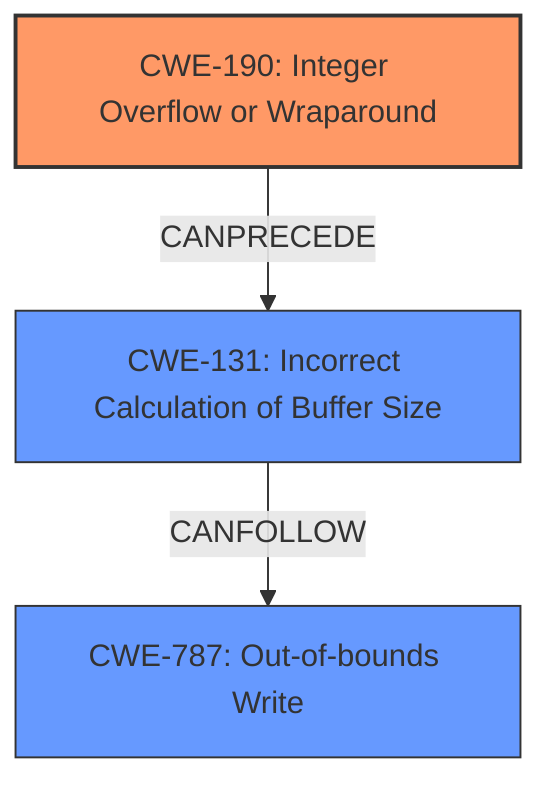

# Raw Analyzer Response for CVE-2025-0684

# Summary
| CWE ID | CWE Name | Confidence | CWE Abstraction Level | CWE Vulnerability Mapping Label | CWE-Vulnerability Mapping Notes |
|---|---|---|---|---|---|
| CWE-190 | Integer Overflow or Wraparound | 0.9 | Base | Allowed | Primary CWE. The root cause is the **improper integer overflow check** leading to smaller than expected buffer. |
| CWE-787 | Out-of-bounds Write | 0.8 | Base | Allowed | The **heap based out-of-bounds write** is a direct consequence of the integer overflow. |
| CWE-131 | Incorrect Calculation of Buffer Size | 0.7 | Base | Allowed | The integer overflow directly leads to the **incorrect calculation of the buffer size**. |

## Evidence and Confidence

*   **Confidence Score:** 0.8
*   **Evidence Strength:** HIGH

## Relationship Analysis
The primary weakness is CWE-190, Integer Overflow or Wraparound. This leads to CWE-131, Incorrect Calculation of Buffer Size, because the overflowed value is used in the buffer size calculation. Finally, the incorrect buffer size leads to CWE-787, Out-of-bounds Write, as the read operation uses the incorrect size to write the data.

## Vulnerability Chain
The vulnerability chain starts with an **improper check for integer overflows** (CWE-190) during buffer size calculation. This results in a smaller-than-expected buffer size calculation (CWE-131). The undersized buffer is then used in a read operation, leading to a heap-based out-of-bounds write (CWE-787). The ultimate impact is arbitrary code execution and bypassing secure boot protections.

## Summary of Analysis
The vulnerability description clearly states that the root cause is the **improper check for integer overflows** when calculating buffer sizes, justifying the selection of CWE-190 as the primary CWE. The subsequent incorrect buffer size calculation and resulting out-of-bounds write are direct consequences of this overflow, leading to the inclusion of CWE-131 and CWE-787. The retriever results also strongly support CWE-190 as a potential candidate.

The description mentions: "grubs reiserfs fs module uses user-controlled parameters from the filesystem geometry to determine the internal buffer size, however, it **improperly checks for integer overflows**." This is the key piece of evidence that supports the primary CWE selection.

The graph relationships show how the integer overflow can precede an incorrect buffer size calculation, which in turn can lead to an out-of-bounds write. This chain aligns with the vulnerability description.

CWE-190 is at the Base level of abstraction, which is preferred. CWE-787 and CWE-131 are also at the Base level of abstraction. These are the most specific CWEs that accurately represent the weaknesses described in the vulnerability.

Other CWEs considered but not used:

*   CWE-1284: Improper Validation of Specified Quantity in Input - While related to quantity, the root cause is the integer overflow, not the validation itself.
*   CWE-191: Integer Underflow (Wrap or Wraparound) - The description explicitly mentions overflow, not underflow.
*   CWE-193: Off-by-one Error - Not the primary cause, although an off-by-one error could contribute.
*   CWE-122: Heap-based Buffer Overflow - CWE-787 is more specific to the out-of-bounds write.
*   CWE-125: Out-of-bounds Read - The description explicitly mentions an out-of-bounds write, not read.
*   CWE-119: Improper Restriction of Operations within the Bounds of a Memory Buffer - Too general; CWE-787 provides a more specific description.
*   CWE-909: Missing Initialization of Resource - Not relevant to this vulnerability.
*   CWE-1339: Insufficient Precision or Accuracy of a Real Number - Not relevant to this vulnerability, which involves integers.