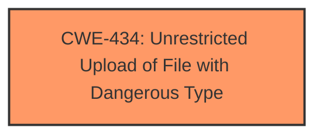

# Analysis Report for CVE-2025-0702

# Vulnerability Analysis Report: CVE-2025-0702

## Description

A vulnerability classified as critical was found in JoeyBling bootplus up to 247d5f6c209be1a5cf10cd0fa18e1d8cc63cf55d. This vulnerability affects unknown code of the file src/main/java/io/github/controller/SysFileController.java. The manipulation of the argument portraitFile leads to **unrestricted upload**. The attack can be initiated remotely. The exploit has been disclosed to the public and may be used. Continious delivery with rolling releases is used by this product. Therefore, no version details of affected nor updated releases are available.

## Vulnerability Description Key Phrases

- **Weakness:** unrestricted upload
- **Vector:** manipulation of the argument portraitFile
- **Product:** JoeyBling bootplus
- **Version:** up to 247d5f6c209be1a5cf10cd0fa18e1d8cc63cf55d
- **Component:** unknown code of the file src/main/java/io/github/controller/SysFileController.java

## Analysis (with Relationship Data)

# Summary
| CWE ID | CWE Name | Confidence | CWE Abstraction Level | CWE Vulnerability Mapping Label | CWE-Vulnerability Mapping Notes |
|---|---|---|---|---|---|
| CWE-434 | Unrestricted Upload of File with Dangerous Type | 1.0 | Base | Allowed | Primary CWE. The application allows uploading files without proper validation, which can lead to the execution of malicious files. |

## Evidence and Confidence

*   **Confidence Score:** 1.0
*   **Evidence Strength:** HIGH

## Relationship Analysis
The primary identified weakness is CWE-434 (Unrestricted Upload of File with Dangerous Type). This CWE stands alone as the root cause, as the description explicitly states that the vulnerability is due to an **unrestricted upload**. There are no direct parent-child or chain relationships immediately relevant in this specific case. The abstraction level of CWE-434 is Base, which is the preferred level.



## Vulnerability Chain
The vulnerability chain is straightforward:
1.  The root cause is **unrestricted upload** (CWE-434).
2.  The impact is potential execution of arbitrary code on the server, potentially leading to remote code execution (RCE).

## Summary of Analysis
The analysis is based on the provided evidence, particularly the "Vulnerability Description Key Phrases" and the "CVE Reference Links Content Summary," both of which point to an **unrestricted upload** vulnerability.

The description states "This vulnerability affects unknown code of the file src/main/java/io/github/controller/SysFileController.java. The manipulation of the argument portraitFile leads to **unrestricted upload**."

The evidence from CVE Reference Links Content Summary states:
*   **Root cause of vulnerability:** The upload method in `SysFileController.java` does not validate the uploaded files.
*   **Weaknesses/vulnerabilities present:** Unrestricted file upload, allowing the upload of executable code (JSP, HTML).

CWE-434 is at the optimal level of specificity as it directly addresses the weakness identified in the vulnerability description.

Relevant CWE Information:

# Enhanced Context (25 CWEs)
The following CWEs were identified as potentially relevant to this vulnerability:

## CWE-434: Unrestricted Upload of File with Dangerous Type
**Abstraction Level**: Base
**Similarity Score**: 0.79
**Source**: dense

**Description**:
The product allows the upload or transfer of dangerous file types that are automatically processed within its environment.

**Mapping Guidance**:
- Usage: Allowed
- Rationale: This CWE entry is at the Base level of abstraction, which is a preferred level of abstraction for mapping to the root causes of vulnerabilities.


## CWE Relationship Analysis

Current CWEs represent these abstraction levels: .


### Vulnerability Chain Analysis

**Chain starting from CWE-434:**
- 434 (Unrestricted Upload of File with Dangerous Type) - ROOT


### CWE Relationship Diagram

```mermaid
graph TD
    classDef primary fill:#f96,stroke:#333,stroke-width:2px
    classDef secondary fill:#69f,stroke:#333
    classDef tertiary fill:#9e9,stroke:#333
```


*Report generated on 2025-07-14 06:15:25*
