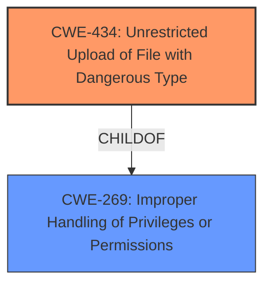

# Raw Analyzer Response for CVE-2025-0722

# Summary
| CWE ID | CWE Name | Confidence | CWE Abstraction Level | CWE Vulnerability Mapping Label | CWE-Vulnerability Mapping Notes |
|---|---|---|---|---|---|
| CWE-434 | Unrestricted Upload of File with Dangerous Type | 0.9 | Base | Allowed | Primary CWE. The vulnerability description explicitly states "**unrestricted upload**". |
| CWE-269 | Improper Handling of Privileges or Permissions | 0.5 | Class | Allowed-with-Review | Secondary candidate. The **unrestricted upload** might be a result of improper handling of privileges or permissions. |

## Evidence and Confidence

*   **Confidence Score:** 0.7
*   **Evidence Strength:** MEDIUM

## Relationship Analysis
The primary relationship considered was the hierarchical structure and the parent-child relationships. CWE-434 is a Base level CWE, which is preferred. I also considered CWE-269 as a Class level because an **unrestricted upload** can be a result of **Improper Handling of Privileges or Permissions**.

## Vulnerability Chain
The vulnerability chain starts with the **unrestricted upload** vulnerability which leads to potential execution of malicious code on the server.

## Summary of Analysis
Based on the provided evidence, the primary weakness is CWE-434, "**Unrestricted Upload** of File with Dangerous Type". The vulnerability description explicitly mentions "**unrestricted upload**". I am also considering CWE-269 as a secondary candidate, as the **unrestricted upload** may be due to improper handling of privileges or permissions, but there isn't enough evidence to confirm. My assessment is based on the vulnerability description, especially the "**unrestricted upload**" key phrase. I am fairly confident in my selection, but it would be great to understand the authentication and authorization mechanism that may have been in place.

Relevant CWE Information:

# Enhanced Context (25 CWEs)
The following CWEs were identified as potentially relevant to this vulnerability:

## CWE-434: Unrestricted Upload of File with Dangerous Type
**Abstraction Level**: Base
**Similarity Score**: 0.80
**Source**: dense

**Description**:
The product allows the upload or transfer of dangerous file types that are automatically processed within its environment.

**Mapping Guidance**:
- Usage: Allowed
- Rationale: This CWE entry is at the Base level of abstraction, which is a preferred level of abstraction for mapping to the root causes of vulnerabilities.

## CWE-434: Unrestricted Upload of File with Dangerous Type
**Abstraction Level**: Base
**Similarity Score**: 591.81
**Source**: sparse

**Description**:
The product allows the upload or transfer of dangerous file types that are automatically processed within its environment.

**Mapping Guidance**:
- Usage: Allowed
- Rationale: This CWE entry is at the Base level of abstraction, which is a preferred level of abstraction for mapping to the root causes of vulnerabilities.

## CWE-434: Unrestricted Upload of File with Dangerous Type
**Abstraction Level**: Base
**Similarity Score**: 2.92
**Source**: graph

**Description**:
The product allows the upload or transfer of dangerous file types that are automatically processed within its environment.

**Mapping Guidance**:
- Usage: Allowed
- Rationale: This CWE entry is at the Base level of abstraction, which is a preferred level of abstraction for mapping to the root causes of vulnerabilities.

## CWE-269: Improper Handling of Privileges or Permissions
The product does not ensure that the actor has the required privileges before the actor attempts to access or manipulate a protected resource.

### CWE Considerations
- Consider the entire environment to determine if a privilege is truly being dropped, or if the code is just making use of different interfaces that don't have the same privileges.
- When a system is deployed, it can have a mixture of code that runs with different privileges and capabilities. This is often a deliberate design choice, but there may be vulnerabilities if one part of the system assumes that a certain privilege is always available.
- Some programming languages or operating systems have limited support for managing privileges, which may make it more difficult for developers to implement privilege management correctly.
- **Poor privilege management can lead to privilege escalation.**

### Mapping Guidance
- Usage: Allowed-with-Review
- Rationale: It can be difficult to establish that privileges are not handled correctly.