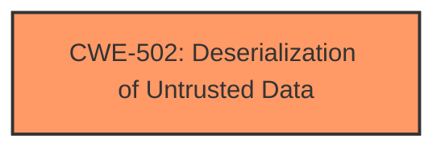

# Analysis Report for CVE-2025-0734

# Vulnerability Analysis Report: CVE-2025-0734

## Description

A vulnerability has been found in y_project RuoYi up to 4.8.0 and classified as critical. This vulnerability affects the function getBeanName of the component Whitelist. The manipulation leads to **deserialization**. The attack can be initiated remotely. The exploit has been disclosed to the public and may be used. The vendor was contacted early about this disclosure but did not respond in any way.

## Vulnerability Description Key Phrases

- **Weakness:** deserialization
- **Product:** y_project RuoYi
- **Version:** up to 4.8.0
- **Component:** getBeanName function of Whitelist component

## Analysis (with Relationship Data)

# Summary
| CWE ID | CWE Name | Confidence | CWE Abstraction Level | CWE Vulnerability Mapping Label | CWE-Vulnerability Mapping Notes |
|---|---|---|---|---|---|
| CWE-502 | Deserialization of Untrusted Data | 1.0 | Base | Allowed | Primary CWE. The vulnerability description explicitly mentions "deserialization". |

## Evidence and Confidence

*   **Confidence Score:** 1.0
*   **Evidence Strength:** HIGH

## Relationship Analysis
There is no parent-child hierarchical, chain, or peer relationships that influenced my decision.



## Vulnerability Chain
The vulnerability chain starts with the **deserialization** of untrusted data (CWE-502), leading to potential remote code execution.

## Summary of Analysis
The vulnerability description clearly states that the vulnerability involves **deserialization** in the `getBeanName` function of the `Whitelist` component in `y_project RuoYi`. The direct mention of **deserialization** makes CWE-502 the most appropriate primary CWE.

Relevant CWE Information:

# Enhanced Context (25 CWEs)
The following CWEs were identified as potentially relevant to this vulnerability:

## CWE-502: Deserialization of Untrusted Data
**Abstraction Level**: Base
**Similarity Score**: 0.71
**Source**: dense

**Description**:
The product deserializes untrusted data without sufficiently ensuring that the resulting data will be valid.

**Mapping Guidance**:
- Usage: Allowed
- Rationale: This CWE entry is at the Base level of abstraction, which is a preferred level of abstraction for mapping to the root causes of vulnerabilities.

### CWE-502: Deserialization of Untrusted Data
The vulnerability description explicitly states that the vulnerability involves **deserialization**. CWE-502 directly addresses this issue, making it the most relevant CWE. The description of CWE-502 states: "The product deserializes untrusted data without sufficiently ensuring that the resulting data will be valid." This aligns perfectly with the vulnerability.


## CWE Relationship Analysis

Current CWEs represent these abstraction levels: .


### Vulnerability Chain Analysis

**Chain starting from CWE-502:**
- 502 (Deserialization of Untrusted Data) - ROOT


### CWE Relationship Diagram

```mermaid
graph TD
    classDef primary fill:#f96,stroke:#333,stroke-width:2px
    classDef secondary fill:#69f,stroke:#333
    classDef tertiary fill:#9e9,stroke:#333
```


*Report generated on 2025-07-14 06:17:30*
