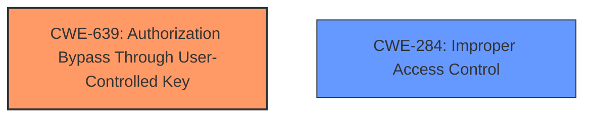

# Raw Analyzer Response for CVE-2025-0741

# Summary
| CWE ID | CWE Name | Confidence | CWE Abstraction Level | CWE Vulnerability Mapping Label | CWE-Vulnerability Mapping Notes |
|---|---|---|---|---|---|
| CWE-639 | Authorization Bypass Through User-Controlled Key | 0.9 | Base | Allowed | Primary CWE. The application allows an attacker to modify a key value (chat_id) to access another user's data. |
| CWE-284 | Improper Access Control | 0.6 | Class | Discouraged | Secondary candidate. While the description states **Improper Access Control**, CWE-639 is a more specific Base level CWE that describes the vulnerability more precisely. |

## Evidence and Confidence

*   **Confidence Score:** 0.9
*   **Evidence Strength:** HIGH

## Relationship Analysis
The primary CWE is CWE-639, which is a Base level CWE. CWE-284 is a more general Class level CWE, and while it's mentioned in the description, CWE-639 provides a more specific description of the vulnerability. There are no direct parent-child relationships apparent in the retriever results that change the mapping.

## Vulnerability Chain
The chain of events is as follows:
1.  **Root Cause:** CWE-639 - Authorization Bypass Through User-Controlled Key: The application allows the authenticated attacker to modify the `chat_id` parameter.
2.  **Impact:** An authenticated attacker can write messages into other users' chats.

## Summary of Analysis
The initial assessment identified CWE-639 as the most suitable primary CWE, given the ability to modify the `chat_id` parameter to gain unauthorized access, which directly aligns with the CWE's description. The vulnerability description explicitly mentions **Improper Access Control**, but the more specific weakness lies in the authorization bypass.

The decision is based on the evidence from the vulnerability description and the CVE Reference Links Content Summary, which both indicate that an authenticated attacker can write messages into other users' chats by manipulating the `chat_id` parameter. This aligns perfectly with the definition of CWE-639, where the system's authorization functionality fails to prevent one user from accessing another user's data by modifying the key value identifying the data.

The selected CWEs are at the optimal level of specificity, with CWE-639 being a Base level CWE that accurately represents the vulnerability.

Relevant CWE Information:

# Enhanced Context (25 CWEs)
The following CWEs were identified as potentially relevant to this vulnerability:

## CWE-639: Authorization Bypass Through User-Controlled Key
**Abstraction Level**: Base
**Similarity Score**: 0.75
**Source**: dense

**Description**:
The system's authorization functionality does not prevent one user from gaining access to another user's data or record by modifying the key value identifying the data.

**Mapping Guidance**:
- Usage: Allowed
- Rationale: This CWE entry is at the Base level of abstraction, which is a preferred level of abstraction for mapping to the root causes of vulnerabilities.

## CWE-284: Improper Access Control
**Abstraction Level**: Class
**Similarity Score**: 1444.55
**Source**: sparse

**Description**:
The product does not perform or incorrectly performs an authorization check when an actor attempts to access a resource or perform an action.

**Mapping Guidance**:
- Usage: Discouraged
- Rationale: CWE-285 is high-level and lower-level CWEs can frequently be used instead. It is a level-1 Class (i.e., a child of a Pillar).