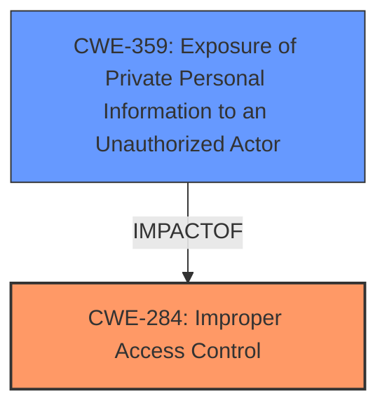

# Raw Analyzer Response for CVE-2025-0743

# Summary
| CWE ID | CWE Name | Confidence | CWE Abstraction Level | CWE Vulnerability Mapping Label | CWE-Vulnerability Mapping Notes |
|---|---|---|---|---|---|
| CWE-284 | Improper Access Control | 1.0 | Pillar | Primary | Allowed with Review |
| CWE-359 | Exposure of Private Personal Information to an Unauthorized Actor | 0.7 | Base | Secondary | Allowed |

## Evidence and Confidence

*   **Confidence Score:** 0.85
*   **Evidence Strength:** HIGH

## Relationship Analysis
The primary CWE is CWE-284, which is a high-level category. A more specific child CWE could potentially be applicable, however, the information provided doesn't give enough details to pinpoint the exact nature of the **improper access control**. CWE-359 is related to the impact of the **improper access control**, where sensitive information is exposed.

## Vulnerability Chain
The vulnerability chain starts with **improper access control** (CWE-284), which allows an authenticated attacker to access sensitive information leading to **exposure of private personal information to an unauthorized actor** (CWE-359).

## Summary of Analysis
The initial assessment identified the **root cause** as **improper access control**, leading to the exposure of sensitive user information. The vulnerability description and CVE content summary strongly support this assessment. The retriever results also suggest relevant CWEs related to authorization and information exposure.

The relationship graph illustrates that CWE-359 is a consequence of CWE-284.
The selection of CWE-284 is at a higher level (Pillar), but it accurately reflects the information available, since there isn't more information about how the access control was implemented. CWE-359 represents the impact of the vulnerability, as the attacker is able to view sensitive data.

Relevant CWE Information:

# Enhanced Context (25 CWEs)
The following CWEs were identified as potentially relevant to this vulnerability:

## CWE-472: External Control of Assumed-Immutable Web Parameter
**Abstraction Level**: Base
**Similarity Score**: 0.77
**Source**: dense
The product allows external control of assumed immutable parameters, not applicable here as we deal with access control issues

## CWE-41: Improper Resolution of Path Equivalence
**Abstraction Level**: Base
**Similarity Score**: 0.76
**Source**: dense
The product is vulnerable to file system contents disclosure through path equivalence. Path equivalence involves the use of special characters in file and directory names. The associated manipulations are intended to generate multiple names for the same object. Not applicable, the vulnerability is about accessing other user's data.

## CWE-497: Exposure of Sensitive System Information to an Unauthorized Control Sphere
**Abstraction Level**: Base
**Similarity Score**: 0.76
**Source**: dense
The product does not properly prevent sensitive system-level information from being accessed by unauthorized actors who do not have the same level of access to the underlying system as the product does. Similar to CWE-359 but not as direct since it's about "system-level"

## CWE-538: Insertion of Sensitive Information into Externally-Accessible File or Directory
**Abstraction Level**: Base
**Similarity Score**: 0.76
**Source**: dense
The product places sensitive information into files or directories that are accessible to actors who are allowed to have access to the files, but not to the sensitive information. Not directly applicable since it's about placing sensitive information, not about access control.

## CWE-668: Exposure of Resource to Wrong Sphere
**Abstraction Level**: Class
**Similarity Score**: 0.76
**Source**: dense
The product exposes a resource to the wrong control sphere, providing unintended actors with inappropriate access to the resource. Too generic, CWE-284 is more appropriate.

## CWE-212: Improper Removal of Sensitive Information Before Storage or Transfer
**Abstraction Level**: Base
**Similarity Score**: 0.75
**Source**: dense
The product stores, transfers, or shares a resource that contains sensitive information, but it does not properly remove that information before the product makes the resource available to unauthorized actors. This is more about not removing sensitive data, which isn't the case here.

## CWE-807: Reliance on Untrusted Inputs in a Security Decision
**Abstraction Level**: Base
**Similarity Score**: 0.75
**Source**: dense
The product uses a protection mechanism that relies on the existence or values of an input, but the input can be modified by an untrusted actor in a way that bypasses the protection mechanism. Not applicable in this case.

## CWE-639: Authorization Bypass Through User-Controlled Key
**Abstraction Level**: Base
**Similarity Score**: 0.75
**Source**: dense
The system's authorization functionality does not prevent one user from gaining access to another user's data or record by modifying the key value identifying the data. Potentially applicable, but the description doesn't state the authorization is bypassed through a user-controlled key.

## CWE-425: Direct Request ('Forced Browsing')
**Abstraction Level**: Base
**Similarity Score**: 0.75
**Source**: dense
The web application does not adequately enforce appropriate authorization on all restricted URLs, scripts, or files. Potentially applicable, but there is no description of URL manipulation.

## CWE-74: Improper Neutralization of Special Elements in Output Used by a Downstream Component ('Injection')
**Abstraction Level**: Class
**Similarity Score**: 0.75
**Source**: dense
The product constructs all or part of a command, data structure, or record using externally-influenced input from an upstream component, but it does not neutralize or incorrectly neutralizes special elements that could modify how it is parsed or interpreted when it is sent to a downstream component. Not related to this vulnerability.

## CWE-863: Incorrect Authorization
**Abstraction Level**: Class
**Similarity Score**: 1489.54
**Source**: sparse
The product performs an authorization check when an actor attempts to access a resource or perform an action, but it does not correctly perform the check. A more specific version of CWE-284.

## CWE-285: Improper Authorization
**Abstraction Level**: Class
**Similarity Score**: 1477.91
**Source**: sparse
The product does not perform or incorrectly performs an authorization check when an actor attempts to access a resource or perform an action. A more specific version of CWE-284.

## CWE-306: Missing Authentication for Critical Function
**Abstraction Level**: Base
**Similarity Score**: 1427.94
**Source**: sparse
The product does not perform any authentication for functionality that requires a provable user identity or consumes a significant amount of resources. The vulnerability description states the attacker is authenticated.

## CWE-22: Improper Limitation of a Pathname to a Restricted Directory ('Path Traversal')
**Abstraction Level**: Base
**Similarity Score**: 1391.43
**Source**: sparse
The product uses external input to construct a pathname that is intended to identify a file or directory that is located underneath a restricted parent directory, but the product does not properly neutralize special elements within the pathname that can cause the pathname to resolve to a location that is outside of the restricted directory. Not related.

## CWE-201: Insertion of Sensitive Information Into Sent Data
**Abstraction Level**: base
**Similarity Score**: 4.33
**Source**: graph
The product inserts sensitive information into sent data, which might be related to CWE-359 since it is about exposure of sensitive information.

## CWE-226: Sensitive Information in Resource Not Removed Before Reuse
**Abstraction Level**: base
**Similarity Score**: 4.33
**Source**: graph
The product reuses a resource that contains sensitive information without properly removing the sensitive information before reuse. Not applicable.

## CWE-322: Key Exchange without Entity Authentication
**Abstraction Level**: base
**Similarity Score**: 2.87
**Source**: graph
The product performs a key exchange without properly authenticating the entities involved. Not applicable.

## CWE-942: Permissive Cross-domain Policy with Untrusted Domains
**Abstraction Level**: variant
**Similarity Score**: 2.68
**Source**: graph
The product uses a permissive cross-domain policy that allows access from untrusted domains. Not applicable.

## CWE-306: Missing Authentication for Critical Function
**Abstraction Level**: base
**Similarity Score**: 2.40
**Source**: graph
The product does not perform any authentication for functionality that requires a provable user identity or consumes a significant amount of resources. The vulnerability description states the attacker is authenticated.