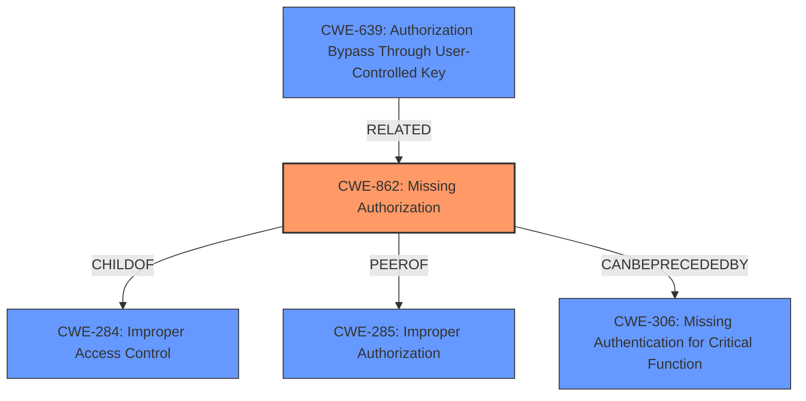

# Raw Analyzer Response for CVE-2025-0744

# Summary
| CWE ID    | CWE Name                                                       | Confidence | CWE Abstraction Level | CWE Vulnerability Mapping Label | CWE-Vulnerability Mapping Notes |
| --------- | ------------------------------------------------------------- | ---------- | --------------------- | ------------------------------- | ------------------------------- |
| CWE-862   | Missing Authorization                                          | 0.9        | Class                 | Allowed-with-Review            | Primary CWE                     |
| CWE-287 | Improper Authentication                                             | 0.7        | Class                  | Discouraged                               | Secondary Candidate               |
| CWE-306   | Missing Authentication for Critical Function                  | 0.6        | Base                  | Allowed                         | Secondary Candidate               |
| CWE-639   | Authorization Bypass Through User-Controlled Key              | 0.5        | Base                  | Allowed                         | Secondary Candidate               |
| CWE-285 | Improper Authorization                                                       | 0.4        | Class                  | Discouraged                               | Secondary Candidate               |

## Evidence and Confidence

*   **Confidence Score:** 0.8
*   **Evidence Strength:** MEDIUM

## Relationship Analysis
The primary CWE is CWE-862, Missing Authorization. This is a class-level CWE, and while it could potentially have more specific children, none are a clear fit based on the provided information. CWE-862 is related to CWE-284 (Improper Access Control) and CWE-285 (Improper Authorization) as a more specific form of improper access control. Additionally, it could be related to authentication issues, such as CWE-306 (Missing Authentication for Critical Function) if authentication is lacking prior to authorization. The relationship between authentication and authorization is crucial here, as missing authentication can lead to authorization bypass.

## Vulnerability Chain
The vulnerability chain starts with an **Improper Access Control** which leads to missing authorization check at the "/demos/embedai/pmt_cash_on_delivery/pay" endpoint, allowing an authenticated attacker to change their subscription plan without paying. The chain is:

1.  **Improper Access Control** (Initial Weakness)
2.  **Missing Authorization** (CWE-862) at the endpoint.
3.  **Change Subscription Plan Without Paying** (Impact)

## Summary of Analysis
The primary focus is on the **Improper Access Control** vulnerability, specifically the ability for an authenticated user to change their subscription plan without proper authorization. The description highlights the **rootcause** as **Improper Access Control**. The analysis of the vulnerability description and the retriever results suggests that CWE-862 (Missing Authorization) is the most appropriate primary CWE. The vulnerability description states that an authenticated attacker can change his subscription plan without paying. This indicates that there is no authorization check in place to prevent authenticated users from changing their subscription plan, thus leading to **Improper Access Control**.

The retriever results also suggest other CWEs, such as CWE-306 (Missing Authentication for Critical Function) and CWE-639 (Authorization Bypass Through User-Controlled Key). However, based on the provided description, the attacker is authenticated, so the issue is not a complete lack of authentication, ruling out CWE-306. CWE-639 could be a secondary factor if the attacker is manipulating a key to bypass authorization, but the primary issue is the lack of an authorization check.

The guidance provided emphasizes the distinction between authentication and authorization. Since the attacker is authenticated, the primary issue is the missing authorization, making CWE-862 the most fitting choice.

The selection of CWE-862 is at the optimal level of specificity because it directly addresses the missing authorization check, which is the core of the vulnerability. While CWE-284 (Improper Access Control) is a broader category, CWE-862 provides a more precise classification of the weakness.

Relevant CWE Information:

# Enhanced Context (25 CWEs)
The following CWEs were identified as potentially relevant to this vulnerability:

## CWE-472: External Control of Assumed-Immutable Web Parameter
**Abstraction Level**: Base
**Similarity Score**: 0.75
**Source**: dense

**Description**:
The web application does not sufficiently verify inputs that are assumed to be immutable but are actually externally controllable, such as hidden form fields.

**Mapping Guidance**:
- Usage: Allowed
- Rationale: This CWE entry is at the Base level of abstraction, which is a preferred level of abstraction for mapping to the root causes of vulnerabilities.

## CWE-639: Authorization Bypass Through User-Controlled Key
**Abstraction Level**: Base
**Similarity Score**: 0.74
**Source**: dense

**Description**:
The system's authorization functionality does not prevent one user from gaining access to another user's data or record by modifying the key value identifying the data.

**Mapping Guidance**:
- Usage: Allowed
- Rationale: This CWE entry is at the Base level of abstraction, which is a preferred level of abstraction for mapping to the root causes of vulnerabilities.

## CWE-807: Reliance on Untrusted Inputs in a Security Decision
**Abstraction Level**: Base
**Similarity Score**: 0.74
**Source**: dense

**Description**:
The product uses a protection mechanism that relies on the existence or values of an input, but the input can be modified by an untrusted actor in a way that bypasses the protection mechanism.

**Mapping Guidance**:
- Usage: Allowed
- Rationale: This CWE entry is at the Base level of abstraction, which is a preferred level of abstraction for mapping to the root causes of vulnerabilities.

## CWE-303: Incorrect Implementation of Authentication Algorithm
**Abstraction Level**: Base
**Similarity Score**: 0.73
**Source**: dense

**Description**:
The requirements for the product dictate the use of an established authentication algorithm, but the implementation of the algorithm is incorrect.

**Mapping Guidance**:
- Usage: Allowed
- Rationale: This CWE entry is at the Base level of abstraction, which is a preferred level of abstraction for mapping to the root causes of vulnerabilities.

## CWE-425: Direct Request ('Forced Browsing')
**Abstraction Level**: Base
**Similarity Score**: 0.73
**Source**: dense

**Description**:
The web application does not adequately enforce appropriate authorization on all restricted URLs, scripts, or files.

**Mapping Guidance**:
- Usage: Allowed
- Rationale: This CWE entry is at the Base level of abstraction, which is a preferred level of abstraction for mapping to the root causes of vulnerabilities.

## CWE-41: Improper Resolution of Path Equivalence
**Abstraction Level**: Base
**Similarity Score**: 0.73
**Source**: dense

**Description**:
The product is vulnerable to file system contents disclosure through path equivalence. Path equivalence involves the use of special characters in file and directory names. The associated manipulations are intended to generate multiple names for the same object.

**Mapping Guidance**:
- Usage: Allowed
- Rationale: This CWE entry is at the Base level of abstraction, which is a preferred level of abstraction for mapping to the root causes of vulnerabilities.

## CWE-74: Improper Neutralization of Special Elements in Output Used by a Downstream Component ('Injection')
**Abstraction Level**: Class
**Similarity Score**: 0.73
**Source**: dense

**Description**:
The product constructs all or part of a command, data structure, or record using externally-influenced input from an upstream component, but it does not neutralize or incorrectly neutralizes special elements that could modify how it is parsed or interpreted when it is sent to a downstream component.

**Mapping Guidance**:
- Usage: Discouraged
- Rationale: CWE-74 is high-level and often misused when lower-level weaknesses are more appropriate.

## CWE-668: Exposure of Resource to Wrong Sphere
**Abstraction Level**: Class
**Similarity Score**: 0.73
**Source**: dense

**Description**:
The product exposes a resource to the wrong control sphere, providing unintended actors with inappropriate access to the resource.

**Mapping Guidance**:
- Usage: Discouraged
- Rationale: CWE-668 is high-level and is often misused as a catch-all when lower-level CWE IDs might be applicable. It is sometimes used for