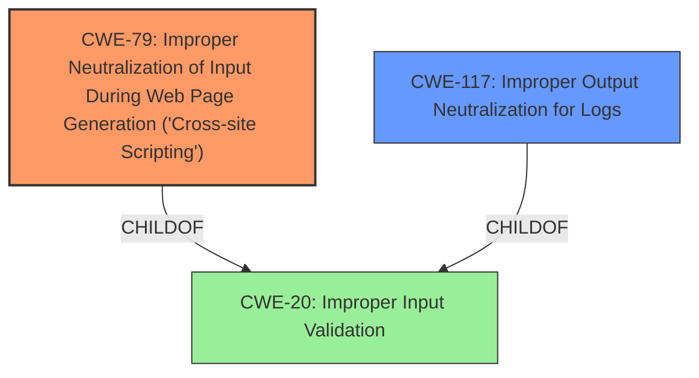

# Raw Analyzer Response for CVE-2025-0754

# Summary

| CWE ID | CWE Name | Confidence | CWE Abstraction Level | CWE Vulnerability Mapping Label | CWE-Vulnerability Mapping Notes |
|---|---|---|---|---|---|
| CWE-79 | Improper Neutralization of Input During Web Page Generation ('Cross-site Scripting') | 0.9 | Base | Allowed | Primary CWE. The vulnerability description explicitly mentions the potential for reflected XSS attacks as a result of the **improper sanitization**.|
| CWE-117 | Improper Output Neutralization for Logs | 0.7 | Base | Allowed | The vulnerability leads to log injection, which is directly related to **improper output neutralization** when writing logs.|

## Evidence and Confidence

*   **Confidence Score:** 0.8
*   **Evidence Strength:** HIGH

## Relationship Analysis
The primary relationship influencing the decision is the parent-child relationship between CWE-20 (Improper Input Validation) and both CWE-79 (Cross-site Scripting) and CWE-117 (Improper Output Neutralization for Logs). The **improper sanitization** leads directly to XSS and log injection.

## Vulnerability Chain
The vulnerability chain starts with **improper sanitization** of HTTP headers. This leads to two distinct but related weaknesses:

1.  The ability to inject malicious payloads into service mesh logs (CWE-117).
2.  The potential for reflected XSS attacks (CWE-79).

Thus, the chain is: **Improper Sanitization** -> Log Injection (CWE-117) and/or XSS (CWE-79).

## Summary of Analysis
The initial assessment identified CWE-79 as the primary candidate due to the explicit mention of XSS in the vulnerability description. However, the log injection aspect also needed to be addressed. The key phrase "improper sanitization of HTTP headers by Envoy" from the "Vulnerability Description Key Phrases" provides strong evidence for both CWE-79 and CWE-117.

The graph relationships, particularly the child-of relationship to CWE-20, helped to confirm that both CWE-79 and CWE-117 are specific instances of a broader input validation issue.

The selection of CWE-79 and CWE-117 at the Base level provides the optimal level of specificity, as these CWEs directly describe the observed weaknesses resulting from the **improper sanitization**.

Relevant CWE Information:
* Vulnerability Description: "This issue occurs due to **improper sanitization of HTTP headers by Envoy**, particularly the x-forwarded-for header. This lack of sanitization can allow attackers to inject malicious payloads into service mesh logs, leading to log injection and spoofing attacks. Such injections can mislead logging mechanisms, enabling attackers to manipulate log entries or execute reflected **cross-site scripting** (XSS) attacks."
* CVE Reference Links Content Summary: "Insufficient sanitization of HTTP headers within the OpenShift Service Mesh, specifically the `x-forwarded-for` header."

The evidence clearly supports the selection of both CWE-79 and CWE-117.

Other CWEs Considered:

*   CWE-138 (Improper Neutralization of Special Elements): This is a Class-level CWE and is too broad. CWE-79 is a more specific instance of this.
*   CWE-93 (Improper Neutralization of CRLF Sequences ('CRLF Injection')): While log injection is present, the primary issue isn't CRLF injection specifically, but rather the broader **improper sanitization** allowing any kind of malicious payload.
*   CWE-74 (Improper Neutralization of Special Elements in Output Used by a Downstream Component ('Injection')): Similar to CWE-138, this is too broad.
* CWE-113: Improper Neutralization of CRLF Sequences in HTTP Headers ('HTTP Request/Response Splitting'): This is less appropriate than CWE-79 and CWE-117 because the issue isn't specifically related to HTTP Request/Response Splitting