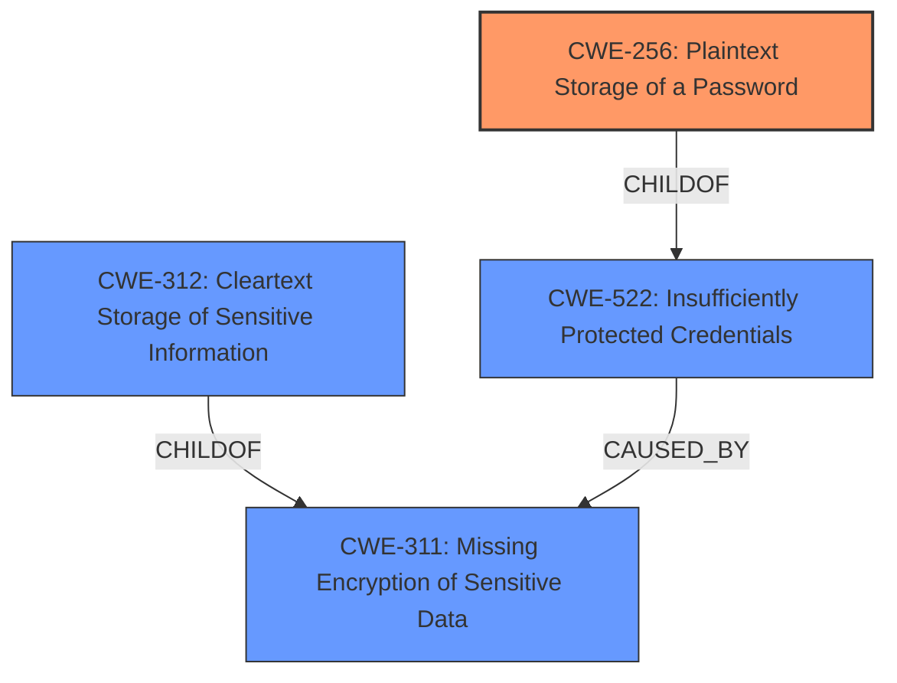

# Analysis Report for CVE-2025-0760

# Vulnerability Analysis Report: CVE-2025-0760

## Description

A Credential Disclosure vulnerability exists where an administrator could extract the stored SMTP account credentials due to lack of encryption.

## Vulnerability Description Key Phrases

- **Rootcause:** Lack of encryption, Unencrypted password
- **Impact:** Credential Disclosure
- **Attacker:** Administrator

## Analysis (with Relationship Data)

# Summary
| CWE ID | CWE Name | Confidence | CWE Abstraction Level | CWE Vulnerability Mapping Label | CWE-Vulnerability Mapping Notes |
|---|---|---|---|---|---|
| CWE-256 | Plaintext Storage of a Password | 1.0 | Base | Allowed | Primary CWE. The vulnerability involves storing the SMTP password in plaintext. |
| CWE-312 | Cleartext Storage of Sensitive Information | 0.7 | Base | Allowed | The password for the SMTP account is sensitive information. |
| CWE-522 | Insufficiently Protected Credentials | 0.6 | Class | Allowed-with-Review | Credentials are not protected through encryption. |

## Evidence and Confidence

*   **Confidence Score:** 0.9
*   **Evidence Strength:** HIGH

## Relationship Analysis
The primary CWE is CWE-256, which is a specific type of CWE-522 (Insufficiently Protected Credentials), which in turn could be caused by CWE-311 (Missing Encryption of Sensitive Data) or result in CWE-312 (Cleartext Storage of Sensitive Information). The vulnerability description directly states the **lack of encryption** (**rootcause**) as the cause for the credential disclosure, which makes CWE-256 the most direct and applicable root cause.



## Vulnerability Chain
The vulnerability chain starts with the **lack of encryption** for the SMTP account credentials. This leads to the **unencrypted password** being stored in plaintext, which then results in the credential disclosure vulnerability, where an administrator can extract the stored credentials.

## Summary of Analysis
The initial analysis strongly suggests CWE-256 (Plaintext Storage of a Password) as the primary CWE, given the direct evidence from the vulnerability description and the CVE reference summary, which states the **lack of encryption** as the root cause. The other suggested CWEs like CWE-312 and CWE-522 are related but are either higher-level or represent the impact rather than the root cause. The graph relationships confirm this understanding, with CWE-256 being a child of CWE-522, making it a more specific and accurate representation of the vulnerability.

The vulnerability description explicitly states: "A Credential Disclosure vulnerability exists where an administrator could extract the stored SMTP account credentials due to **lack of encryption**."

The final decision is based on direct evidence, relationship analysis, and mapping guidance, ensuring that the selected CWEs are at the optimal level of specificity and accurately represent the vulnerability's root cause and potential impact.
Based on the Retriever Results, the following is the list of CWEs that were considered but not used.

*   CWE-259: Use of Hard-coded Password - This was not used since the password was not hardcoded, but stored in plaintext.
*   CWE-325: Missing Cryptographic Step - This was not used since the vulnerability is not about missing a cryptographic step in general, but about storing the password in plaintext.
*   CWE-321: Use of Hard-coded Cryptographic Key - This was not used since the vulnerability is not about using a hardcoded cryptographic key, but about storing the password in plaintext.
*   CWE-319: Cleartext Transmission of Sensitive Information - This was not used since the vulnerability is not about transmitting the password in cleartext, but about storing it in plaintext.
*   CWE-1392: Use of Default Credentials - This was not used since the vulnerability is not about using default credentials, but about storing the password in plaintext.
*   CWE-472: External Control of Assumed-Immutable Web Parameter - This was not used since this is not relevant to the case of storing the password in plaintext.


## CWE Relationship Analysis

Current CWEs represent these abstraction levels: .


### Vulnerability Chain Analysis

**Chain starting from CWE-321:**
- 321 (Use of Hard-coded Cryptographic Key) - ROOT


**Chain starting from CWE-319:**
- 319 (Cleartext Transmission of Sensitive Information) - ROOT


### CWE Relationship Diagram

```mermaid
graph TD
    classDef primary fill:#f96,stroke:#333,stroke-width:2px
    classDef secondary fill:#69f,stroke:#333
    classDef tertiary fill:#9e9,stroke:#333
```


*Report generated on 2025-07-14 06:20:58*
