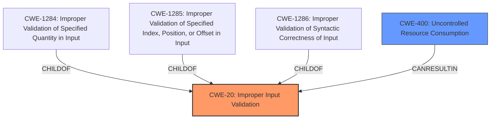

# Raw Analyzer Response for CVE-2025-0815

# Summary
| CWE ID  | CWE Name                                                      | Confidence | CWE Abstraction Level | CWE Vulnerability Mapping Label | CWE-Vulnerability Mapping Notes |
| :-------- | :------------------------------------------------------------ | :--------- | :---------------------- | :------------------------------ | :------------------------------ |
| CWE-20    | Improper Input Validation                                     | 0.75       | Class                   | Primary CWE                    | Discouraged                   |
| CWE-400   | Uncontrolled Resource Consumption ('Resource Exhaustion')   | 0.65       | Base                    | Secondary Candidate                | Allowed                       |

## Evidence and Confidence

*   **Confidence Score:** 0.70
*   **Evidence Strength:** MEDIUM

## Relationship Analysis

The primary relationship influencing the CWE selection is the parent-child relationship. CWE-20 is a class-level CWE, and more specific base or variant level CWEs could potentially be children of CWE-20 (e.g., CWE-1284, CWE-1285, CWE-1286). However, the provided vulnerability description lacks sufficient detail to pinpoint a specific type of **improper input validation**. CWE-400 is a potential consequence of **improper input validation**, specifically when dealing with resource consumption.

## Vulnerability Chain

The vulnerability chain starts with **improper input validation** (CWE-20). The attacker sends malicious ICMPv6 packets (vector), which are not properly validated. This leads to a denial-of-service (impact). While the description points to a DoS, the root cause is the **lack of input validation**. It is possible that the DoS is caused by resource exhaustion (CWE-400), because the invalid input may cause the program to consume excessive resources.
CWE-20 -> CWE-400

## Summary of Analysis

The initial analysis focused on identifying the root cause of the vulnerability and its potential impact. The vulnerability description explicitly mentions "**Improper Input Validation vulnerability** exists that could cause Denial-of-Service".
The primary focus was on the **improper input validation** aspect, which led to the selection of CWE-20. The description lacks specific details about the type of input validation that is missing or incorrect. Given the information, CWE-20 is the most appropriate primary CWE. It is possible that the DoS is a result of resource exhaustion, so CWE-400 is included as a secondary candidate.
The decision to use CWE-20 is based on the explicit mention of "**Input Validation vulnerability**". While CWE-20 is a class-level CWE and discouraged, the lack of details prevents a more specific mapping.

Relevant CWE Information:

*   **CWE-20: Improper Input Validation**: This CWE is selected as the primary weakness because the vulnerability description explicitly states "**Improper Input Validation vulnerability** exists". The description matches the CWE's characteristic of not validating input properties. The security implication is a denial-of-service.
*   **CWE-400: Uncontrolled Resource Consumption ('Resource Exhaustion')**: This CWE is a likely consequence of **improper input validation** in this case because the description mentioned that the vulnerability could cause Denial-of-Service. Malicious ICMPv6 packets may cause the device to exhaust its resources, leading to a DoS. This CWE is a base-level CWE, and the mapping is allowed.

CWEs Considered But Not Used:

*   CWE-1284, CWE-1285, and CWE-1286: These CWEs represent more specific types of **improper input validation**. However, the vulnerability description lacks the necessary details to determine if the vulnerability involves a quantity, index, or syntactic correctness issue. Therefore, they were not selected.
*   CWE-789: This CWE relates to memory allocation with excessive size value. While DoS can be caused by allocating too much memory, there is no direct evidence in the description.
*   CWE-119: This CWE relates to improper restriction of operations within the bounds of a memory buffer. While this could be triggered by crafted packets, there is not sufficient information to classify this as a memory corruption issue.