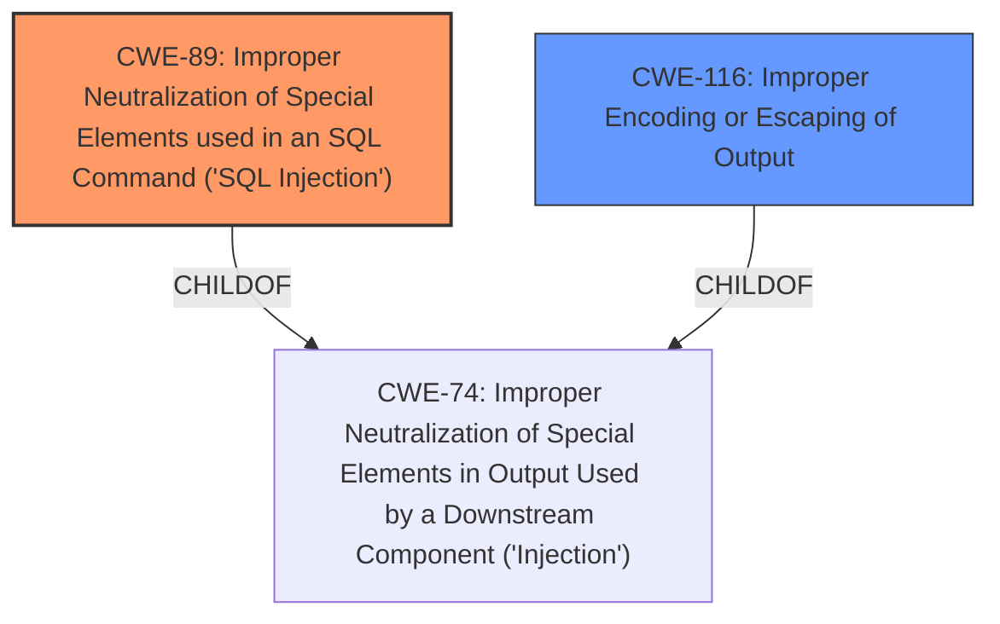

# Raw Analyzer Response for CVE-2025-0866

# Summary
| CWE ID   | CWE Name                                                                      | Confidence | CWE Abstraction Level | CWE Vulnerability Mapping Label | CWE-Vulnerability Mapping Notes |
| -------- | ----------------------------------------------------------------------------- | ---------- | --------------------- | ------------------------------- | ------------------------------- |
| CWE-89   | Improper Neutralization of Special Elements used in an SQL Command ('SQL Injection') | 1          | Base                  | Primary                         | Allowed                         |
| CWE-116  | Improper Encoding or Escaping of Output                                     | 0.7        | Class                 | Secondary                       | Allowed-with-Review             |

## Evidence and Confidence

*   **Confidence Score:** 0.9
*   **Evidence Strength:** HIGH

## Relationship Analysis
The primary weakness is CWE-89, which directly addresses the **improper neutralization** issue leading to SQL injection. CWE-116 is a related Class-level weakness, but CWE-89 is more specific and directly applicable. The root cause of the vulnerability is the **insufficient escaping** of user-supplied parameters and the **lack of sufficient preparation** on the existing SQL query, which enables the injection.

## Vulnerability Chain
The vulnerability chain starts with **insufficient escaping** and **lack of sufficient preparation** of the SQL query. This leads to the **time-based SQL Injection**, which ultimately allows attackers to **extract sensitive information from the database**.
- **Root Cause:** **Insufficient escaping** and **lack of sufficient preparation**
- **Weakness:** **Time-based SQL Injection**
- **Impact:** **Extract sensitive information**

## Summary of Analysis
The primary CWE is CWE-89 because the vulnerability description clearly states that the Legoeso PDF Manager plugin is vulnerable to **time-based SQL Injection** due to **insufficient escaping** and **lack of sufficient preparation** on the existing SQL query. This aligns directly with the description of CWE-89, which focuses on **improper neutralization** of special elements in SQL commands.
The description explicitly mentions that authenticated attackers can append additional SQL queries to extract sensitive information.

CWE-116 is considered a secondary CWE because **insufficient escaping** directly relates to **improper encoding or escaping of output**. However, CWE-89 is more specific to SQL injection vulnerabilities.

The analysis is based on the provided evidence, specifically the vulnerability description and the keyphrase analysis.

Relevant evidence:
- "The Legoeso PDF Manager plugin for WordPress is vulnerable to **time-based SQL Injection** via the checkedVals parameter in all versions up to, and including, 1.2.2 due to **insufficient escaping on the user supplied parameter and lack of sufficient preparation on the existing SQL query**."

The selection of CWE-89 is at the optimal level of specificity, as it directly addresses the SQL injection vulnerability described.

# Enhanced Context (25 CWEs)
The following CWEs were identified as potentially relevant to this vulnerability:

## CWE-74: Improper Neutralization of Special Elements in Output Used by a Downstream Component ('Injection')
**Abstraction Level**: Class
**Similarity Score**: 0.75
**Source**: dense

**Description**:
The product constructs all or part of a command, data structure, or record using externally-influenced input from an upstream component, but it does not neutralize or incorrectly neutralizes special elements that could modify how it is parsed or interpreted when it is sent to a downstream component.

**Mapping Guidance**:
- Usage: Discouraged
- Rationale: CWE-74 is high-level and often misused when lower-level weaknesses are more appropriate.

*Not Used*: CWE-74 is too high-level and the child CWE-89 is a better fit.

## CWE-138: Improper Neutralization of Special Elements
**Abstraction Level**: Class
**Similarity Score**: 0.75
**Source**: dense

**Description**:
The product receives input from an upstream component, but it does not neutralize or incorrectly neutralizes special elements that could be interpreted as control elements or syntactic markers when they are sent to a downstream component.

**Mapping Guidance**:
- Usage: Discouraged
- Rationale: This CWE entry is a level-1 Class (i.e., a child of a Pillar). It might have lower-level children that would be more appropriate

*Not Used*: CWE-138 is too general and the more specific CWE-89 is a better fit.

## CWE-303: Incorrect Implementation of Authentication Algorithm
**Abstraction Level**: Base
**Similarity Score**: 0.74
**Source**: dense

**Description**:
The requirements for the product dictate the use of an established authentication algorithm, but the implementation of the algorithm is incorrect.

**Mapping Guidance**:
- Usage: Allowed
- Rationale: This CWE entry is at the Base level of abstraction, which is a preferred level of abstraction for mapping to the root causes of vulnerabilities.

*Not Used*: This CWE is not applicable as the vulnerability is not related to authentication algorithms.

## CWE-345: Insufficient Verification of Data Authenticity
**Abstraction Level**: Class
**Similarity Score**: 0.74
**Source**: dense

**Description**:
The product does not sufficiently verify the origin or authenticity of data, in a way that causes it to accept invalid data.

**Mapping Guidance**:
- Usage: Discouraged
- Rationale: This CWE entry is a level-1 Class (i.e., a child of a Pillar). It might have lower-level children that would be more appropriate

*Not Used*: This CWE is not applicable as the vulnerability is related to SQL injection, not data authenticity.

## CWE-212: Improper Removal of Sensitive Information Before Storage or Transfer
**Abstraction Level**: Base
**Similarity Score**: 0.74
**Source**: dense

**Description**:
The product stores, transfers, or shares a resource that contains sensitive information, but it does not properly remove that information before the product makes the resource available to unauthorized actors.

**Mapping Guidance**:
- Usage: Allowed
- Rationale: This CWE entry is at the Base level of abstraction, which is a preferred level of abstraction for mapping to the root causes of vulnerabilities.

*Not Used*: This CWE is not applicable as the vulnerability is related to SQL injection, not sensitive information handling.

## CWE-668: Exposure of Resource to Wrong Sphere
**Abstraction Level**: Class
**Similarity Score**: 0.74
**Source**: dense

**Description**:
The product exposes a resource to the wrong control sphere, providing unintended actors with inappropriate access to the resource.

**Mapping Guidance**:
- Usage: Discouraged
- Rationale: CWE-668 is high-level and is often misused as a catch-all when lower-level CWE IDs might be applicable. It is sometimes used for low-information vulnerability reports [REF-1287]. It is a level-1 Class (i.e., a child of a Pillar). It is not useful for trend analysis.

*Not Used*: This CWE is not applicable as the vulnerability is related to SQL injection, not resource exposure.

## CWE-425: Direct Request ('Forced Browsing')
**Abstraction Level**: Base
**Similarity Score**: 0.74
**Source**: dense

**Description**:
The web application does not adequately enforce appropriate authorization on all restricted URLs, scripts, or files.

**Mapping Guidance**:
- Usage: Allowed
- Rationale: This CWE entry is at the Base level of abstraction, which is a preferred level of abstraction for mapping to the root causes of vulnerabilities.

*Not Used*: This CWE is not applicable as the vulnerability is related to SQL injection, not direct requests.

## CWE-116: Improper Encoding or Escaping of Output
**Abstraction Level**: Class
**Similarity Score**: 0.74
**Source**: dense

**Description**:
The product prepares a structured message for communication with another component, but encoding or escaping of the data is either missing or done incorrectly. As a result, the intended structure of the message is not preserved.

**Mapping Guidance**:
- Usage: Allowed-with-Review
- Rationale: This CWE entry is a Class and might have Base-level children that would be more appropriate

*Used as secondary*: CWE-116 is a general class of weakness related to encoding/escaping, which is relevant to the vulnerability.

## CWE-472: External Control of Assumed-Immutable Web Parameter
**Abstraction Level**: Base
**Similarity Score**: 0.74
**Source**: dense

**Description**:
The web application does not sufficiently verify inputs that are assumed to be immutable but are actually externally controllable, such as hidden form fields.

**