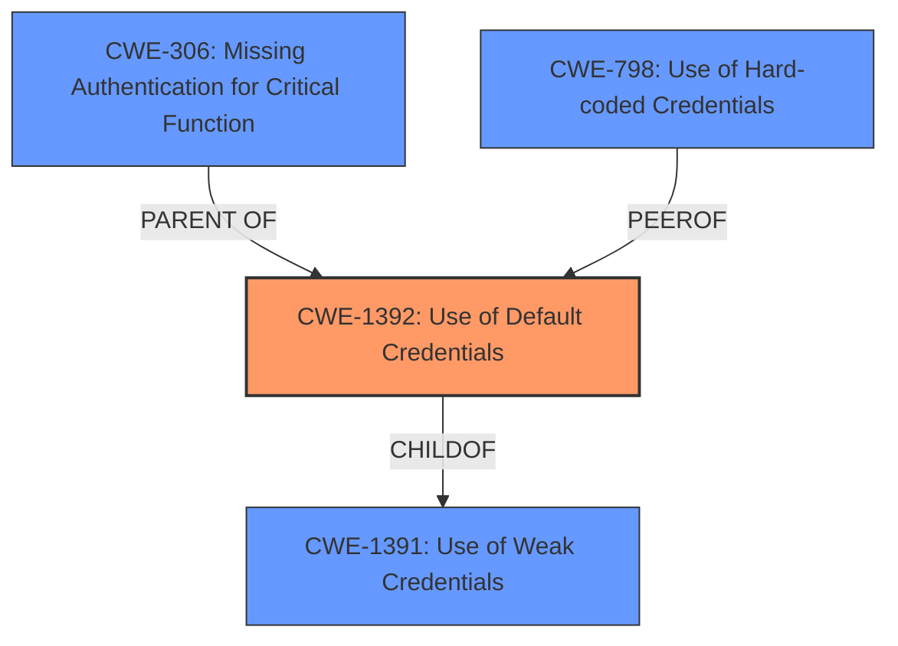

# Raw Analyzer Response for CVE-2025-0890

# Summary
| CWE ID | CWE Name | Confidence | CWE Abstraction Level | CWE Vulnerability Mapping Label | CWE-Vulnerability Mapping Notes |
|---|---|---|---|---|---|
| CWE-1392 | Use of Default Credentials | 1.0 | Base | Allowed | Primary CWE |
| CWE-306 | Missing Authentication for Critical Function | 0.6 | Base | Allowed | Secondary Candidate |
| CWE-798 | Use of Hard-coded Credentials | 0.6 | Base | Allowed | Secondary Candidate |

## Evidence and Confidence

*   **Confidence Score:** 0.8
*   **Evidence Strength:** HIGH

## Relationship Analysis
The primary CWE, CWE-1392 (Use of Default Credentials), is a Base level CWE, which aligns with the goal of identifying the root cause. CWE-1392 is related to CWE-1391 (Use of Weak Credentials) at the Class level. Since the description specifies "insecure default credentials", CWE-1392 is more specific and appropriate than its parent, CWE-1391.

CWE-306 (Missing Authentication for Critical Function) and CWE-798 (Use of Hard-coded Credentials) are also considered because the use of default credentials can lead to a missing authentication scenario, and default credentials can be hard-coded.

## Vulnerability Chain
The vulnerability chain starts with the **insecure default credentials** (CWE-1392), which leads to a potential authentication bypass and allows an attacker to log in to the management interface.

## Summary of Analysis
The primary weakness is the presence of **insecure default credentials** for the Telnet function. The vulnerability description states "**Insecure default credentials** for the Telnet function in the legacy DSL CPE Zyxel VMG4325-B10A firmware version 1.00(AAFR.4)C0_20170615 could allow an attacker to log in to the management interface if the administrators have the option to change the default credentials but fail to do so." This directly points to CWE-1392 (Use of Default Credentials) as the root cause. The "CVE Reference Links Content Summary" also confirms "**Root cause of vulnerability:** Insecure default credentials for the Telnet function."
CWE-1392 is a Base level CWE and is more specific than CWE-1391 (Use of Weak Credentials), which is a Class level CWE.

CWE-306 (Missing Authentication for Critical Function) is a possible consequence of using default credentials, but it is not the root cause. Similarly, CWE-798 (Use of Hard-coded Credentials) could be related if the default credentials are hard-coded, but this is not explicitly stated in the vulnerability description. Therefore, CWE-1392 is the most accurate and specific CWE to represent the vulnerability.

Relevant CWE Information:

# Enhanced Context (25 CWEs)
The following CWEs were identified as potentially relevant to this vulnerability:

## CWE-1392: Use of Default Credentials
**Abstraction Level**: Base
**Similarity Score**: 0.78
**Source**: dense

**Description**:
The product uses default credentials (such as passwords or cryptographic keys) for potentially critical functionality.

**Mapping Guidance**:
- Usage: Allowed
- Rationale: This CWE entry is at the Base level of abstraction, which is a preferred level of abstraction for mapping to the root causes of vulnerabilities.