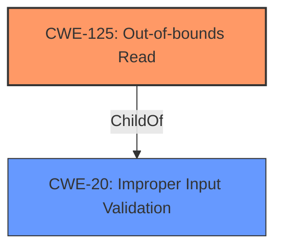

# Enhanced Analysis for CVE-2025-0904

# Summary
| CWE ID | CWE Name | Confidence | CWE Abstraction Level | CWE Vulnerability Mapping Label | CWE-Vulnerability Mapping Notes |
|---|---|---|---|---|---|
| CWE-125 | Out-of-bounds Read | 0.9 | Base | Primary | Allowed |
| CWE-20 | Improper Input Validation | 0.7 | Class | Secondary | Discouraged |

## Evidence and Confidence

*   **Confidence Score:** 0.8
*   **Evidence Strength:** HIGH

## Relationship Analysis
The primary weakness is CWE-125 **Out-of-bounds Read**, which occurs due to **lack of proper validation of user-supplied data**, suggesting a relationship with CWE-20 **Improper Input Validation**.
CWE-125 is a base CWE, which is the preferred level of abstraction.
CWE-20 is a class CWE, and is often misused in low-information vulnerability reports when lower-level CWEs could be used instead.



## Vulnerability Chain
The vulnerability chain starts with **lack of proper validation of user-supplied data** (CWE-20), leading to an **Out-Of-Bounds Read** (CWE-125), and resulting in **Information Disclosure**.
- **Root Cause:** CWE-20 Improper Input Validation
- **Weakness:** CWE-125 Out-of-bounds Read
- **Impact:** Information Disclosure

## Summary of Analysis
The initial analysis identified CWE-125 **Out-of-bounds Read** and CWE-20 **Improper Input Validation** as the primary candidates. The vulnerability description clearly states "**Out-Of-Bounds Read** **Information Disclosure Vulnerability**" and mentions that the issue results from the **lack of proper validation of user-supplied data**.

The Retriever results and keyphrase analysis also pointed towards these CWEs. Given the specific nature of the vulnerability, CWE-125 is selected as the primary CWE because it describes the specific **out-of-bounds read** condition. CWE-20 is added as a secondary CWE due to the **lack of proper validation of user-supplied data** aspect of the root cause.

The selection of CWE-125 is at the optimal level of specificity (Base).

Relevant CWE Information:

# Enhanced Context (25 CWEs)
The following CWEs were identified as potentially relevant to this vulnerability:

## CWE-125: Out-of-bounds Read
**Abstraction Level**: Base
**Similarity Score**: 4216.02
**Source**: sparse

**Description**:
The product reads data past the end, or before the beginning, of the intended buffer.

**Mapping Guidance**:
- Usage: Allowed
- Rationale: This CWE entry is at the Base level of abstraction, which is a preferred level of abstraction for mapping to the root causes of vulnerabilities.

# Summary
| CWE ID | CWE Name | Confidence | CWE Abstraction Level | CWE Vulnerability Mapping Label | CWE-Vulnerability Mapping Notes |
|---|---|---|---|---|---|
| CWE-125 | Out-of-bounds Read | 0.9 | Base | Primary | Allowed |
| CWE-20 | Improper Input Validation | 0.7 | Class | Secondary | Discouraged |

## Evidence and Confidence

*   **Confidence Score:** 0.8
*   **Evidence Strength:** HIGH

## Relationship Analysis
The primary weakness is CWE-125 **Out-of-bounds Read**, which occurs due to **lack of proper validation of user-supplied data**, suggesting a relationship with CWE-20 **Improper Input Validation**.
CWE-125 is a base CWE, which is the preferred level of abstraction.
CWE-20 is a class CWE, and is often misused in low-information vulnerability reports when lower-level CWEs could be used instead.mermaid
graph TD
    cwe125["CWE-125: Out-of-bounds Read"]
    cwe20["CWE-20: Improper Input Validation"]

    cwe125 -->|ChildOf| cwe20
    
    classDef primary fill:#f96,stroke:#333,stroke-width:2px
    classDef secondary fill:#69f,stroke:#333
    class cwe125 primary
    class cwe20 secondary
```

## Vulnerability Chain
The vulnerability chain starts with **lack of proper validation of user-supplied data** (CWE-20), leading to an **Out-Of-Bounds Read** (CWE-125), and resulting in **Information Disclosure**.
- **Root Cause:** CWE-20 Improper Input Validation
- **Weakness:** CWE-125 Out-of-bounds Read
- **Impact:** Information Disclosure

## Summary of Analysis
The initial analysis identified CWE-125 **Out-of-bounds Read** and CWE-20 **Improper Input Validation** as the primary candidates. The vulnerability description clearly states "**Out-Of-Bounds Read** **Information Disclosure Vulnerability**" and mentions that the issue results from the **lack of proper validation of user-supplied data**.

The Retriever results and keyphrase analysis also pointed towards these CWEs. Given the specific nature of the vulnerability, CWE-125 is selected as the primary CWE because it describes the specific **out-of-bounds read** condition. CWE-20 is added as a secondary CWE due to the **lack of proper validation of user-supplied data** aspect of the root cause.

The selection of CWE-125 is at the optimal level of specificity (Base).
```


## CWE Relationship Analysis

Current CWEs represent these abstraction levels: .


### Vulnerability Chain Analysis

**Chain starting from CWE-20:**
- 20 (Improper Input Validation) - ROOT


**Chain starting from CWE-125:**
- 125 (Out-of-bounds Read) - ROOT


### CWE Relationship Diagram

```mermaid
graph TD
    classDef primary fill:#f96,stroke:#333,stroke-width:2px
    classDef secondary fill:#69f,stroke:#333
    classDef tertiary fill:#9e9,stroke:#333
```