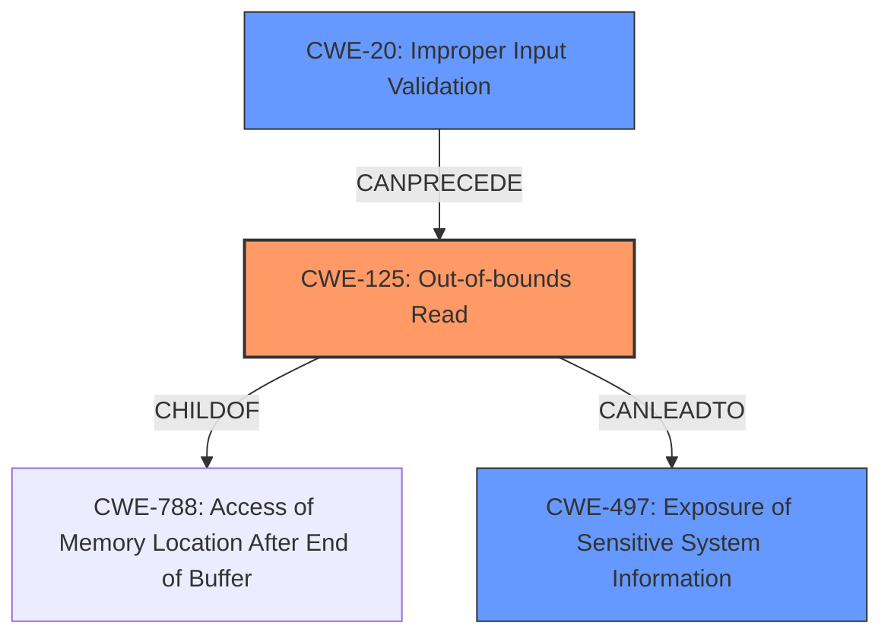

# Enhanced Analysis for CVE-2025-0907

# Summary
| CWE ID    | CWE Name                                                                   | Confidence | CWE Abstraction Level | CWE Vulnerability Mapping Label | CWE-Vulnerability Mapping Notes |
| :--------- | :------------------------------------------------------------------------- | :--------- | :---------------------- | :------------------------------ | :------------------------------ |
| CWE-125     | Out-of-bounds Read                                                         | 0.9        | Base                    | Primary CWE                    | Allowed                       |
| CWE-20      | Improper Input Validation                                                  | 0.7        | Class                   | Secondary Candidate                  | Discouraged                    |
| CWE-497     | Exposure of Sensitive System Information to an Unauthorized Control Sphere | 0.6        | Base                    | Secondary Candidate                  | Allowed                       |

## Evidence and Confidence

*   **Confidence Score:** 0.8
*   **Evidence Strength:** HIGH

## Relationship Analysis
The primary weakness is an **out-of-bounds read**, which stems from **improper input validation**. The **improper input validation** can **precede** the **out-of-bounds read**. The impact of the **out-of-bounds read** is **information disclosure**.



## Vulnerability Chain
1.  **Root Cause:** **Lack of proper validation of user-supplied data** (CWE-20)
2.  **Weakness:** **Out-of-bounds Read** (CWE-125)
3.  **Impact:** **Information Disclosure** (CWE-497)

## Summary of Analysis
The vulnerability is an **out-of-bounds read** in the parsing of JB2 files in PDF-XChange Editor. The **root cause** is the **lack of proper validation of user-supplied data**. This leads to a read past the end of an allocated object, resulting in **information disclosure**.

The primary CWE is CWE-125, **Out-of-bounds Read**, because the vulnerability description explicitly mentions an **out-of-bounds read**.

CWE-20, **Improper Input Validation**, is a secondary CWE because the **lack of proper validation of user-supplied data** is the root cause.

CWE-497, **Exposure of Sensitive System Information to an Unauthorized Control Sphere**, is considered because the **out-of-bounds read** results in **information disclosure**.

CWE-787, **Out-of-bounds Write**, was considered but not selected because the vulnerability description specifically states a read, not a write.

CWE-122, **Heap-based Buffer Overflow**, was considered but not selected because the vulnerability is specifically a read, not a write or overflow.

CWE-1284, **Improper Validation of Specified Quantity in Input**, was considered but not selected because the description doesn't specifically mention a quantity.


## CWE Relationship Analysis

Current CWEs represent these abstraction levels: .


### Vulnerability Chain Analysis

**Chain starting from CWE-1284:**
- 1284 (Improper Validation of Specified Quantity in Input) - ROOT


**Chain starting from CWE-125:**
- 125 (Out-of-bounds Read) - ROOT


### CWE Relationship Diagram

```mermaid
graph TD
    classDef primary fill:#f96,stroke:#333,stroke-width:2px
    classDef secondary fill:#69f,stroke:#333
    classDef tertiary fill:#9e9,stroke:#333
```