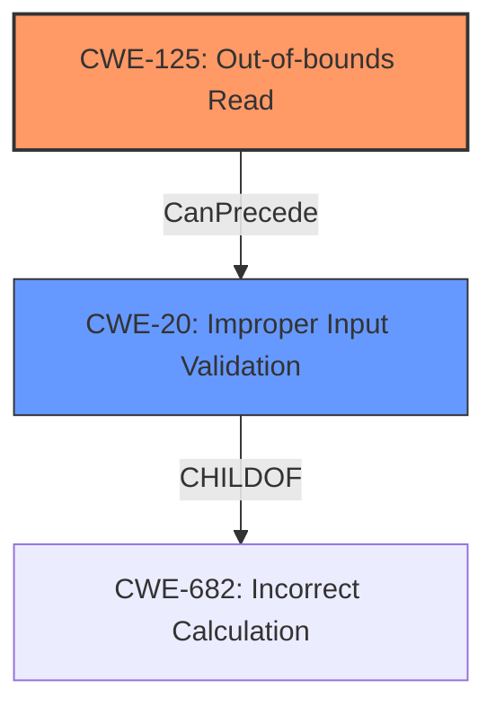

# Enhanced Analysis for CVE-2025-0908

# Summary
| CWE ID  | CWE Name                                                        | Confidence | CWE Abstraction Level | CWE Vulnerability Mapping Label | CWE-Vulnerability Mapping Notes |
| :-------- | :-------------------------------------------------------------- | :--------- | :-------------------- | :------------------------------ | :------------------------------ |
| CWE-125   | Out-of-bounds Read                                              | 0.95       | Base                  | Primary                         | Allowed                         |
| CWE-20    | Improper Input Validation                                       | 0.85       | Class                 | Secondary                       | Allowed                         |

## Evidence and Confidence

*   **Confidence Score:** 0.90
*   **Evidence Strength:** HIGH

## Relationship Analysis
The primary weakness is CWE-125, which directly reflects the **out-of-bounds read** condition described in the vulnerability. CWE-20 is included as a secondary weakness because the root cause is the **lack of proper validation of user-supplied data**, which is a form of improper input validation and can lead to the **out-of-bounds read**.



## Vulnerability Chain
The vulnerability chain starts with the **lack of proper validation of user-supplied data** (CWE-20), leading to an **out-of-bounds read** (CWE-125), which then results in an **information disclosure vulnerability**.

## Summary of Analysis
The primary CWE is CWE-125 because the vulnerability description explicitly states an **Out-Of-Bounds Read**. The root cause is the **lack of proper validation of user-supplied data**, which maps to CWE-20, and is a prerequisite for the **out-of-bounds read** to occur.

The selection of CWE-125 and CWE-20 is based on the vulnerability description and the provided context. Both CWEs are at appropriate levels of abstraction. CWE-125 is a Base level CWE, representing the specific type of **out-of-bounds read**. CWE-20 is a Class level CWE, representing the generic **improper input validation** that is the root cause of the vulnerability.

**Supporting Evidence:**

*   Vulnerability Description: "PDF-XChange Editor U3D File Parsing **Out-Of-Bounds Read** **Information Disclosure Vulnerability**...The issue results from the **lack of proper validation of user-supplied data**, which can result in a read past the end of an allocated buffer."
*   Keyphrase Analysis:
    *   ROOTCAUSE: '**lack of proper validation of user-supplied data**'
    *   WEAKNESS: '**Out-Of-Bounds Read**'
    *   IMPACT: 'Information Disclosure Vulnerability'

**CWEs Considered But Not Used:**

*   CWE-787 (Out-of-bounds Write): This CWE was considered, but the vulnerability is specifically an **out-of-bounds read**, not a write.
*   CWE-1284 (Improper Validation of Specified Quantity in Input): This CWE was considered, but the description doesn't specify that the improper validation is regarding the quantity in input.
*   CWE-122 (Heap-based Buffer Overflow): This CWE was considered, but the description doesn't say that the buffer is allocated in the heap.
*   CWE-126 (Buffer Over-read): This CWE was considered, but it's too similar to CWE-125 (Out-of-bounds Read) and doesn't provide additional specificity.


## CWE Relationship Analysis

Current CWEs represent these abstraction levels: .


### Vulnerability Chain Analysis

**Chain starting from CWE-1284:**
- 1284 (Improper Validation of Specified Quantity in Input) - ROOT


**Chain starting from CWE-125:**
- 125 (Out-of-bounds Read) - ROOT


### CWE Relationship Diagram

```mermaid
graph TD
    classDef primary fill:#f96,stroke:#333,stroke-width:2px
    classDef secondary fill:#69f,stroke:#333
    classDef tertiary fill:#9e9,stroke:#333
```